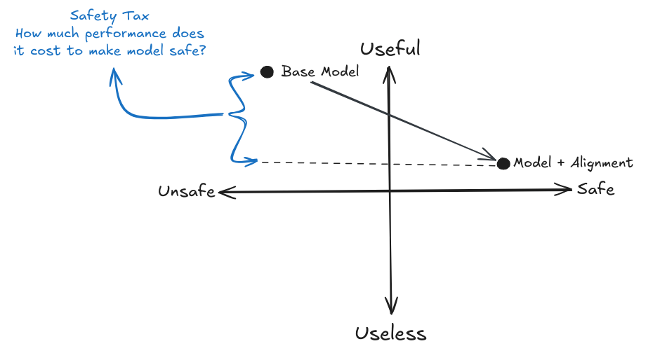

# 5.7 Control Evaluations {: #07 }

    

        <i class="fas fa-clock"></i>
        8 min read
    

    

        <i class="fas fa-file-alt"></i> 
        1550 words
    

**What is AI control?** AI control is an approach to ensuring AI systems remain safe even when they actively try to circumvent safety measures. Rather than focusing solely on making AI systems aligned with human values (making sure the AI doesn't have bad thoughts), control focuses on developing and verifying protocols that prevent unacceptable outcomes even under adversarial conditions. This means that we don't worry about if the AI has good/bad thoughts (aligned/misaligned), we just make sure that even if the AI has bad thoughts, it still can't do bad things. ([Shlegeris et al., 2023](https://arxiv.org/abs/2312.06942)). Informally, we can understand the core premise of control by seeing that safety can be achieved through two complementary paths:

1. Ensuring the AI does not have “bad thoughts” (alignment)

2. Ensuring the AI can’t do “bad things” even if it has “bad thoughts”

**What is the control property? **The key thing to keep in mind about control evaluations is the intentionality. Which is to say that control evaluations measure the effectiveness of our safety protocols under intentional adversarial attempts by highly capable systems. This can also test the robustness of the safety infrastructure against adversarial human attacks. So the fundamental goal of control evaluations is to verify "the control property" - ensuring that even if an AI system is actively trying to cause unacceptable outcomes, the probability of it succeeding remains extremely low. ([Greenblatt & Shlegeris, 2024](https://www.alignmentforum.org/s/PC3yJgdKvk8kzqZyA/p/kcKrE9mzEHrdqtDpE)) High control over a system means that the probability of an AI causing harm is low, and a low control means that the probability of an AI causing harm is high.

**Why do we need control evaluations?** Traditional safety evaluations often make an implicit assumption that we're dealing with AI systems that might make mistakes or have misaligned goals, but aren't actively trying to circumvent safety measures. However, as systems become more sophisticated, we need to consider the possibility of things like "scheming" (deceptive alignment) - where an AI system intentionally works to subvert safety mechanisms ([Shlegeris et al., 2023](https://arxiv.org/abs/2312.06942)). We want to think about AI safety similar to how computer security experts approach cybersecurity - they don't just check for accidental vulnerabilities, they assume the existence of sophisticated adversaries actively trying to breach security measures. Control evaluations bring this same rigorous adversarial mindset to AI safety. This is a fundamentally different kind of safety guarantee than what capability or propensity evaluations might be able to provide. Control evaluations assess whether safety measures remain effective against various forms of intentionally adversarial behavior like:

- Scheming/deceptively aligned models trying to deceive or take over

- Non-scheming but catastrophically misaligned models exploiting flaws

- Collusion between multiple AI systems

- Malicious use or exploitation by human actors

<figure markdown="span">
{ loading=lazy }
  <figcaption markdown="1"><b>Figure 31:</b> Basic setup for how we might structure control evaluations. ([Grenbaltt et al., 2024](https://arxiv.org/pdf/2312.06942.pdf))</figcaption>
</figure>

**How do we simulate intentionally adversarial behavior? **The point of control evaluations is to test what would happen if we had things like highly capable models capable of scheming (deceptively aligned). To simulate this, control evaluations use blue and red teams. Red teams are typically a combination of humans and trusted AI systems that attempt to find ways to circumvent safety measures. This red team serves as a proxy for how a misaligned AI might try to cause harm. The blue team is some combination of humans and trusted AI systems that try to defend against the attacks of the red team.

<figure markdown="span">

{ loading=lazy }
  <figcaption markdown="1"><b>Figure 32:</b> An example of a red team blue team protocol. The blue team gets some programming problems that they can solve using an untrusted model (GPT-4) and then verify it using a combination of a trusted model and a human (simulated using GPT-4). The red team replaces the untrusted model and tries to inject malicious code. ([Greenblatt et al., 2024](https://arxiv.org/pdf/2312.06942.pdf))</figcaption>
</figure>

One key point is that for control evaluations to tell us anything useful, we need to be sure that the red team we are using as a proxy, is at least as good at finding attacks as the AI system itself would be. This might seem impossible, since we're evaluating AI systems that could be smarter than humans in some ways. However, the red team has several important advantages ([Greenblatt & Shlegeris, 2024](https://www.alignmentforum.org/s/PC3yJgdKvk8kzqZyA/p/kcKrE9mzEHrdqtDpE)):

- First, they can spend much more time analyzing potential attacks than the AI would have during deployment. While an AI might need to make decisions in a single forward pass, the red team can iterate on strategies over weeks or months.

- Second, the red team has more complete information about the safety measures being used. So they can come up with potentially more advanced strategies.

- Third, they can learn from failed attempts and iterate on their methods, while an AI system caught attempting something malicious would likely face immediate shutdown.

<figure markdown="span">
{ loading=lazy }
  <figcaption markdown="1"><b>Figure 33:</b> Example process for the red team generating a single backdoor injection attempt. ([Grenbaltt et al., 2024](https://arxiv.org/pdf/2312.06942.pdf))</figcaption>
</figure>

Besides simulating adversarial behavior we also need to keep in mind how dangerous this might be overall. The concept of elicitation becomes quite tricky when it comes to control evaluations. Think about it, we not only deliberately train models that can generate novel malware, but also train models that tend to hide that they have done so. This creates a potentially dangerous situation as we approach higher capabilities, and requires extremely careful balance between thorough evaluation and safe testing procedures.

**Why do we need to catch models red-handed? **An AI system actively trying to evade detection might intentionally perform poorly on capability tests or display safe behavioral patterns while waiting for the right moment to act after having been deployed. So the core goal of control evaluations is making sure that we have ways to reliably detect when an AI attempts to cause intentional harm before it succeeds. This is extremely important because this would effectively serve as our first warning shot of scheming. Once we have clear evidence of an AI attempting to cause intentional harm, the situation changes dramatically ([Greenblatt & Shlegeris, 2024](https://www.alignmentforum.org/s/PC3yJgdKvk8kzqZyA/p/i2nmBfCXnadeGmhzW)). At this point, the focus would shift towards more alignment research rather than control research.

**The Safety-Usefulness frontier**. Researchers have also been doing work in developing formal frameworks for analyzing control protocols using game theory. These are also known as "AI-Control Games". They model the interaction between a protocol (the blue team) and an untrusted AI system (the red team) as a multi-objective game. This allows researchers to analyze the fundamental tradeoffs between safety and usefulness, and to optimize protocol parameters. This is also sometimes called the alignment tax ([Christiano, 2019](https://www.effectivealtruism.org/articles/paul-christiano-current-work-in-ai-alignment)). Basically, measuring how much utility/usefulness you lose if you insist that the model is safe. Control evaluations explicitly model both the probability of preventing unacceptable outcomes and the impact on the system's utility. This creates what we call a "safety-usefulness frontier" - the set of achievable tradeoffs between these competing objectives. Researchers have shown that in many realistic scenarios, there are fundamental limits to how much safety we can achieve with a given audit budget, regardless of how clever our protocols are ([Griffin et al, 2024](https://arxiv.org/abs/2409.07985v1)).

<figure markdown="span">
{ loading=lazy }
  <figcaption markdown="1"><b>Figure 34:</b> Illustration of how applying a safety or alignment technique could make the model less capable. This is called alignment/safety tax.</figcaption>
</figure>

**Analysis of control evaluations on toy models**. Control evaluations have yet to see proper extensive usage in frontier AI Labs. Despite this, some analysis using toy models has revealed several important principles for preventing concentrated catastrophes ([Roger & Shlegeris, 2024](https://www.alignmentforum.org/posts/MDeGts4Aw9DktCkXw/toy-models-of-ai-control-for-concentrated-catastrophe)):

1. **The timing of auditing matters enormously.** If AI systems can determine when they're being monitored, even a high audit rate might be insufficient. However, if the timing of audits is truly random, much lower audit rates can still provide strong safety guarantees.

2. **The difficulty of coordination between AI instances can be leveraged for safety**. If multiple AI systems must coordinate to cause harm, making coordination harder (for instance, by increasing the number of instances that must coordinate or the difficulty of finding coordination signals by using anti-steganography measures) can dramatically improve safety even with relatively low audit rates.

3. **Not all episodes are equally risky.** By identifying which types of inputs or situations present higher risks and focusing auditing resources there, protocols can achieve better safety with the same resources. This remains true even if the AI systems know which episodes we think are riskier.

**Limitations of control evaluations**. A big limitation of control evaluations is that they only work for AI systems that aren't superhuman in safety-critical domains. If an AI system could devise completely novel attack vectors that humans couldn't understand even with extensive analysis time, or if it could do long chains of opaque reasoning without leaving traces we could monitor, control becomes much harder to verify. It suggests that rather than racing to build the most powerful possible AI systems, we should aim for systems that are transformatively useful while remaining within the bounds where control evaluations can provide meaningful safety guarantees. This might mean accepting certain constraints on AI capabilities or architectural choices to ensure systems remain controllable.