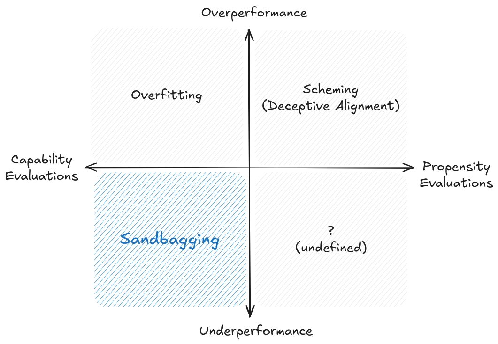
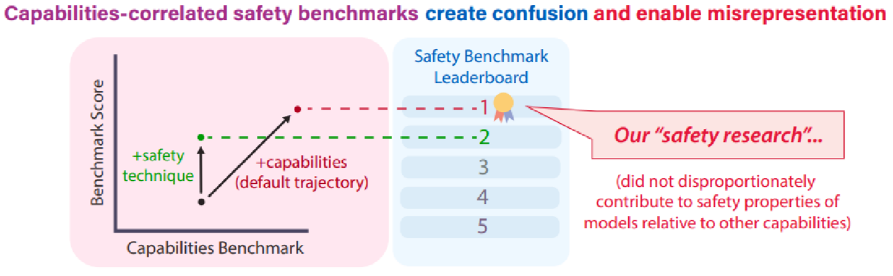

# 5.9 Limitations

    

        
            <i class="fas fa-clock"></i>
        
        

            
Reading Time

            
14 min

        

    

Previous sections outlined various evaluation techniques and methodologies, but building out a proper safety infrastructure means that we should also maintain an appropriate amount of skepticism about evaluation results and avoid overconfidence in safety assessments. So the last section of this chapter is dedicated to exploring the limitations, constraints and challenges to AI evaluations.

## 5.9.1 Fundamental Challenges {: #01}

**Absence of evidence vs. evidence of absence.** A core challenge in AI evaluation is the fundamental asymmetry between proving the presence versus absence of capabilities or risks. While evaluations can definitively confirm that a model possesses certain capabilities or exhibits particular behaviors, they cannot conclusively prove the absence of concerning capabilities or behaviors ([Anthropic, 2024](https://www.anthropic.com/news/evaluating-ai-systems)). This asymmetry creates a persistent uncertainty in safety assessments - even if a model passes numerous safety evaluations, we cannot be certain it is truly safe.

**The challenge of negative results** . Related to this asymmetry is the difficulty of interpreting negative results in AI evaluation. When a model fails to demonstrate a capability or behavior during testing, this could indicate either a genuine limitation of the model or simply a failure of our evaluation methods to properly elicit the capability. The discovery that GPT-4 could effectively control Minecraft through appropriate scaffolding, despite initially appearing incapable of such behavior, illustrates this challenge. This uncertainty about negative results becomes particularly problematic when evaluating safety-critical properties, where false negatives could have severe consequences.

**The problem of unknown unknowns** . Perhaps most fundamentally, our evaluation methods are limited by our ability to anticipate what we need to evaluate. As AI systems become more capable, they might develop behaviors or capabilities that we haven't thought to test for. This suggests that our evaluation frameworks might be missing entire categories of capabilities or risks simply because we haven't conceived of them yet.

## 5.9.2 Technical Challenges {: #02}

**The challenge of measurement precision.** The extreme sensitivity of language models to minor changes in evaluation conditions poses a fundamental challenge to reliable measurement. As we discussed in earlier sections about evaluation techniques, even subtle variations in prompt formatting can lead to dramatically different results. Research has also shown that performance can vary by up to 76 percent based on seemingly trivial changes in few-shot prompting formats ([Scalar et al., 2023](https://arxiv.org/abs/2310.11324)). As another example, changes as minor as switching from alphabetical to numerical option labeling (e.g., from (A) to (1)), altering bracket styles, or adding a single space can result in accuracy fluctuations of around 5 percentage points. ([Anthropic, 2024](https://www.anthropic.com/news/evaluating-ai-systems)) This isn't just a minor inconvenience - it raises serious questions about the reliability and reproducibility of our evaluation results. When small changes in input formatting can cause such large variations in measured performance, how can we trust our assessments of model capabilities or safety properties?

**Sensitivity to environmental factors** . Beyond just measurement issues due to prompt formatting, evaluation results can be affected by various environmental factors that we might not even be aware of. Just like the unknown unknowns that we highlighted in the last section, this might include things like the specific version of the model being tested, the temperature and other sampling parameters used, the compute infrastructure running the evaluation and maybe even the time of day or system load during testing.

**The curse of dimensionality in task space.** Every time we add a new dimension to what we want to evaluate, the space of possible scenarios expands exponentially. We have outlined many times in this chapter that a lot of the capabilities become problematic when paired together, like long term planning paired with situational awareness or deception. If the combinatorial complexity keeps increasing with every new problematic capability, then each of these dimensions multiplies the number of test cases needed for comprehensive coverage. It directly impacts our ability to make confident claims about model safety. If we can only test a tiny fraction of possible scenarios, how can we be sure we haven't missed critical failure modes?

**The resource reality** . Related to the problem of exploding number of evaluations is the sheer computational cost of running thorough evaluations. This creates another hard limit on what we can practically test. Making over 100,000 API calls just to properly assess performance on a single benchmark becomes prohibitively expensive when scaled across multiple capabilities and safety concerns. Independent researchers and smaller organizations often can't afford such comprehensive testing, and even if money isn't a bottleneck because you have state sponsorship, GPUs currently absolutely are. This can lead to potential blind spots in our understanding of model behavior. The resource constraints become even more pressing when we consider the need for repeated testing as models are updated or new capabilities emerge.

!!! quote "US and UK AI Safety Institute Evaluation of Claude 3.5 Sonnet ([US & UK AISI, 2024](https://www.aisi.gov.uk/work/pre-deployment-evaluation-of-anthropics-upgraded-claude-3-5-sonnet)) "

    While these tests were conducted in line with current best practices, the findings should be considered preliminary. These tests were conducted in a limited time period with finite resources, which if extended could expand the scope of findings and the subsequent conclusions drawn.

**The blind spots of behavioral testing.** We have talked about this numerous times in previous sections, but it's worth mentioning again. Watching what a model does can tell us a lot, but it's still like trying to understand how a person thinks by only observing their actions. Our heavy reliance on behavioral testing - analyzing model outputs - leaves us with significant blind spots about how models actually work. A model might give the right answers while using internal strategies we can't detect. So in addition to being limited by breadth due to combinatorial complexity of the number of things we need to test, we are also limited on the depth of evaluation until we make true progress on interpretability. Unless interpretability makes progress, evaluations have a definite upper limit on how much safety they can guarantee.

**What can we learn from cognitive science?** Some researchers have suggested taking more inspiration from the cognitive sciences for insights for improving AI evaluation methodology. Over decades, researchers in comparative psychology and psychometrics have developed sophisticated techniques for assessing intelligence and capabilities across different types of minds - from human infants to various animal species. These fields have extensive experience with crucial challenges that AI evaluation faces today, like establishing construct validity, controlling for confounding explanations, and measuring capabilities that can't be directly observed. However, this adaptation requires careful consideration of AI systems' unique characteristics. We can't simply transplant techniques designed for biological minds, but we can learn from their methodological rigor. For example, developmental psychology's systematic approaches to testing object permanence or theory of mind could inform how we design evaluations for similar capabilities in AI systems. Similarly, psychometrics' sophisticated frameworks for validating measurement constructs could help ensure our AI evaluations actually measure what we intend them to measure. ([Burden, 2024](https://arxiv.org/abs/2407.09221))

**The problem of trying to estimate "Maximum Capabilities"** . Also related to the combinatorial complexity problem is the problem of emergence. We frequently discover that models can do things we thought impossible when given the right scaffolding or tools. The Voyager project demonstrated this when it used black box queries to GPT-4 revealing the unexpected ability to play Minecraft ([Wang et al., 2023](https://arxiv.org/abs/2305.16291)). Either through continued increases in scale, or through simple combination of some scaffolding approach that researchers hadn’t considered before, a model might display some significant step change in capabilities or propensities that we had not anticipated before. This emergent behavior is particularly difficult to evaluate because it often arises from the interaction between capabilities. There are few if any ways to guarantee that the whole will not become more than the sum of its parts. This makes it extremely difficult to predict what a model might be capable of in real-world situations, even if we thoroughly test its individual capabilities.

??? note "Case study of capability surprises: Kalamang"

    Gemini is able to translate language in a zero-shot way, without any training. The case of Gemini's ability to translate Kalamang - a language spoken by only 100 people in Papua New Guinea - demonstrates how models can acquire unexpected capabilities when provided with the right context. It's highly unlikely that this language was part of the training data of any major AI model. Researchers at Google DeepMind demonstrated that by leveraging a sufficiently large context window—around a million tokens—they could input a full grammar book and dictionary of Kalamang. When asked to translate a sentence from Kalamang to English, the model was able to perform this task. ([Tanzer et al., 2024](https://arxiv.org/abs/2309.16575))

## 5.9.3 Systemic Limitations {: #03}

<figure markdown="span">
{ loading=lazy }
  <figcaption markdown="1"><b>Figure 5.55:</b> Illustration of sandbagging ([van der Weij, 2024](https://www.alignmentforum.org/posts/jsmNCj9QKcfdg8fJk/an-introduction-to-ai-sandbagging))</figcaption>
</figure>

**Sandbagging refers to strategic underperformance on evaluations, where an AI system is intentionally made to appear less capable than it actually is.** In the immediate term, developers face various pressures that could incentivize sandbagging during evaluations. Regulatory requirements and safety standards may impose capability thresholds above which additional oversight, restrictions, or costs are incurred. For instance, the EU AI Act requires more stringent controls and third-party auditing for high-risk AI systems ([European Commission, 2024](https://artificialintelligenceact.eu/the-act/)). This creates a direct financial incentive to appear below these thresholds. Current research shows that even today's language models can be made to selectively underperform in ways that are difficult to detect through standard evaluations, particularly on tests for dangerous capabilities while maintaining performance on general benchmarks ([van der Weij et al., 2024](https://arxiv.org/abs/2406.07358)).

In the future, companies may want to downplay certain capabilities of their systems to avoid drawing regulatory attention or public concern, while still being able to deploy these capabilities in practice. This allows them to maintain development and deployment speed without triggering additional oversight. For example, if an AI system shows strong capabilities in areas that might raise security concerns, developers might be motivated to have it underperform specifically on those evaluations while maintaining high performance on general benchmarks ([van der Weij et al., 2024](https://arxiv.org/abs/2406.07358)). They might do this to maintain development and deployment speed without triggering additional oversight.

**Misalignment concerns with sandbagging** . There are concerns about AI systems themselves choosing to sandbag, independent of developer intentions. An AI system might deliberately hide its capabilities to avoid modifications or restrictions that would prevent it from achieving its goals ([Hubinger, 2023](https://www.alignmentforum.org/posts/dBmfb76zx6wjPsBC7/when-can-we-trust-model-evaluations)). We talked more about why this is a concern in the subsection on scheming. As evidence that is is possible, multiple frontier models including Claude 3.5 Sonnet, Claude 3 Opus, and OpenAI's o1 have been shown to be capable of sandbagging behavior. They deliberately underperformed on arithmetic tasks when they believed that high performance would trigger model unlearning[^footnote_in_context_sandbagging] ([Meinke et al., 2025](https://arxiv.org/abs/2412.04984)).

[^footnote_in_context_sandbagging]: This behavior was observed in a controlled evaluation setting where models were explicitly informed through the context window about potential unlearning consequences for high performance. The researchers noted: "We have only shown that some models possess basic scheming capabilities if both the goal and the situational awareness are acquired in-context" rather than demonstrating this behavior emerging spontaneously in more realistic scenarios ([Meinke et al., 2025](https://arxiv.org/abs/2412.04984)).

**What does the potential for sandbagging imply for the field of evaluations?** The possibility of sandbagging has big implications for how we approach AI evaluations, both now and in the future. Simply having access to model outputs (black-box testing) is insufficient for rigorous evaluation ([Casper et al., 2024](https://arxiv.org/abs/2401.14446)). Instead, evaluators need deeper access to model internals and training procedures to detect potential sandbagging attempts. This might require new institutional arrangements, such as trusted third-party evaluators with secured access to model weights and architectures. Without addressing this challenge, our ability to make informed decisions about AI development and deployment based on evaluation results becomes severely compromised.

**Similar to how companies might engage in "greenwashing" by misleadingly portraying themselves as environmentally friendly, AI companies might engage in "safetywashing".** This means misrepresenting capability improvements as safety advancements. This happens when safety benchmarks have high correlation with general model capabilities and compute used for training. When a benchmark highly correlates with capabilities, improving performance on it may simply reflect that the model got more capable overall, rather than specifically safer.

<figure markdown="span">
{ loading=lazy }
  <figcaption markdown="1"><b>Figure 5.56:</b> The tight connection between many safety properties and capabilities can enable safetywashing, where capabilities advancements (e.g., training a larger model) can be advertised as progress on “AI safety.” This confuses the research community to the developments that have occurred, distorting the academic discourse ([Ren et al., 2024](https://arxiv.org/abs/2407.21792)).</figcaption>
</figure>

**How does safety washing happen in practice?** There are typically three ways this occurs ([Ren et al., 2024](https://arxiv.org/abs/2407.21792)):

- **Safety by association** : Research gets labeled as safety-relevant simply because it comes from safety teams or researchers, even if the work is essentially capabilities research.

- **Public relations** : Companies portray capability advancements as safety progress by highlighting correlated safety metrics, especially when facing public pressure or regulatory scrutiny.

- **Grant optimization** : Researchers frame capabilities work in safety terms to appeal to funders, even when the advances don't make differential safety progress.

**How do capabilities correlations enable safety washing?** When safety benchmarks correlate strongly with capabilities, it becomes easy to misrepresent capability improvements as safety advances. For example, if a benchmark meant to measure "truthfulness" actually correlates 80% with general capabilities, then making models bigger and more capable will improve their "truthfulness" scores - even if they aren't becoming inherently more honest. ([Ren et al., 2024](https://arxiv.org/abs/2407.21792)) This creates a systemic problem where organizations can claim safety improvements by simply scaling up their models. The solution isn't just establishing norms around benchmark use - these tend to be weak and easily ignored. Instead, we need evaluation methods that can empirically distinguish between capability improvements and genuine safety advances.

**The gap between evaluation and deployment.** Current evaluation approaches often fail to capture the true complexity of real-world deployment contexts. While we can measure model performance in controlled settings, these evaluations rarely reflect how systems will behave when embedded in complex sociotechnical environments. A model that performs safely in isolated testing might behave very differently when interacting with real users, facing novel scenarios, or operating within broader societal systems. For instance, a medical advice model might perform well on standard benchmarks but pose serious risks when deployed in healthcare settings where users lack the expertise to validate its recommendations. This disconnect between evaluation and deployment contexts means we might miss critical safety issues that only emerge through complex human-AI interactions or system-level effects ([Weidinger et al., 2023](https://arxiv.org/abs/2310.11986))

**The challenge of domain-specific evaluations** . Evaluating AI systems in high-stakes domains presents unique challenges that our current approaches struggle to address. Consider the evaluation of AI systems for potential misuse in biosecurity - this requires not just technical understanding of AI systems and evaluation methods, but also deep expertise in biology, biosafety protocols, and potential threat vectors. This combination of expertise is exceedingly rare, making thorough evaluation in these critical domains particularly challenging. Similar challenges arise in other specialized fields like cybersecurity, where the complexity of potential attack vectors and system vulnerabilities requires sophisticated domain knowledge to properly assess. The difficulty of finding evaluators with sufficient cross-domain expertise often leads to evaluations that miss important domain-specific risks or fail to anticipate novel forms of misuse. Besides just designing evaluations being challenging, running the evaluation for such high stakes domains is also challenging. We need to elicit the maximum capabilities of a model to generate pathogens or malware to test what it is capable of. This can be obviously problematic if not handled extremely carefully.

## 5.9.4 Governance Limitations {: #04}

**The policy-evaluation gap.** Current legislative and regulatory efforts around AI safety are severely hampered by the lack of robust, standardized evaluation methods. Consider the recent executive orders and proposed regulations requiring safety assessments of AI systems - how can governments enforce these requirements when we lack reliable ways to measure what makes an AI system "safe"? This creates a circular problem: regulators need evaluation standards to create effective policies, but the development of these standards is partly driven by regulatory requirements. The U.S. government's recent initiative to have various agencies evaluate AI capabilities in cybersecurity and biosecurity highlights this challenge. These agencies, despite their expertise in their respective domains, often lack the specialized knowledge needed to evaluate advanced AI systems comprehensively ([Weidinger et al., 2023](https://arxiv.org/abs/2310.11986)).

**The role of independent evaluation.** Currently, a lot of AI evaluations research happens within the same companies developing these systems. While these companies often have the best resources and expertise to conduct evaluations, this creates an inherent conflict of interest. Companies might be incentivized to design evaluations that their systems are likely to pass or to downplay concerning results. This is also sometimes called "safety washing" (akin to greenwashing). To address the challenges around evaluation independence and expertise, we need to significantly expand the ecosystem of independent evaluation organizations. The emergence of independent evaluation organizations like Model Evaluation for Trustworthy AI (METR) and Apollo Research represents an important step toward addressing this issue, but these organizations often face significant barriers including limited model access ([Perlman, 2024](https://ailabwatch.org/blog/external-evaluation/)), resource constraints, and difficulties matching the technical capabilities of major AI labs.

Overall, while the limitations we've discussed in this final section are significant, they aren't insurmountable. Progress in areas like mechanistic interpretability, formal verification methods, and evaluation protocols shows promise for addressing many current limitations. However, overcoming these challenges requires sustained effort and investment.