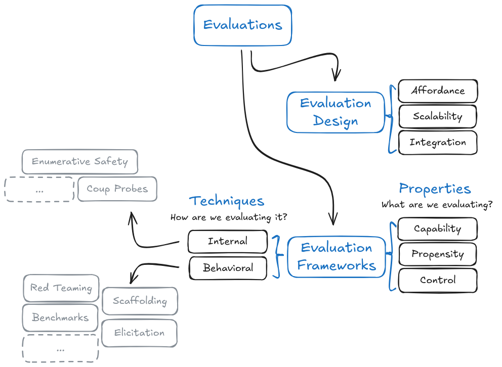

# Evaluations

    <!-- Left Column -->
    

        <!-- Authors -->
        

            
                <i class="fas fa-users"></i>
            
            

                
Authors

                

                    

Markov Grey & Charbel-Raphael Segerie

                

            

        

        
        <!-- Affiliations -->
        

            
                <i class="fas fa-building"></i>
            
            

                
Affiliations

                

                    

French Center for AI Safety (CeSIA)

                

            

        

<!-- Acknowledgements section -->

    
        <i class="fas fa-heart"></i>
    
    

        
Acknowledgements

        

            Maxime Riché, Martin, Jeanne Salle, Camille Berger
        

    

    

    <!-- Right Column -->
    

        <!-- Date -->
        

            
                <i class="fas fa-calendar"></i>
            
            

                
Last Updated

                
2024-11-20

            

        

        
        <!-- Reading Time -->
        

            
                <i class="fas fa-book-open"></i>
            
            

                
Reading Time

                
124 minutes

            

        

        
        <!-- Links -->
        

            
                <i class="fas fa-link"></i>
            
            

                
Also available on

                

                    <a href="https://docs.google.com/document/d/1KI95w27Ce7yWoynE11PJ94IXK0gT0NwP8091s06P7wM/edit?usp=sharing" class="meta-link">Google Docs</a>
                

            

        

    

[Feedback](https://forms.gle/ZsA4hEWUx1ZrtQLL9){ .md-button }

# Introduction

As AI systems grow increasingly powerful, our ability to rigorously evaluate them becomes crucial for safety and governance. The challenge isn't just measuring what AI systems can do, but understanding their behavioral tendencies and verifying our ability to maintain control. This section introduces the landscape of AI evaluation and explains why we need increasingly sophisticated approaches beyond simple benchmarking.

<figure markdown="span">
{ loading=lazy }
  <figcaption markdown="1"><b>Figure 1:</b> Overview of chapter content.</figcaption>
</figure>

**Benchmarks.** Building on this need for measurement, we explore how standardized tests like MMLU or TruthfulQA have historically helped quantify AI capabilities. While these benchmarks provide valuable standardization, they face fundamental limitations - models can memorize answers without understanding, and benchmark performance may not translate to real-world safety. The "reversal curse" demonstrates how models might score well on tests while failing to learn basic logical relationships, highlighting why we need more comprehensive evaluation approaches.

**Evaluated Properties.** To develop better evaluations, we first need to understand exactly what properties of AI systems matter for safety. This section introduces three fundamental categories: capabilities (what a model can do), propensities (what it tends to do), and control (whether we can prevent unacceptable outcomes). This framework helps clarify why, for instance, a model being capable of writing malicious code is different from having a tendency to do so, and both are different from our ability to prevent it from doing so even if it tries.

**Evaluation Techniques.** With clear properties to measure, we explore specific techniques for gathering evidence about AI systems. We examine both behavioral techniques that study model outputs and internal techniques that analyze model mechanisms. This includes approaches like best-of-N sampling, multistep reasoning prompting, and red teaming, providing concrete tools for the evaluations explored in subsequent sections.

**Dangerous Capability Evaluations.** Focusing first on dangerous capabilities, we examine how to measure abilities like deception, situational awareness, and autonomous replication. These evaluations aim to establish upper bounds on what AI systems can achieve when explicitly trying, providing crucial information about potential risks. METR's evaluation of GPT-4 demonstrates how systematic protocols can probe concerning capabilities even in current systems.

**Dangerous Propensity Evaluations.** Building on capability assessment, we explore how to measure behavioral tendencies like power-seeking or deception. These become increasingly critical as models grow more capable - knowing what a model can do isn't enough, we need to understand what it's likely to do by default. This involves carefully designed choice frameworks and consistency measurements to reveal underlying behavioral patterns.

**Control Evaluations.** Taking evaluation to its logical conclusion, we examine whether we can maintain meaningful control even if an AI system actively tries to circumvent safety measures. This section explores how techniques like red team/blue team testing can help verify safety protocols remain effective under worst-case scenarios, while acknowledging the inherent challenges in simulating truly adversarial behavior.

**Evaluation Design.** Moving from theory to practice, we examine how to implement these evaluations effectively at scale. This includes designing robust evaluation protocols, automating assessment processes where possible, and integrating evaluations with broader safety frameworks and auditing systems. A key focus is developing systematic approaches that can be reliably implemented across different organizations.

**Limitations.** Finally, we talk about the fundamental challenges facing AI evaluations. From the difficulty of proving absence of capabilities, to technical constraints around measurement precision, to governance challenges around independence and standardization - understanding these limitations is crucial for both improving our methods and maintaining appropriate epistemic humility about their results.
