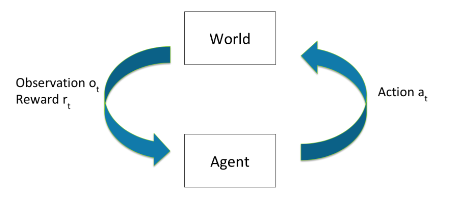

# 6.1 Reinforcement Learning {: #01 }

    

        <i class="fas fa-clock"></i>
        7 min read
    

    

        <i class="fas fa-file-alt"></i> 
        1444 words
    

The section provides a succinct reminder of several concepts in reinforcement learning (RL). It also disambiguates various often conflated terms such as rewards, values and utilities. The section ends with a discussion around distinguishing the concept of objectives that a reinforcement learning system might pursue from what it is being rewarded for. Readers who are already familiar with the basics can skip directly to section 1.2.

## 6.1.1 Primer {: #01 }

!!! info "Definition: Reinforcement Learning (RL)"

    Reinforcement Learning (RL) focuses on developing agents that can learn from interactive experiences. RL is based on the concept of an agent learning through interaction with an environment and altering its behavior based on the feedback it receives through rewards after each action.

Some examples of real-world applications of RL include:

- **Robotic systems**: RL has been applied to tasks such as controlling physical robots in real-time, and enabling them to learn more complicated movements (OpenAI 2018 “[Learning Dexterity](https://www.youtube.com/watch?v=jwSbzNHGflM)”). RL can enable robotic systems to learn complex tasks and adapt to changing environments.

- **Recommender Systems**: RL can be applied to recommender systems, which interact with billions of users and aim to provide personalized recommendations. RL algorithms can learn to optimize the recommendation policy based on user feedback and improve the overall user experience.

- **Game playing systems: **In the early 2010s RL-based systems started to beat humans at a few very simple Atari games, like Pong and Breakout. Over the years, there have been many models that have utilized RL to defeat world masters in both board and video games. These include models like [AlphaGo](https://www.deepmind.com/research/highlighted-research/alphago) (2016), [AlphaZero](https://www.deepmind.com/blog/alphazero-shedding-new-light-on-chess-shogi-and-go) (2018), [OpenAI Five](https://openai.com/research/openai-five-defeats-dota-2-world-champions) (2019), [AlphaStar](https://www.deepmind.com/blog/alphastar-mastering-the-real-time-strategy-game-starcraft-ii) (2019), [MuZero](https://www.deepmind.com/blog/muzero-mastering-go-chess-shogi-and-atari-without-rules) (2020) and [EfficientZero](https://github.com/YeWR/EfficientZero) (2021).

RL is different from supervised learning as it begins with a high-level description of "what" to do but allows the agent to experiment and learn from experience the best "how". In RL, the agent learns through interaction with an environment and receives feedback in the form of rewards or punishments based on its actions. RL is focused on learning a set of rules that recommend the best action to take in a given state to maximize long-term rewards. In contrast, supervised learning typically involves learning from explicitly provided labels or correct answers for each input.

## 6.1.2 Core Loop {: #02 }

The overall functioning of RL is relatively straightforward. The two main components are the agent itself, and the environment within which the agent lives and operates. At each time step
t
:

- The agent then takes some action $a_{t}$

- The environment state $s_{t}$ changes depending upon the action $a_{t}$.

- The environment then outputs an observation $o_{t}$ and a reward $r_{t}$.

A history is the sequence of past observations, actions and rewards that have been taken up until time $t: h_t = (a_1,o_1,r_1, \ldots, a_t,o_t,r_t)$ . The state of the world is generally some function of the history: $s_t = f(h_t)$. The World State is the full true state of the world used to determine how the world generates the next observation and reward. The agent might either get the entire world state as an observation $o_t$, or some partial subset.

The word goes from one state $s_t$ to the next $s_{t+1}$ either based on natural environmental dynamics, or the agent's actions. State transitions can be both deterministic or stochastic.

This loop continues until a terminal condition is reached or can run indefinitely. Following is a diagram that succinctly captures the RL process:

<figure markdown="span">
{ loading=lazy }
  <figcaption markdown="1"><b>Figure 6.1:</b> Emma Brunskill (Winter 2022) “[Stanford CS234 : RL](https://web.stanford.edu/class/cs234/CS234Win2022/modules.html) - Lecture 1”</figcaption>
</figure>

## 6.1.3 Policies {: #03 }

!!! info "Definition: Reinforcement Learning Policy"

    A policy helps the agent determine what action to take once it has received an observation. It is a function mapping from states to actions specifying what action to take in each state. Policies can be both deterministic or stochastic.

The goal of RL is to learn a policy (often denoted by $\pi$) that recommends the best action to take at any given moment in order to maximize total cumulative reward over time. The policy defines the mapping from states to actions and guides the agent's decision-making process.

$$\pi: S \to A$$

A policy can be either deterministic or stochastic. A deterministic policy directly maps each state $s_t$ to a specific action $a_t$ and is usually denoted by $\mu$. In contrast, a stochastic policy assigns a probability distribution over actions for each state. Stochastic policies usually denoted by $\pi$.

Deterministic policy: $a_t = \mu(s_t)$

Stochastic policy: $\pi(a|s) = P(a_t = a|s_t=s)$

In Deep RL policies are function maps that are learned during the training process. They depend on the set of learned parameters of a neural network (e.g. the weights and biases). These parameters are often denoted with subscripts on the policy equations using either $\theta$ or $\phi$. So the deterministic policy over the parameters of a neural network is written $a_t = \mu_{\theta}(s_t)$, and the stochastic equivalent is $a_t \sim \pi_{\theta}(\cdot|s_t)$

An optimal policy maximizes the expected cumulative reward over time. The agent learns from experience and adjusts its policy based on the feedback it receives from the environment in the form of rewards or punishments.

In order to determine whether an action is better than another, the actions (or the state-action pairs) need to be evaluated somehow. There are two different ways to look at which action to take: the immediate rewards (determined by reward function) and the long term cumulative rewards (determined by the action-value function). Both of these greatly influence the types of policies learned by the agent, and therefore also the actions that the agent takes. The following section explores and clarifies the concept of rewards in greater depth.

## 6.1.4 Reward {: #04 }

!!! info "Definition: Reward"

    *Reward refers to any signal or feedback mechanism used to guide the learning process and optimize the behavior of the model.*

The reward signal from the environment is a number that tells the agent how good or bad the current world state is. It is a way to provide an evaluation or measure of performance for the model's outputs or actions. The reward can be defined based on a specific task or objective, such as maximizing a score in a game or achieving a desired outcome in a real-world scenario. The training process for RL involves optimizing the model's parameters to maximize the expected reward. The model learns to generate actions or outputs that are more likely to receive higher rewards, leading to improved performance over time. Where does the reward come from? It is generated through a reward function.

!!! info "Definition: Reward function"

    *A reward function defines the goal or objective in a reinforcement learning problem. It maps perceived states or state-action pairs of the environment to a single number.*

    $$R: (S \times A) \to \mathbb{R} ; r_t = R(s_t,a_t)$$

The reward function provides immediate feedback to the agent, indicating the goodness or badness of a particular state or action. It is a mathematical function that maps the state-action pairs of an agent's environment to a scalar value, representing the desirability of being in that state and taking that action. It provides a measure of immediate feedback to the agent, indicating how well it is performing at each step.

**Reward Functions vs. Value Functions**

The reward indicates the immediate desirability of states or actions, while a value function represents the long-term desirability of states, taking into account future rewards and states. The value is the expected return if you start in a state or state-action pair, and then act according to a particular policy forever after. 

There are many different ways of choosing value functions. They can also be discounted over time, i.e. future rewards are worth less by some factor
(0,1)
.

Following is one simple formulation is the discounted sum of future rewards given some policy. The cumulative discounted rewards are given by:

$$R = r_t + \gamma r_{t+1} + \gamma^{2} r_{t+2} + \ldots = \sum_{t=0}^{\inf}{\gamma^{t}r_t}$$

And the value of acting according to this policy is given by:

$$V^{\pi}(s_t=s) = E_{\pi}(R|s_t=s)$$

**Reward Functions vs. Utility Functions**

It is also worth distinguishing the concept of utility from reward and value. A reward function is typically used in the context of RL to guide the agent's learning process and behavior. In contrast, a utility function is more general and captures the agent's subjective preferences or satisfaction, allowing for comparisons and trade-offs between different world states. Utility functions are a concept that is used more in the field of decision theory and agent foundations work.

    ❧

