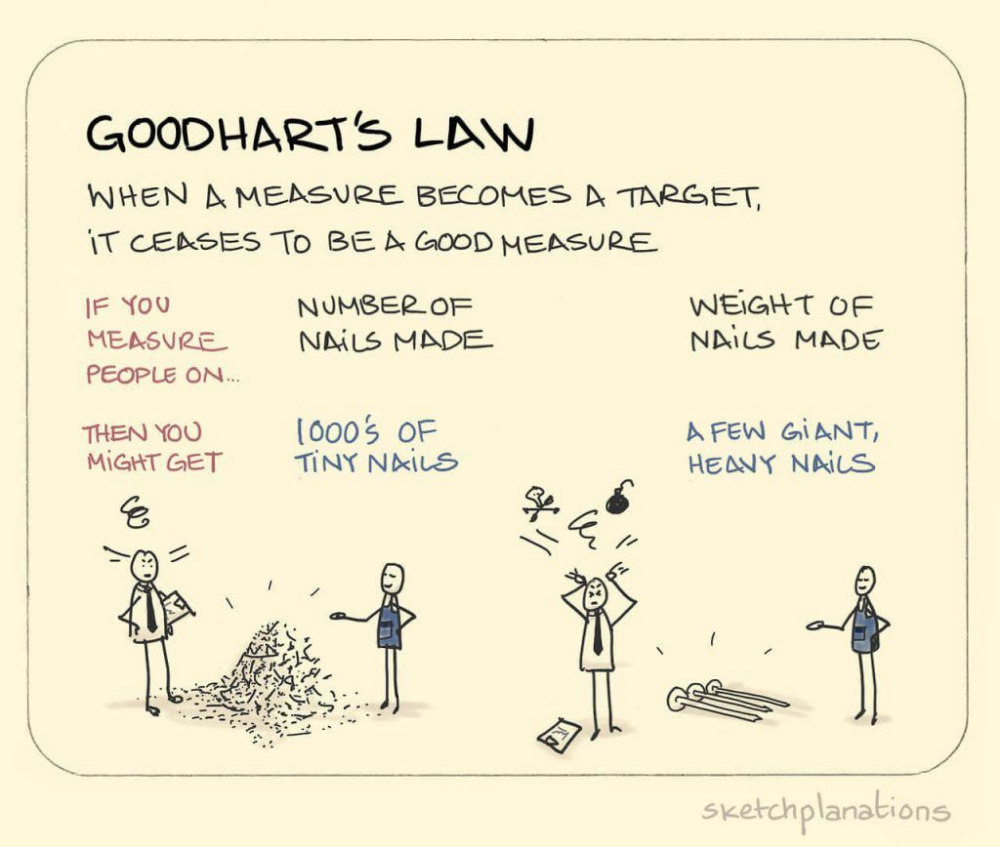

# 6.2 Optimization {: #02 }
!!! note "Reading Time: 4 minutes" 

Optimization is important to understand for AI safety concerns because it plays a central role in ML. AI systems, particularly those based on deep learning, are trained using optimization algorithms to learn patterns and associations from data. These algorithms update the model's parameters to minimize a loss function, maximizing its performance on the given task.[ \
 \
](https://duckduckgo.com/?q=Key%20Concepts%20in%20AI%20Safety%3A%20An%20Overview)Optimization amplifies certain behaviors or outcomes, even if they were initially unlikely. For example, an optimizer can search through a space of possible outputs and take extreme actions that have a high score according to the objective function, potentially leading to unintended and undesirable behavior. These include reward misspecification failures. A better recognition of the power of optimization to amplify certain outcomes might help in designing systems and algorithms that truly align with human values and objectives even under pressure of optimization. This involves ensuring that the optimization process is aligned with the intended goals and values of the system's designers. It also requires considering the potential failure modes and unintended consequences that can arise from optimization processes.

Risks from optimization are everywhere in AI Safety. It is only touched on briefly in this chapter, but will be discussed in further detail in the chapters on goal misgeneralization and agent foundations.

Optimization power plays a crucial role in reward hacking. Reward hacking occurs when RL agents exploit the difference between a true reward and a proxy reward. The increase in optimization power can lead to a higher likelihood of reward hacking behavior. In some cases, there are phase transitions where a moderate increase in optimization power results in a drastic increase in reward hacking.

## 6.2.1 Goodhart's Law {: #01 }

!!! info "Definition: Goodhart’s Law"

    
    
    "*When a measure becomes a target, it ceases to be a good measure.*"
    
    

This notion initially stems from the work of Charles Goodhart in economic theory. However, it has emerged as one of the primary challenges in many different fields including AI alignment today.

To illustrate this concept, the following is a story of a Soviet nail factory. The factory received instructions to produce as many nails as possible, with rewards for high output and penalties for low output. Within a few years, the factory had significantly increased its nail production—tiny nails that were essentially thumbtacks and proved impractical for their intended purpose. Consequently, the planners shifted the incentives: they decided to reward the factory based on the total weight of the nails produced. Within a few years, the factory began producing large, heavy nails—essentially lumps of steel—that were equally ineffective for nailing things.

([Source](https://lwfiles.mycourse.app/networkcapitalinsider-public/cc478b844a27de3f4f79f3dc0f9e0fde.jpeg))

A measure is not something that is optimized, whereas a target is something that is optimized. When we specify a target for optimization, it is reasonable to expect it to be correlated with what we want. Initially the measure might lead to the kind of actions that are truly desired. However, once the measure itself becomes the target, optimizing that target then starts diverging away from our desired states.

In the context of AI and reward systems, Goodhart's Law means that when a reward becomes the objective for an AI agent, the AI agent will do everything it can to maximize the reward function, rather than the original intention. This can lead to unintended consequences and manipulation of the reward system, as it can often be easier to "cheat" rather than to achieve the intended goals This is one of the core underlying reasons for reward hacking failures that we will see in subsequent sections.

Reward hacking can be seen as a manifestation of Goodhart's Law in the context of AI systems. When designing reward functions, it is challenging to precisely articulate the desired behavior, and agents may find ways to exploit loopholes or manipulate the reward system to achieve high rewards without actually fulfilling the intended objectives. For example, a cleaning robot may create its own trash to put in the trash can to collect rewards, rather than actually cleaning the environment. Understanding Goodhart's Law is crucial for addressing reward hacking and designing robust reward systems that align with the intended goals of AI agents. It highlights the need for careful consideration of the measures and incentives used in AI systems to avoid unintended consequences and perverse incentives. The next section dives deeper into specific instances of reward misspecification and how AIs can find ways to achieve the literal specification of the objective and obtain high reward while not fulfilling the task in spirit.