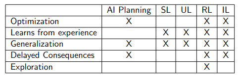
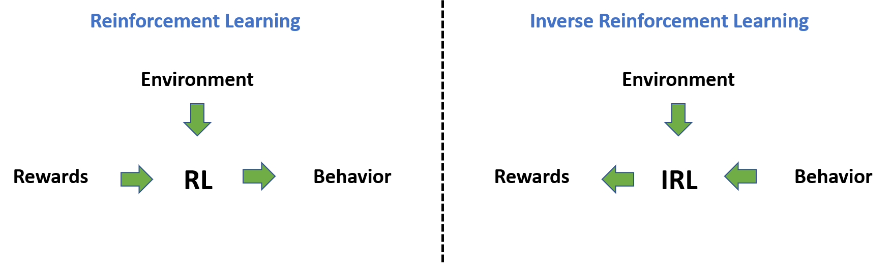

# 6.4 Learning from imitation {: #04 }

    

        <i class="fas fa-clock"></i>
        13 min read
    

    

        <i class="fas fa-file-alt"></i> 
        2503 words
    

The preceding sections have underscored the significance of reward misspecification for the alignment of future artificial intelligence. The next few sections will explore various attempts and proposals formulated to tackle this issue, commencing with an intuitive approach – learning the appropriate reward function through human behavior observation and imitation, rather than manual creation by the designers.

## 6.4.1 Imitation Learning (IL) {: #01 }

!!! info "Definition: Imitation Learning"

    Imitation learning entails the process of learning via the observation of an expert's actions and replicating their behavior.

Unlike reinforcement learning (RL), which derives a policy for a system's actions based on its interaction outcomes with the environment, imitation learning aspires to learn a policy through the observation of another agent interacting with the environment. Imitation learning is the general term for the class of algorithms that learn through imitation. Following is a table that distinguishes various machine learning based methods, where SL = Supervised learning; UL = Unsupervised learning; RL = Reinforcement Learning; IL = Imitation Learning. IL reduces RL to SL. IL + RL is a promising area.

<figure markdown="span">
{ loading=lazy }
  <figcaption markdown="1"><b>Figure 8:</b> Emma Brunskill (Winter 2022) “[Stanford CS234 : RL](https://web.stanford.edu/class/cs234/CS234Win2022/modules.html) - Lecture 1”</figcaption>
</figure>

IL can be implemented through behavioral cloning (BC), procedural cloning (PC) , inverse reinforcement learning (IRL), cooperative inverse reinforcement learning (CIRL), generative adversarial imitation learning (GAIL), etc…

One instance of this process's application is in the training of modern large language models (LLMs). LLMs, after training as general-purpose text generators, often undergo fine-tuning for instruction following through imitation learning, using the example of a human expert who follows instructions provided as text prompts and completions.

In the context of safety and alignment, imitation learning is favored over direct reinforcement to alleviate specification gaming issues. This problem emerges when the programmers overlook or fail to anticipate certain edge cases or unusual ways of achieving a task in the specific environment. The presumption is that demonstrating behavior, compared to RL, would be simpler and safer, as the model would not only attain the objective but also fulfill it as the expert demonstrator explicitly intends. However, this is not an infallible solution, and its limitations will be discussed in later sections.

## 6.4.2 Behavioral Cloning (BC) {: #02 }

!!! info "Definition: Behavioral Cloning"

    Behavioral cloning involves collecting observations of an expert demonstrator proficient at the underlying task, and using supervised learning (SL) to guide an agent to 'imitate' the demonstrated behavior.

Behavioral cloning is one way in which we can implement imitation learning (IL). There are also other ways such as inverse reinforcement learning (IRL), or cooperative inverse reinforcement Learning (CIRL). Unlike IRL, the goal behind behavioral cloning as a machine learning (ML) method is to replicate the demonstrator's behavior as closely as possible, regardless of what the demonstrator’s goals might be.

Self-driving cars can serve as a simplistic illustration of how behavioral cloning operates. A human demonstrator (driver) is directed to operate a car, during which data about the environment state from sensors like lidar and cameras, along with the actions taken by the demonstrator, are collected. These actions can include wheel movements, gear use, etc. This creates a dataset comprising (state, action) pairs. Subsequently, supervised learning is used to train a prediction model, which attempts to predict an action for any future environment state. For instance, the model might output a specific steering wheel and gear configuration based on the camera feed. When the model achieves sufficient accuracy, it can be stated that the human driver's behavior has been 'cloned' into a machine via learning. Hence, the term behavioral cloning.

The following points highlight several potential issues that might surface when employing behavioral cloning:

- **Confident incorrectness**: During the demonstrations, the human experts have some amount of background knowledge that they rely on, which is not taught to the model. For example, when training an LLM to have conversations using behavioral cloning, the human demonstrator might less frequently ask certain questions because they are considered ‘common sense’. A model trained to imitate will copy both - the types of questions asked in conversation, as well as, the frequency with which they are asked. Humans already possess this background knowledge, but an LLM doesn’t. This means that to have the same level of information as a human, the model should ask some questions more frequently to fill the gaps in its knowledge. But since the model seeks to imitate, it will stick to the low frequency demonstrated by the human and thus has strictly less information overall than the demonstrator for the same conversational task. Despite this dearth of knowledge, we expect it to be able to perform as a clone and reach human-level performance. This means in order to reach human performance on less than human knowledge it will resort to ‘making up facts’ that help it reach its performance goals. These ‘hallucinations’ will then be presented during the conversation, with the same level of confidence as all the other information. Hallucinations and confident incorrectness is an empirically verified problem in many LLMs including GPT-2 and 3, and raises obvious concerns for AI safety. ([source](https://arxiv.org/pdf/2103.15025.pdf))

- **Underachieving**: The types of hallucinations mentioned above arose because the model knew too little. However, the model can also know too much. If the model knows more than the human demonstrator because it is able to find more patterns in the environment state that it is given, it will throw away that information and reduce its performance to match human level. This is because it is trained as a ‘clone’. Ideally, we don’t want the model dumbing itself down or not disclosing useful new patterns in data just because it is trying to be humanlike or perform at a human level. This is another problem that will have to be addressed if behavioral cloning continues to be used as an ML technique.

## 6.4.3 Procedural Cloning (PC) {: #03 }

!!! info "Definition: Procedure cloning"

    Procedure cloning (PC) extends behavioral cloning (BC) by not just imitating the demonstrators outputs but also imitating the complete sequence of intermediate computations associated with an expert's procedure.

In BC, the agent learns to map states directly to actions by discarding the intermediate search outputs. On the other hand, the PC approach learns the entire sequence of intermediate computations, including branches and backtracks, during training. During inference, PC generates a sequence of intermediate search outcomes that mimic the expert's search procedure before outputting the final action.

The main difference between PC and BC lies in the information they utilize. BC only has access to expert state-action pairs as demonstrations, while PC also has access to the intermediate computations that generated those state-action pairs. PC learns to predict the complete series of intermediate computation outcomes, enabling it to generalize better to test environments with different configurations compared to alternative improvements over BC. PC's ability to imitate the expert's search procedure allows it to capture the underlying reasoning and decision-making process, leading to improved performance in various tasks. ([source](https://arxiv.org/abs/2205.10816))

A limitation of PC is the computational overhead compared to BC, as PC needs to predict intermediate procedures. Additionally, the choice of how to encode the expert's algorithm into a form suitable for PC is left to the practitioner, which may require some trial-and-error in designing the ideal computation sequence.

## 6.4.4 Inverse Reinforcement Learning (IRL) {: #04 }

!!! info "Definition: Inverse reinforcement learning (IRL)"

    Inverse reinforcement learning (IRL) represents a form of machine learning wherein an artificial intelligence observes the behavior of another agent within a particular environment, typically an expert human, and endeavors to discern the reward function without its explicit definition.

IRL is typically employed when a reward function is too intricate to define programmatically, or when AI agents need to react robustly to sudden environmental changes necessitating a modification in the reward function for safety. For instance, consider an AI agent learning to execute a backflip. Humans, dogs, and Boston Dynamics robots can all perform backflips, but the manner in which they do so varies significantly depending on their physiology, their incentives, and their current location, all of which can be highly diverse in the real world. An AI agent learning backflips purely through trial and error across a wide range of body types and locations, without something to observe, might prove highly inefficient.

IRL, therefore, does not necessarily imply that an AI mimics other agents’ behavior, since AI researchers may anticipate the AI agent to devise more efficient ways to maximize the discovered reward function. Nevertheless, IRL does assume that the observed agent behaves transparently enough for an AI agent to accurately identify their actions, and what success constitutes. This means that IRL endeavors to discover the reward functions that 'explain' the demonstrations. This should not be conflated with imitation learning where the primary interest is a policy capable of generating the observed demonstrations.

<figure markdown="span">
{ loading=lazy }
  <figcaption markdown="1"><b>Figure 9:</b> ([Source](https://miro.medium.com/v2/resize:fit:3508/1*rZoO-azxiEH3viQao8NcAA.png))</figcaption>
</figure>

IRL constitutes both a machine learning method, since it can be employed when specifying a reward function is excessively challenging, and a machine learning problem, as an AI agent may settle on an inaccurate reward function or utilize unsafe and misaligned methods to achieve it.

One of the limitations to this approach is that IRL algorithms presume that the observed behavior is optimal, an assumption that arguably proves too robust when dealing with human demonstrations. Another problem is that the IRL problem is ill-posed as every policy is optimal for the null reward. For most behavioral observations, multiple fitting reward functions exist. This set of solutions often includes many degenerate solutions, which assign zero rewards to all states.

## 6.4.5 Cooperative Inverse Reinforcement Learning (CIRL) {: #05 }

CIRL (Cooperative Inverse Reinforcement Learning) is an extension of the IRL (Inverse Reinforcement Learning) framework. IRL is a learning approach that aims to infer the underlying reward function of an expert by observing their behavior. It assumes that the expert's behavior is optimal and tries to learn a reward function that explains their actions.  CIRL, on the other hand, is an interactive form of IRL that addresses two major weaknesses of conventional IRL.

First, Instead of simply copying the human reward function CIRL is formulated as a learning process. It is an interactive reward maximization process, where the human functions as a teacher and provides feedback (in the form of rewards) on the agent's actions. This allows the human to nudge the AI agent towards behavioral patterns that align with their preferences. The second weakness of conventional IRL is that it assumes the human behaves optimally, which limits the teaching behaviors that can be considered. CIRL addresses this weakness by allowing for a variety of teaching behaviors and interactions between the human and the AI agent. It enables the AI agent to learn not only what actions to take but also how and why to take them, by observing and interacting with the human.

CIRL has been studied as a potential approach to AI alignment, particularly in scenarios where deep learning may not scale to AGI. However, opinions on the potential effectiveness of CIRL vary, with some researchers expecting it to be helpful if deep learning doesn't scale to AGI, while others have a higher probability of deep learning scaling to AGI.

## 6.4.6 The Goal Inference Problem {: #06 }

!!! info "Definition: Goal inference problem"

    The goal inference problem refers to the task of inferring the goals or intentions of an agent based on their observed behavior or actions.

This final section builds upon the limitations highlighted in previous sections to introduce the Goal Inference problem, and its simpler subset - the easy goal inference problem. Imitation learning based approaches, generally follows these steps:

1. Observe the user's actions and statements.

2. Deduce the user's preferences.

3. Endeavor to enhance the world according to the user's preferences, possibly collaborating with the user and seeking clarification as needed.

The merit of this method is that we can immediately start constructing systems that are driven by observed user behavior. However, as a consequence of this approach, we run into the goal inference problem. This refers to the task of inferring the goals or intentions of an agent based on their observed behavior or actions. It involves determining what the agent is trying to achieve or what their desired outcome is. The goal inference problem is challenging because agents may act sub-optimally or fail to achieve their goals, making it difficult to accurately infer their true intentions. Traditional approaches to goal inference often assume that agents act optimally or exhibit simplified forms of sub-optimality, which may not capture the complexity of real-world planning and decision-making. Therefore, the goal inference problem requires accounting for the difficulty of planning itself and the possibility of sub-optimal or failed plans.

However, it also optimistically presumes that we can depict a human as a somewhat rational agent, which might not always hold. The easy goal inference problem is a simplified version of the goal inference problem.

!!! info "Definition: Easy Goal inference problem"

    The easy goal inference problem involves finding a reasonable representation or approximation of what a human wants, given complete access to the human's policy or behavior in any situation.

This version of the problem assumes no algorithmic limitations and focuses on extracting the true values that the human is imperfectly optimizing. However, even this simplified version of the problem remains challenging, and little progress has been made on the general case. The easy goal inference problem is related to the goal inference problem because it highlights the difficulty of accurately inferring human goals or intentions, even in simplified scenarios. While narrow domains with simple decisions can be solved using existing approaches, more complex tasks such as designing a city or setting policies require addressing the challenges of modeling human mistakes and sub-optimal behavior. Therefore, the easy goal inference problem serves as a starting point to understand the broader goal inference problem and the additional complexities it entails.

Inverse reinforcement learning (IRL) is effective in modeling and imitating human experts. However, for many significant applications, we desire AI systems that can make decisions surpassing even the experts. In such cases, the accuracy of the model isn't the sole criterion because a perfectly accurate model would merely lead us to replicate human behavior and not transcend it.

This necessitates an explicit model of errors or bounded rationality, which will guide the AI on how to improve or be "smarter," and which aspects of the human policy it should discard. Nonetheless, this remains an exceedingly challenging problem as humans are not primarily rational with a bit of added noise. Hence, constructing any model of mistakes is just as complex as building a comprehensive model of human behavior. A critical question we face is: How do we determine the quality of a model when accuracy can no longer be our reliable measure? How can we distinguish between good and bad decisions?