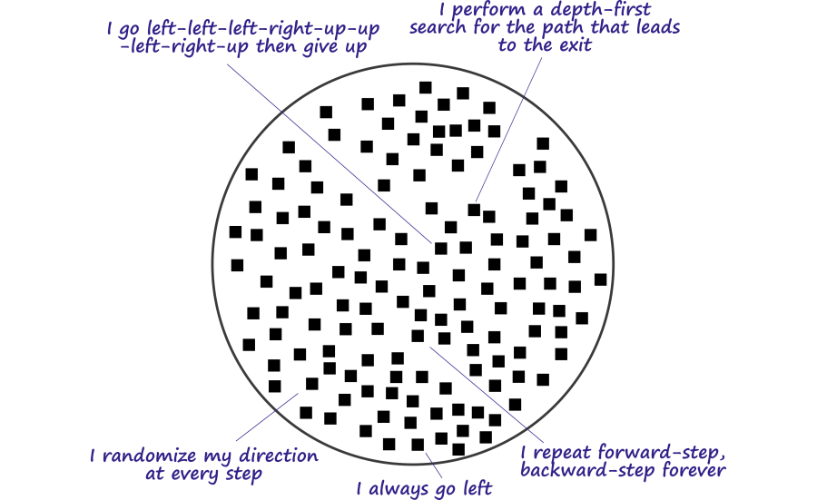
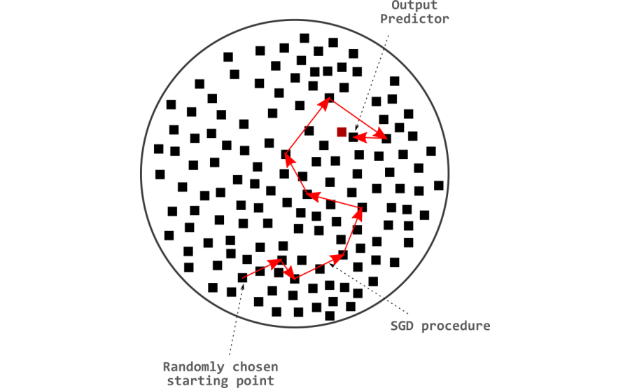
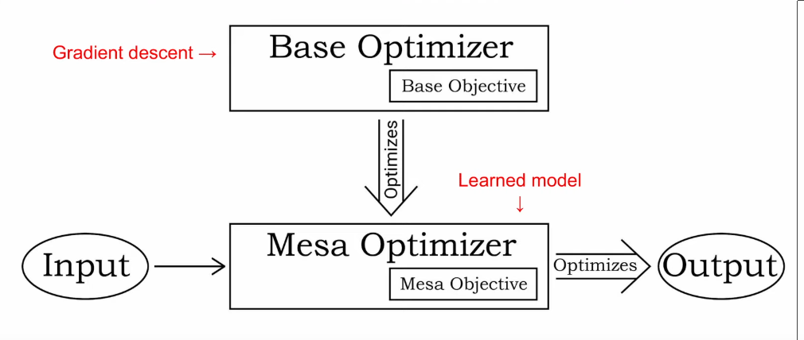
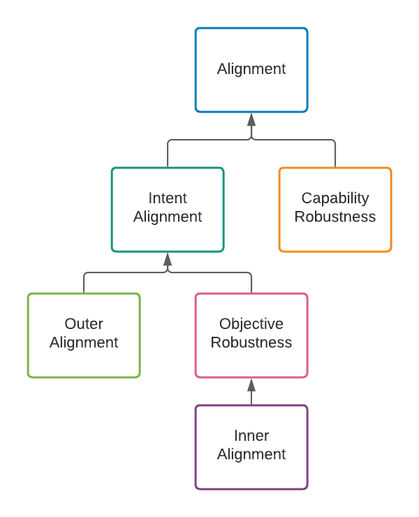

# 7.2 Inner Alignment {: #02 }
!!! note "Reading Time: 9 minutes" 

!!! warning "This section is still being written and is considered a work in progress."

## 7.2.1 Optimization = Search {: #01 }

Traditional programming requires the explicit coding of a set of instructions to solve a specified problem. Programmers go step-by-step discovering and implementing the required algorithms. However, sometimes it’s too hard to hand-code a solution. In this case, the focus changes to a learning based approach. The learning based approach entails the automated finding of new algorithms instead of relying on pre-programmed logic.

In machine learning, the term 'learning' refers to a system or an algorithm that continuously refines an algorithm. This means that ML can be broken down into three individual parts:

- **Learned algorithm**: This is represented by the parameters of the neural network. A combination of the floating point numbers in these parameters encodes an algorithmic process that matches the inputs to the desired outputs.

- **Objective**: This is either a piece of code, or math, that captures what the programmers want the learned algorithm to do. This could be, for example, a reward function for a reinforcement learning system, or a loss function in a deep learning system. Such functions take as input the answers or actions of our machine learning model, and output a measure of how good they are, which serves as feedback during training.

- **Refinement process**: The learned algorithm is initially made up of random floating point numbers. Which means that it initially performs random actions. Slowly through the process of refinement, it should perform the specific actions which cause it to achieve a good score on the desired objective. This is commonly an optimization algorithm such as stochastic gradient descent (SGD). This algorithm modifies the parameters of the learning model in function of its performance. For example, gradient descent strengthens or weakens the connections in a neural network in a way that makes its outputs achieve better scores according to the loss function. 

!!! info "Definition: Optimizer"

    
    
    *An ****optimizer**** is a system that internally searches through some space of possible outputs, policies, plans, strategies, etc. looking for those that do well according to some internally-represented objective function. - *Hubinger et. al. (Jun 2019) “*[Risks from Learned Optimization (Glossary)](https://intelligence.org/learned-optimization/)*”
    
    

Optimization algorithms like gradient descent can be thought of as being analogous to search algorithms. Every collection of parameters making up neural networks encodes some algorithm. So the search space is the set of algorithms that can be encoded by the available number of free parameters in the neural network.

The size of the search space corresponds to the number of free parameters in a neural network. This then also relates directly to the quantity of algorithms that can theoretically be located within this space. More free parameters, implies a more complex possible internal algorithm. This is referred to as the "algorithmic range" of the network.

!!! info "Definition: Algorithmic Range"

    
    
    *The ****algorithmic range**** of a machine learning system refers to how extensive the set of algorithms capable of being found be the base optimizer is. - *Hubinger et. al. (Jun 2019) “*[Risks from Learned Optimization (Glossary)](https://intelligence.org/learned-optimization/)*”
    
    

As an example, In the following diagram every black dot represents a full set of possible neural network parameters, which collectively represent some algorithm. A maze solving agent then has following search space of algorithms:

Source: Harth, Rafael (Aug 2020) “*[Inner Alignment: Explain like I'm 12 Edition](https://www.alignmentforum.org/posts/AHhCrJ2KpTjsCSwbt/inner-alignment-explain-like-i-m-12-edition)*”

Stochastic gradient descent (SGD) searches through this space according to the direction dictated by the steepest descent of the loss. Depending on where gradient descent starts in this search space, certain algorithms might be harder, or easier to reach. This is called “reachability”.

!!! info "Definition: Algorithmic Reachability"

    
    
    *The reachability of a learned algorithm refers to the difficulty for the base optimizer to find that learned algorithm. - *Hubinger et. al. (Jun 2019) “*[Risks from Learned Optimization (Glossary)](https://intelligence.org/learned-optimization/)*”
    
    

The search target is an algorithm that performs well on the evaluation criteria. In supervised learning, for instance, the search seeks the best parameters that minimize the difference between predicted outputs and true labels. In reinforcement learning, it focuses on locating the optimal policy to maximize the cumulative reward signal.

Source: Harth, Rafael (Aug 2020) “*[Inner Alignment: Explain like I'm 12 Edition](https://www.alignmentforum.org/posts/AHhCrJ2KpTjsCSwbt/inner-alignment-explain-like-i-m-12-edition)*”

## 7.2.2 Mesa Optimizers {: #02 }

In the framing of Risks from learned optimization (RFLO), gradient descent is referred to as a base optimizer.

!!! info "Definition: Base Optimizer"

    
    
    *A ****base optimizer ****is an optimizer that searches through algorithms according to some objective. A ****base objective**** is the objective of a base optimizer. The algorithms that a base optimizer is searching through are called ****learned algorithms****. - *Hubinger et. al. (Jun 2019) “*[Risks from Learned Optimization (Glossary)](https://intelligence.org/learned-optimization/)*”
    
    

Throughout the search procedure (training), direct control over the resulting algorithm type remains minimal. Provided that the discovered set of parameters perform well on the original specified objective, training could potentially result in any class of algorithm. Consequently, one type of algorithm potentially ‘discovered’ by SGD while going through the algorithm space could be yet another search (optimization) algorithm. In essence, learned algorithms can serve as optimizers themselves. Such entities are referred to as mesa- (or inner or learned) optimizers. They search for their own mesa-objective. Therefore, during training, SGD could identify a mesa-optimizer—a model not only optimized but also capable of executing optimization itself.

!!! info "Definition: Mesa-Optimizer"

    
    
    *A ****mesa-optimizer**** is a learned algorithm that is itself an optimizer. A ****mesa-objective**** is the objective of a mesa-optimizer. - *Hubinger et. al. (Jun 2019) “*[Risks from Learned Optimization (Glossary)](https://intelligence.org/learned-optimization/)*”
    
    

Source: Hubinger, Evan (Jan 2023) “*[AI Safety Talks - Risks from Learned Optimization](https://www.youtube.com/watch?v=oY7c75ggrRI)*”

“Meta” refers to the above/upper level of something. E.g. Meta-Learning is learning how to learn. Similarly "Mesa" is Greek for inner/within/inside. "Optimizer" is the term for something that solves problems. So "mesa-optimizer" means something like "inner problem-solver".

As an example, imagine evolution as a process that is trying to get the best genes to be passed on through generations. This is the base optimizer. It tries out random mutations, and if these changes help the organism survive better or reproduce more, those changes are kept and passed on. Now, consider humans. They are a product of this process, but their behaviors and goals are not solely focused on passing on genes. This makes humans mesa-optimizers. They are optimizing for their own objectives, not just the objective that evolution 'intended'.

Why does finding a mesa-optimizer warrant more concern than locating any other arbitrary algorithm type? Two primary reasons exist:

- Firstly, optimization can lead to arbitrarily bad end states. Failures due to over-optimization were already explored in the previous chapter. It can lead to possible extreme actions that veer from intended behavior and potentially induce harm or undesirable outcomes. While a conventional algorithm is a mere set of heuristics, optimizers adjust their own behavior or environment to yield improved results. Similar to how SGD can improve the performance of the learned algorithm, these systems can learn from experience (potentially even post training) and enhance performance over time relative to their mesa-objective.

- Secondly, there are now two divergent search targets—SGDs human-set performance metric (base objective), and the mesa-optimizers own performance metric (mesa-objective). This means that now there are two problems - Align the goal inside the human mind with the goal given to gradient descent, and, align the goal inside gradient descent to the goal given to the mesa optimizer.

Trying to get the objective of these two different optimization processes to match up with each other is what is called the inner alignment problem.

!!! info "Definition: Inner alignment problem"

    
    
    “... *[We define the] problem of aligning mesa-optimizers with the base objective as the ****inner alignment problem.***”
    
    Hubinger et. al. (Jun 2019) “[Risks from Learned Optimization](https://arxiv.org/abs/1906.01820)”
    
    

There are some common confusions around the concept of mesa-optimizers and mesa-objectives that merit clarification:

**Mesa-Optimizers ≠ Sub-Agents: **Optimization does not imply agency. Similarly, in the context of deep learning, a mesa-optimizer is simply a neural network that is implementing some optimization process and not some emergent subagent inside that neural network. Mesa-optimizers are simply a particular type of algorithm that the base optimizer might find to solve its task. Furthermore, the base optimizer will generally be considered a straightforward optimization algorithm, and not as an intelligent agent choosing to create a subagent. A subagent is an agent that is a part of an agent; a mesa-optimizer is an optimizer that is optimized by an optimizer.

**Mesa-Objective ≠ Behavioral Objective**: Informally, the behavioral objective is the objective which “appears” to be optimized by the system’s behavior. This is in contrast to the mesa-objective, which is the objective actually being used by the mesa-optimizer in its optimization algorithm.

!!! info "Definition: Behavioral Objective"

    
    
    *The behavioral objective is what an optimizer appears to be optimizing for. Formally, the behavioral objective is the objective recovered from perfect inverse reinforcement learning.*
    
    *- *Hubinger et. al. (Jun 2019) “*[Risks from Learned Optimization (Glossary)](https://intelligence.org/learned-optimization/)*”
    
    

## 7.2.3 Objective taxonomy {: #03 }

Within the alignment community, unfortunately, a myriad of definitions for 'inner alignment' circulate. The term 'inner alignment' has since been extended beyond its original narrow context as defined above, leading to widespread confusion. This situation has been acknowledged by Evan Hubinger himself in [response](https://www.lesswrong.com/posts/HYERofGZE6j9Tuigi/?commentId=Gp7fDFdN7sFCJAA2m) to John Wentworth's post, ["Inner Alignment Failures" Which Are Actually Outer Alignment Failures](https://www.lesswrong.com/posts/HYERofGZE6j9Tuigi/inner-alignment-failures-which-are-actually-outer-alignment).

Goal misgeneralization leverages its own breakdown of the alignment problem as was introduced earlier. Misgeneralization, in the generalization taxonomy, points to an AI system's inability to accurately generalize its learned objective to new distributions, while inner alignment, belonging to the objective-based taxonomy, zeroes in on aligning the base objective with the learned objective  within the system.

Source: Hubinger, Evan (Nov 2020) “*[Clarifying inner alignment terminology](https://www.alignmentforum.org/posts/SzecSPYxqRa5GCaSF/clarifying-inner-alignment-terminology)*”

The emphasis within the objective focused approach is towards ensuring that AI models or agents have the correct objectives or goals. The natural decomposition is then to separate alignment into two problems:

- How do we specify an outer (base) objective that incentivizes good behavior in all situations that the model will ever encounter?

- How do we ensure that the mesa objective equals the base objective?