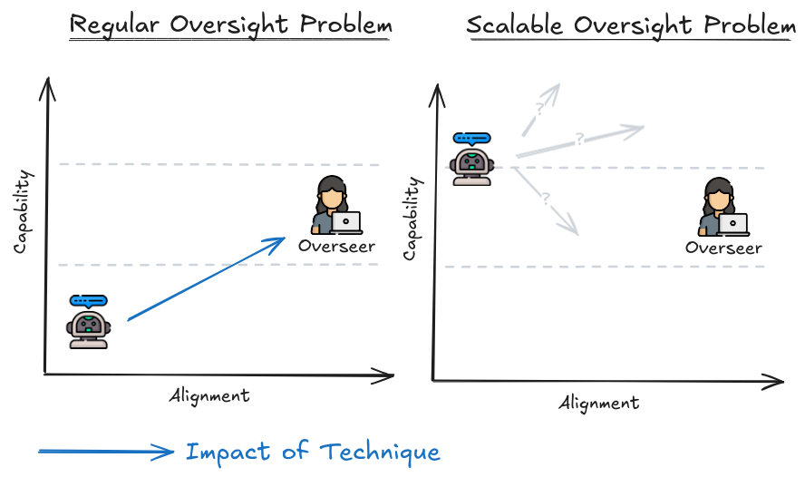
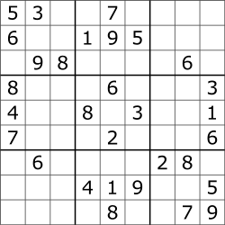
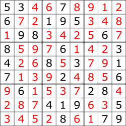

# 8.1 Oversight

    

        
            <i class="fas fa-clock"></i>
        
        

            
Reading Time

            
9 min

        

    

**Why do we need oversight?** As AI systems get smarter, they will start doing tasks that are hard for humans to evaluate. Evaluation means checking how well the AI did after completing a task, while feedback is the information we give to the AI during or after it works to help it learn and improve. Right now, we can still use methods like Reinforcement Learning from Human Feedback (RLHF) to guide AI in the right direction. But we can only give feedback if we can still evaluate the outputs. As tasks get more complex, even experts might struggle to provide accurate evaluations and feedback. So, we need new ways to give accurate feedback, even for tasks that are beyond human expertise. This is the goal of scalable oversight.

Scalable Oversight techniques help humans provide accurate feedback on tasks to ensure AI systems are aligned with our goals, even after the task complexity outstrips the ability of the best human experts. This can happen during the AI's training or deployment and isn't limited to RLHF-style feedback.

<figure markdown="span">
{ loading=lazy }
  <figcaption markdown="1"><b>Figure 8.1:</b> The difference between regular oversight safety research, and scalable oversight safety research.</figcaption>
</figure>

**Aligning RL Agents vs. LLMs** . A few years ago it looked like the path to AGI was by training deep RL agents from scratch in a wide range of games and multi-agent environments. These agents would be aligned to maximizing simple score functions such as survival and winning games and wouldn’t know much about human values. Aligning the resulting agents would require a lot of effort: not only do we have to create a human-aligned objective function from scratch, we’d likely also need to instill new capabilities into the agents like understanding human society, what humans care about, and how humans think. Large language models (LLMs) make this a lot easier: they come preloaded with a lot of humanity’s knowledge, including detailed knowledge about human preferences and values. Out of the box they aren’t agents who are trying to pursue their own goals in the world, and their objective functions are quite malleable. For example, they are surprisingly easy to train to behave more nicely. If AGI comes out of LLMs it might be easier to align. ([Leike, 2022](https://aligned.substack.com/p/alignment-optimism))

## 8.1.1 Training Signals & Fuzzy Tasks {: #01}

Before we understand how to actually align smarter than human AIs, we need to understand the general concept of training signals and why they are getting increasingly harder to generate as AI is starting to display higher levels of general purpose capabilities.

**What are training signals?** Training signals is a general term that we use for inputs that are used to guide AI learning. They can be rewards, labels, or evaluations indicating how well the AI is performing a task. For example:

- In supervised learning (SL), the training signal is the correct label for each example.

- For large language models (LLMs) using self-supervised learning (SSL), training signals are the correct next word in a sentence during pre-training. Human feedback on the quality of responses during fine-tuning is also a type of training signal guiding the outputs in a direction we want (a more “aligned” direction).

- In reinforcement learning (RL), training signals are rewards based on the success/failure of actions (or multiple actions), like points scored in a game or successful navigation to a location.

These signals shape how AI systems learn and are used to both evaluate performance and provide feedback.

**Easy-to-generate training signals.** For some tasks, generating training signals is simple. AlphaGo Zero, an RL agent playing Go, is a good example of this. The game has clear rules and win/loss outcomes, so training signals are straightforward: algorithmically generated win and lose signals directly measure performance, making it easy for the model to learn and improve its gameplay.

**Hard-to-generate training signals.** For other tasks, creating training signals is much harder. For example, training GPT models to generate accurate text summaries is challenging. The AI needs to convey correct information while being coherent and interesting. Success is subjective. Since it depends on individual reader preferences, it is hard to define clear, algorithmically generated training signals. Another example is self-driving cars navigating through busy city streets. These cars need to make real-time decisions, and the training signals or rewards for safe and efficient navigation are difficult to define due to varying contexts and sometimes conflicting traffic laws and safety considerations.

**Fuzzy tasks.** We call tasks where training signals are hard to generate “fuzzy tasks“. These tasks generally have ambiguous or ill-defined objectives and outcomes. We can’t generate precise training signals due to inherent subjectivity and variability in “correct responses”. Fuzzy tasks lack clear, objective criteria for success. Unlike well-defined tasks with specific, measurable goals, fuzzy tasks are more open-ended, which complicates our job of coming up with training signals. If it's difficult to provide precise rewards or labels that accurately capture the desired behavior, the training process becomes complicated. AI systems might not receive the consistent, reliable feedback needed to learn effectively. This is essentially highlighting again the difficulty of the reward specification problem that we talked about in previous chapters.

**Fuzzy tasks and Scalable Oversight.** Fuzzy tasks are closely related to AI alignment, where ensuring AI systems act in accordance with human values and intentions is challenging due to ambiguity and subjectivity. Aligning AI with human values is a fuzzy task. Oversight techniques aim to solve alignment by providing training signals for fuzzy tasks, including feedback and imitation learning techniques like RLHF, Constitutional AI (CAI), and Inverse Reinforcement Learning (IRL). Scalable oversight techniques aim to provide training signals for fuzzy tasks that are too complex for even experts to understand or evaluate.

To make scalable oversight techniques viable verification needs to be easier than generation, and preferably (but not necessarily) tasks should be decomposable. These properties will be discussed in the next sections.

## 8.1.2 Verification vs. Generation {: #02}

**What Does P ≠ NP Mean?** In computer science, we classify problems based on how hard they are to solve (generate a solution) and how hard they are to check (verify a solution).

- P (Polynomial time): These are problems that a computer can solve quickly.

- NP (Nondeterministic Polynomial time): These are problems where, if you have a solution, you can check it quickly, but finding the solution might take a long time.

**What is generation?** Generation is the process of coming up with solutions from scratch. This means searching through many possibilities, which can take a lot of time and computing power. For example, solving a Sudoku puzzle involves filling a 9x9 grid with numbers so that each row, column, and 3x3 subgrid contains all the digits from 1 to 9 without repeating. If you've ever tried to solve a Sudoku puzzle, you know it involves a lot of trial and error to make sure all the rules are followed.

<figure markdown="span">
{ loading=lazy }
  <figcaption markdown="1"><b>Figure 8.2:</b> ([Wikipedia](https://en.wikipedia.org/wiki/Sudoku))</figcaption>
</figure>

Generation here involves filling in the blank grid while ensuring all the constraints (unique numbers in rows, columns, and subgrids) are satisfied.

**What is verification?** Verification is the process of checking whether a given solution attempt is correct. Using the Sudoku example, verification means making sure that each row, column, and subgrid contains all the digits from 1 to 9 without any repeats. Once someone gives you a completed Sudoku puzzle, checking whether it's correct is straightforward and quick. This idea is central to the concept of P ≠ NP.

<figure markdown="span">
{ loading=lazy }
  <figcaption markdown="1"><b>Figure 8.3:</b> ([Wikipedia](https://en.wikipedia.org/wiki/Sudoku))</figcaption>
</figure>

**Examples: Illustrating Verification is Easier Than Generation** . This is a very general property that holds across many domains:

- Formal Problems: In computational complexity theory, most computer scientists believe that P ≠ NP ([Wikipedia](https://en.wikipedia.org/wiki/P_versus_NP_problem#Reasons_to_believe_P_%E2%89%A0_NP_or_P_=_NP)), which means there are many problems where checking a solution is easier than finding one. This is seen in tasks like solving SAT problems or graph algorithms.

- Sports and Games: It's easier to look at a football scoreboard to see who is winning than it is to play the game well.

- Consumer Products: Comparing the quality of smartphones based on user reviews is simpler than designing and building a new smartphone.

- Job Performance: Evaluating how well an employee is doing is less demanding than actually doing the job.

- Academic Research: While reviewing research can be tough, it's still less work than producing new research.

**Why Verification Being Easier Than Generation Matters for Scalable Oversight** . This fact is crucial for scalable oversight because it allows us as human overseers to efficiently ensure the correctness and safety of outputs produced by complex systems without needing to fully understand or replicate the entire generation process. If P ≠ NP is true , it implies that we might be able to trust and delegate alignment research itself to AI models, because we can comparatively easily verify that their solutions work while they have to do the hard task of generating the solutions to alignment. Overall operating under this assumption can make the task of aligning advanced AI systems seem more feasible. The next few paragraphs go into the debate of how valid this assumption is.

**Verification in Adversarial Contexts** . When verifying something in situations where someone might be actively trying to trick or attack you, the process becomes much harder. Put another way, if we have AIs that are deceptive, the problem becomes significantly trickier. For example, making sure software is secure against all possible attacks can be tougher than writing the software in the first place. An attacker only needs to find one security hole, but the person verifying must check everything to ensure there are no holes. This makes verification very challenging. Similarly creating a secure system in cryptography is hard, but proving that it’s secure against all possible attacks is even more difficult. You need to consider every potential way someone might try to break the system, which is a huge task.

**Easier than generation does not mean verification is trivial** . Just because verification is theoretically easier than generation doesn’t mean it’s always easy in practice. For example, checking a complex mathematical proof can be very hard. Writing the proof takes creativity and deep understanding, but verifying it requires careful and detailed checking, which can be exhausting and prone to mistakes. In the case of software, writing secure software is challenging, but verifying that it’s completely secure is even harder. Even though verifying a problem’s solution might be easier than generating the solution, the process can still be very difficult and require significant effort and expertise.

**Verification of Safety vs. Provable Alignment** . In the event that we have to deal with superintelligent AI, just verifying its behavior might not be enough. Some researchers argue that we need to prove that the AI will always act in ways that align with human values. Verification means checking whether the AI behaves correctly in specific situations. Provable alignment means giving solid evidence that the AI will act correctly in every possible situation, even new and unexpected ones. This requires more than just checking—it needs formal methods and guarantees, which is extremely difficult.

**Verification vs. Mathematical Proof** . Verification involves checking if a specific solution is correct, usually through testing or inspection. A mathematical proof, on the other hand, is a rigorous logical argument that shows a statement is always true. For example, verifying a Sudoku solution checks if the given arrangement is correct, while a mathematical proof might show that any Sudoku puzzle with a certain number of clues always has a unique solution.