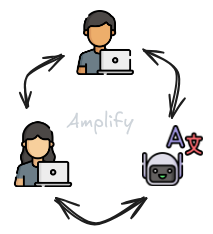
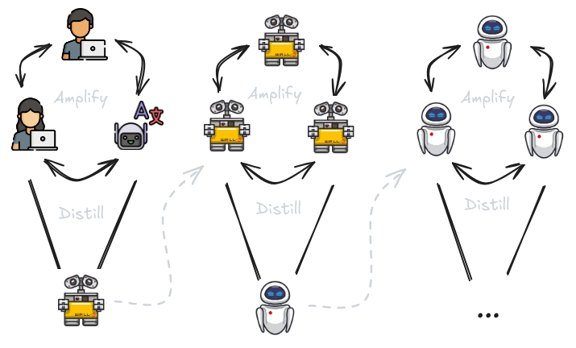

# 8.4 Iterated Amplification

    

        
            <i class="fas fa-clock"></i>
        
        

            
Reading Time

            
13 min

        

    

In previous sections, we discussed methods for decomposing tasks and potentially emulating human decision making by breaking down cognition into smaller components. In this section, we will explain one of the primary motivations for wanting to decompose tasks in the first place - to amplify the abilities of overseers. We want to enhance (amplify) the capabilities of humans or AI to generate better training signals to help keep iteratively aligning the AI.

## 8.4.1 Amplification {: #01}

**What is capability amplification?** Amplification is the process of enhancing the abilities of an overseer, whether human or AI, to solve complex tasks that exceed the capacity of a single overseer. The most common type of amplification is also called capability amplification. It focuses on enhancing an AIs ability to solve complex tasks by improving its intelligence and problem-solving skills. We want AIs not just to imitate human behavior but to improve upon it, making better decisions and achieving superior outcomes. ([Christiano Paul, 2016](https://ai-alignment.com/policy-amplification-6a70cbee4f34)) We can amplify capabilities in many different ways:

1. **Aggregation** : We can collaborate with each other and aggregate the expertise of many experts to increase our ability to solve complex tasks. For things like fuzzy tasks, where the evaluation criteria is subjective, using multiple experts to provide feedback can create a more reliable and representative training signal. As an example, in imitation learning approaches, collecting demonstrations from a group of experts instead of an individual can help normalize the behavior distribution and improve the overall performance on the task. So simply using more overseers is one approach to amplification.

2. **Assistants** : In addition to amplifying abilities by getting more overseers involved, we can also simply improve individual performance by using assistants. As an example, if we want to use an LLM to assist in conducting medical research, we could use it to read through large amounts of medical literature and highlight potential treatments based on patterns and insights it identifies. The AI assistant provides a list of potential treatments, which a team of medical researchers can then review in detail and further investigate.

3. **Task Decomposition** : While not necessary for amplification, task decomposition and delegation is often one of the most common ways of implementing amplification. Having tasks that can be factored and solved individually makes solving problems much more scalable. In the same example as above of using an LLM as a medical research tool, if we have task decomposability then we can amplify the abilities of researchers further. The LLM could first identify relevant studies and data, then another AI model could extract and summarize key findings, and finally, a team of experts could review these summaries to make informed decisions about potential treatments.

<figure markdown="span">
{ loading=lazy }
  <figcaption markdown="1"><b>Figure 8.11:</b> An example of aggregation and AI assistants amplifying overall abilities of an overseer. ([Christiano, 2020](https://forum.effectivealtruism.org/posts/63stBTw3WAW6k45dY/paul-christiano-current-work-in-ai-alignment))</figcaption>
</figure>

**What is iterated amplification?** Even though we are amplifying capabilities, the underlying goal is to still use this research for alignment. Capability amplification allows us to avoid the overwhelming difficulty of reward specification, or of generating training signals for complex fuzzy tasks. Instead, we can do incremental improvements.

Iterated Amplification builds on the basic concept of amplification by making the process recursive. Each iteration involves using the amplified system to generate improved training signals and solutions to problems, so we can iteratively use these better training signals to train more capable and aligned models. These improved models then further amplify our abilities, creating a feedback loop of scaling oversight. Theoretically, we can use this to scale human oversight to any task.

By focusing on making the AI a little better each time, we avoid the need for a perfect initial design. We just keep improving it step by step. In an ideal world this allows us to mitigate the reward specification problem, and ensures that as AI systems become more powerful, they also become more adept at handling complex tasks without losing alignment.

Here is a rough example of how the iterated amplification process might go:

1. **Initial Training** : We begin by training a foundational LLM on a broad dataset to develop general capabilities, similar to how models like GPT-3 are trained on vast amounts of text data to understand and generate human language.

2. **Amplification** : In our medical research example, the LLM is fine-tuned and used to help identify and diagnose complex illnesses. We next break down the complex diagnosis into smaller, manageable subtasks that the model can handle. These might include identifying primary symptoms, correlating them with known diseases, and suggesting initial tests or treatments. Multiple instances of the LLM can each handle a different sub-task. One instance focuses on gathering and analyzing detailed patient symptoms, another on matching these symptoms with known medical conditions, and a third on suggesting initial tests or treatments. Combine the solutions of the sub-tasks to address the original complex problem, creating a more capable overall system. The model combines these into a comprehensive detailed report that includes a likely diagnosis, suggested tests to confirm the diagnosis, and potential treatment options.

3. **Retraining** : This output is then reviewed by a group of medical experts, who provide feedback. The feedback and outputs are used to retrain the LLM, improving its ability to identify complex diseases with each iteration.

4. **Iteration** : This process is repeated, with each cycle involving further amplification and retraining. The model becomes progressively better at identifying treatments, providing more accurate and useful outputs with each iteration. This iterative loop ensures continuous improvement in both capability and alignment.

**Reliability Amplification** . Capability Amplification focuses on making an AI system smarter or more capable by improving its ability to solve complex tasks through collaboration and breaking down tasks into simpler parts. Reliability Amplification, on the other hand, focuses on making an AI system more dependable by reducing its failure rate. It ensures that the AI system can consistently perform these tasks correctly without making mistakes. Even if an AI usually works well and aligns with human values, it might occasionally behave incorrectly, especially when faced with rare or unusual inputs. If it behaves in an unintended manner 1% of the time, combining ten decisions from these models could lead to a 9.6% failure rate. Any single failure in the process makes the whole process fail. This makes the combination less reliable, even if it is more capable. Reliability amplification aims to make mistakes extremely rare, thus making the AI more aligned. Overall, the approach is complementary to capability amplification. ([Christiano, 2016](https://ai-alignment.com/reliability-amplification-a96efa115687))

Some ideas on how we can implement reliability amplification schemes:

1. **Redundant Systems:** One method is to use multiple AI systems to perform the same task independently. This redundancy means that even if one system fails, others can still provide the correct output. As an example, if we are using language models in a reliability critical domain like healthcare, we can use three separate instances of the same LLM to analyze the same patient symptoms independently of each other.

2. **Majority Voting:** When multiple models are used on the same task, their outputs can be compared. If most systems agree on a solution, it can be considered more likely to be correct. If one system's output is different, the majority vote can help choose the right answer, reducing the chance of failure. Continuing the example from above, each instance of the LLM proposes a diagnosis. If two or more instances agree on the same diagnosis, it is considered more reliable. If one instance disagrees, the majority vote is used to determine the final diagnosis.

3. **Error Checking:** In safety critical domains, we can implement mechanisms to cross-check and validate the outputs of the AI systems. This involves using different methods or algorithms to solve the same problem and comparing the results to ensure accuracy. In the context of the example, we can implement additional mechanisms to validate the outputs. For example, use separate algorithms or a rule-based system to cross-check the diagnosis provided by the LLMs.

4. **Iterative Improvement:** Continuously refine the AI systems to reduce their individual failure rates. In the context of the medical LLM example, we would continuously monitor and refine the model by feeding back cases where the diagnosis was incorrect or uncertain. Then we can improve the models based on this feedback to reduce their individual failure rates over time.

**Security Amplification** . Security amplification addresses the challenge of ensuring that an aligned AI system does not behave badly on rare or "bad" inputs. While reliability amplification focuses on reducing the failure probability of an aligned AI, security amplification aims to reduce the prevalence of these bad inputs. Essentially, it seeks to make it exponentially difficult to find an input that would cause the AI to behave undesirably. ([Christiano, 2016](https://ai-alignment.com/security-amplification-f4931419f903))

In practical terms, security amplification is about creating AI systems that are robust against adversarial inputs. These are inputs specifically designed to exploit vulnerabilities in the AI, causing it to act in unintended ways. AI models need mechanisms to protect against inputs that exploit these weaknesses. Security amplification allows for iterative improvement of AI systems. This is quite similar to the concept of adversarial inputs or adversarial training methods which we discussed in previous chapters.

## 8.4.2 Distillation {: #02}

**Limitations of amplification alone.** Amplification is a powerful technique that enhances the abilities, reliability, and security of AI systems. However, amplification alone presents several challenges:

1. **Complexity** : Amplified systems can become so complex that they are difficult for humans to understand and manage. This complexity can obscure how decisions are made, making it challenging to ensure that the system behaves safely and as intended.

2. **Resource Use** : Amplified models often require significant computational resources. Continuing to amplify and scale can be quite costly, particularly for real-time or resource-constrained applications.

3. **Operational Efficiency** : Amplified systems may involve many interacting components, leading to problems of coordination, inefficiencies in execution and difficulties in maintaining coherence and stability.

It is to address these limitations that we need the step of distillation.

**What is distillation?** Distillation is a process that transforms a large, complex model (or system of models) into a smaller, more efficient version without losing the essential capabilities gained through amplification. The term "distillation" is used because it is similar to the distillation process in chemistry. In chemistry, the term is used to mean purifying a substance by removing impurities. Similarly, AI Safety model distillation aims to "purify" the knowledge gained during amplification to retain the core functionality and abilities in a more streamlined form.

The larger, more complex model is often called the "teacher" model, and the smaller, more efficient model is called the "student" model. This process allows the smaller model to mimic the behavior and performance of the larger model while being faster and requiring fewer resources. Here is the general process for distilling down the knowledge of an amplified model:

1. Training the teacher: Initially, a large and complex model is trained on a dataset. This is the amplified model.

2. Generating targets: The teacher model is then used to generate outputs on some set of training data. This includes the final outputs, but also the probabilities assigned to each possible outcome (soft targets).

3. Training the Student Model: The student model is trained using these soft targets as well as the original training data. By mimicking the outputs of the teacher model, the student model learns to imitate its performance. During distillation, the student model learns to approximate the function learned by the teacher model. This is typically done by minimizing a loss function that measures the difference between the student’s predictions and the teacher’s soft targets.

## 8.4.3 Iterated Distillation and Amplification (IDA) {: #03}

Having explored the mechanisms of amplification and distillation individually, we can combine these two approaches in a continuous iterative loop that we call Iterated Distillation and Amplification (IDA). The primary objective of IDA is to generate progressively better training signals using amplified models for tasks that are hard to evaluate directly, thereby maintaining oversight over AI models as their outputs become too complex for humans to assess accurately. This approach aims to address the specification or outer alignment problem.

The advantage of IDA lies in its iterative nature, allowing the gradual construction of a robust training signal through task decomposition and recomposition, rather than depending on a perfectly specified signal from the outset.

<figure markdown="span">
{ loading=lazy }
  <figcaption markdown="1"><b>Figure 8.12:</b> Iterated Distillation and Amplification (IDA) ([Christiano, 2020](https://forum.effectivealtruism.org/posts/63stBTw3WAW6k45dY/paul-christiano-current-work-in-ai-alignment))</figcaption>
</figure>

**Step-by-Step Process for IDA** . Here is how we can go about theoretically using IDA to generate iteratively better training signals/feedback for our models:

- **Initial Model Training** : Start with a baseline model that can perform a relatively simple version of the task. We can use supervised learning, imitation learning, or reinforcement learning to train this initial model to get some base level of capabilities and alignment.

- **Amplification** : Use various copies of the model, external tools, or any other techniques to improve the capabilities of the model to solve more complex tasks. One example of a complex task is generating training signals. The overseer uses the amplified abilities to assist in generating better training signals.

- **Task decomposition** : If possible, break the task into individually achievable sub-tasks. Multiple copies of the model solve the subtasks and work in parallel. Then we combine the collective outputs to solve the more complex problem.

- **Distillation** : Train a compressed, simpler model (student) to imitate the behavior of the complex amplified system (teacher). This process simplifies or "distills" the complex behavior of a more advanced system into a form that a single model can understand and replicate. The goal is to retain the amplified capabilities while making the model more efficient and preserving the level of alignment. This distillation step helps scalability. If we improve efficiency of a more capable, more aligned model, we can run more copies of it. If we can run more copies we can continue the process.

- **Iteration** : The distillation and amplification steps are repeated. Each cycle refines the model, making it more capable and better aligned.

**Limitations and Criticisms of IDA** 1. **Distillation Must Preserve Alignment**: Training methods should ensure that the distilled model behaves as the overseer would, without introducing misaligned behaviors.

2. **Amplification Must Preserve Alignment** : The amplification process should use AI subroutines in ways that prevent misaligned optimization.

3. **Human Oversight Limitations** : Human overseers, with sufficient resources, should be able to leverage AI assistants to solve complex problems effectively. The process heavily depends on the capabilities and limitations of human overseers, and human-generated vulnerabilities might persist.

4. **Difficulty in Scaling** : The process can be computationally intensive, particularly during amplification steps, making it challenging to scale effectively.

5. **Retaining Necessary Capabilities** : Distilled models might not retain all the capabilities of the amplified models, potentially reducing performance on complex tasks.

6. **Cumulative Errors** : Iterative processes introduce the risk of cumulative errors or value where small misalignments accumulate over time.

7. **Algorithmic Decomposition Limitations** : Not all tasks can be easily decomposed into simpler sub-tasks, limiting the applicability of IDA to certain domains.