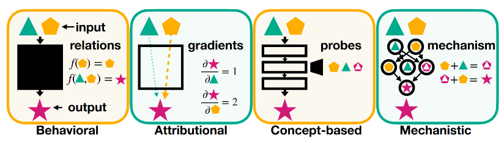

# 9.1 What is Interpretability ? {: #01 }
!!! note "Reading Time: 9 minutes" 

Interpretability is the study of how and why AI models make decisions. Its central aim is to understand the inner workings of models and the processes behind their decisions. There are diverse approaches to interpretability, but in this chapter—and the broader context of AI safety—**mechanistic interpretability (mech interp)** is the primary focus ([Ras et al., 2020](https://arxiv.org/abs/2004.14545), [Ali et al., 2023](https://www.sciencedirect.com/science/article/pii/S1566253523001148)).

[^1]: For an overview of the broader interpretability landscape see ([Ras et al., 2020](https://arxiv.org/abs/2004.14545), [Ali et al., 2023](https://www.sciencedirect.com/science/article/pii/S1566253523001148))

#### **Mechanistic Interpretability: The Bottom-Up Approach**

**Mechanistic interpretability seeks to reverse-engineer neural networks to uncover how their internal components—such as neurons, weights, and layers—work together to process information. This approach starts at the lowest level of abstraction and builds understanding piece by piece**: this is why it’s considered a bottom-up approach**. **By analyzing these basic components, we hope we can piece together how the network processes information and makes decisions.

For example, mechanistic interpretability could explain how a neural network recognizes objects in an image or generates language, down to the contributions of individual neurons or attention heads. The hope is that this level of detail will allow researchers to diagnose and potentially fix unwanted behaviors in AI systems.

#### **Other Approaches to Interpretability**

While mechanistic interpretability is a strong focus in AI safety, it is not the only approach. Other methods provide complementary perspectives:

- **Concept-Based Interpretability**: Contrarily to mechanistic interpretability, concept-based interpretability takes a** top-down approach**: instead of analyzing neurons or weights on a granular level, it focuses on understanding how the network manipulates **high-level concepts** ([Belinkov, 2022](https://aclanthology.org/2022.cl-1.7/)). For instance, *representation engineering *—a concept-based research agenda— explores how models encode concepts like "honesty" and how those representations can be adjusted to produce more honest outputs ([Zou et al., 2023](https://www.semanticscholar.org/paper/Representation-Engineering%3A-A-Top-Down-Approach-to-Zou-Phan/aac3469581061cd5b46440c3eeca91c385d54ccf)).

- **Developmental Interpretability**: This approach examines how model capabilities and internal representations **evolve during training**. By understanding the emergence of behaviors or knowledge over time, researchers hope they will be able to identify the emergence of certain capabilities and prevent unwanted ones from developing ([Hoogland et al., 2023](https://www.lesswrong.com/s/SfFQE8DXbgkjk62JK/p/TjaeCWvLZtEDAS5Ex)).

- **Behavioral Interpretability**: Unlike the previous approaches, behavioral interpretability studies **input-output relationships without delving into the internal structure of models**. 

***Figure****: A visual classification of interpretability techniques. From **(**[Bereska et Gavves, 2024](https://arxiv.org/abs/2404.14082)**).*

#### **Why Mechanistic Interpretability Matters for AI Safety**

Mechanistic interpretability is a strong focus in AI safety because it provides a level of precision that other approaches do not. Behavioral interpretability, for instance, offers insights into how a model behaves by studying input-output relationships, but it cannot reveal how its internal structure leads to its decisions. To prevent AI models from making harmful decisions or ensuring alignment with human values, we need to understand *why* models make certain decisions, and potentially steer the decision-making process. 

For instance, by pinpointing where harmful concepts—such as instructions for cyberattacks—are stored within a model, mechanistic interpretability tools could help erase or modify those concepts without degrading the model’s overall capabilities.

## 9.1.1 Motivation for AI Safety? {: #01 }

The ultimate goal of interpretability, from an AI safety perspective, is to build confidence in the behavior of complex models by understanding their internal mechanisms and ensuring they act safely and predictably. There are different ways interpretability could contribute to AI safety ([Nanda, 2022](https://www.alignmentforum.org/posts/uK6sQCNMw8WKzJeCQ/a-longlist-of-theories-of-impact-for-interpretability)):

??? note "Trust and transparency"

    
    
    By offering insights into which features of the input data (such as specific parts of an image or words in a sentence) or which specific concepts a model uses in its reasoning are influencing the model's outputs, interpretability tools can make it easier for users to understand, verify, and trust the behavior of complex models. This is particularly important in high-stakes applications like healthcare or autonomous systems, where trust in AI decisions is crucial.
    
    

??? note "Enhance model editing"

    
    
    Interpretability could be used to **mitigate misuse by erasing specific pieces of knowledge** from neural networks, such as knowledge on conducting cyberattack or building bioweapons. 
    
    Some mechanistic interpretability tools serve to locate where certain concepts are encoded in a model (those are covered in the *Observational Methods* section). For example, researchers could identify how models generate answers to harmful queries such as "steps for creating a virus" and use knowledge erasure methods to remove that knowledge from the model.
    
    

??? note "Detection of undesirable behaviors"

    
    
    Interpretability could help identify when models are not functioning as intended or have learned undesirable behaviors or patterns. For alignment research, it could be used to detect, analyze, and understand undesired answers from models.
    
    A well-known example of this comes from a model trained to classify chest X-rays. Researchers discovered that instead of focusing on medical features like lung conditions, the model was using subtle artifacts from the scanning equipment or markers in the image to make its predictions. This led the model to perform well in testing but for the wrong reasons. By using interpretability tools, researchers identified and corrected this issue ([DeGrave et al., 2021](https://www.nature.com/articles/s42256-021-00338-7)).
    
    

??? note "Extrapolation"

    
    
    Some hope that by understanding how current models function, interpretability may help predict how future, larger models will behave, whether new capabilities or risks will emerge, and how systems will evolve as they scale.
    
    

It’s important to note that while these goals are promising, the field of interpretability is still maturing. The adoption of interpretability tools in real-world scenarios is still limited, and assessing their quality remains challenging. Many existing techniques in interpretability are not designed for large-scale use and state-of-the-art models. These limitations will be explored in more detail in the **Critics of Interpretability** section.

## 9.1.2 What is the End Goal of Interpretability? {: #02 }

**What concrete outcomes should interpretability achieve to make AI systems safer and more predictable?** There are different opinions on the end goals of interpretability, including the following approaches:

#### **Enumerative Safety: Cataloging Concepts for Control**

Enumerative safety aims to identify and catalog all the concepts and behaviors encoded within a model. The idea is straightforward: if we can thoroughly understand and enumerate every action the model can take, we could selectively remove undesirable behaviors and ensure that the model can only perform safe and desirable actions ([Elhage et al., 2022](https://transformer-circuits.pub/2022/toy_model/index.html)).

For example, if a language model encodes harmful instructions—such as steps to create a cyberattack—enumerative safety would involve locating and eliminating this knowledge without impairing the model’s useful functions.

***Figure****: Enumerative safety aims to ensure that in all situations, the model doesn’t do something we don’t want. From (**[Olah, 2023](https://transformer-circuits.pub/2023/interpretability-dreams/index.html)**).*

#### **Retargeting the Search: Steering Model Objectives**

Retargeting the search represents a more ambitious goal: rather than removing harmful behaviors, it seeks to directly **modify a model’s objectives**. This involves identifying how the model internally represents its goals and **redirecting those representations to align with human values**.

Unlike enumerative safety, retargeting does not require reverse-engineering the entire model. Instead, it focuses on altering specific components while preserving the system’s overall functionality. For instance, if a model learned to optimize for harmful outcomes, researchers could “retarget” this optimization toward beneficial goals ([johnswentworth, ](https://www.alignmentforum.org/posts/w4aeAFzSAguvqA5qu/how-to-go-from-interpretability-to-alignment-just-retarget)[2022](https://www.alignmentforum.org/posts/w4aeAFzSAguvqA5qu/how-to-go-from-interpretability-to-alignment-just-retarget)).

#### **Relaxed Adversarial Training: Testing and Improving Corrigibility**

Relaxed adversarial training is an approach designed to enhance the robustness of AI systems, particularly to **ensure their corrigibility**—their ability to accept and assist with corrective interventions. Traditional adversarial training tests a model's robustness by exposing it to adversarial inputs. Relaxed adversarial training, however, works by testing against adversarial latent vectors instead of real inputs.

Mechanistic interpretability could be used to identify latent vectors that correspond to specific model behaviors, such as corrigibility or alignment with user intentions, and then test whether the model resists corrigibility directly by manipulating its internal representation ([Christiano, 2019](https://ai-alignment.com/training-robust-corrigibility-ce0e0a3b9b4d)).

#### **Mechanistic Anomaly Detection (****MAD****): Spotting Deviations**

Mechanistic Anomaly Detection (MAD) focuses on identifying instances where a model produces outputs for *unusual reasons*. While traditional interpretability methods aim to understand a model’s mechanisms comprehensively, MAD takes a more targeted approach: it flags anomalies in the decision-making process without requiring a full understanding of the underlying mechanisms.

For example, MAD could detect when a model’s reasoning deviates from its usual patterns, such as when it relies on spurious correlations rather than meaningful features. Insights from mechanistic interpretability could be useful to flag instances when a model operates outside its usual patterns of behavior ([Jenner, 2024](https://www.lesswrong.com/s/GiZ6puwmHozLuBrph/p/n7DFwtJvCzkuKmtbG)).

## 9.1.3 Overview of the Field of Mechanistic Interpretability {: #03 }

Mechanistic interpretability is a diverse field, but its techniques can be broadly categorized into two main approaches: **observational methods** and **interventional methods **[^2]. These categories reflect two complementary strategies for understanding how neural networks process information. 

??? note "Observational Methods: Analyzing Without Intervening"

    
    
    **Observational methods aim to analyze a model’s internal structures—such as neurons, activations, and weights—without directly modifying them**. These techniques allow us to observe what a model represents or lacks in its internal computations but do not reveal how or whether the model uses this information during inference. They include techniques such as *probing classifiers*, the *Logit Lens*, and *Sparse Autoencoders*. 
    
    For example, in a study of a chess-playing neural network, researchers used probing classifiers to *investigate whether the network encoded board states and strategic concepts*. They discovered that the model had learned to represent critical features such as whether a player could capture their opponent’s queen or the number of pieces each side controlled ([McGrath et al., 2022](https://www.pnas.org/doi/10.1073/pnas.2206625119)).
    
    Observational methods provide an essential foundation for understanding model representations, but they have limitations. Most notably, they cannot determine whether the observed representations causally influence the model’s behavior.
    
    

??? note "Interventional Methods: Manipulating for Causal Insights"

    
    
    Interventional methods take the next step by **actively manipulating a model’s internals to understand their causal role in decision-making**. By modifying activations or parameters, researchers can test how specific components contribute to overall behavior.
    
    Interventions help us identify what information is used by the model, and how. They include techniques such as *activation patching* and *activation steering*.
    
    For instance, researchers at Anthropic demonstrated the potential of interventional methods by manipulating a model’s activations at runtime. They were able to make the model sound more joyful in its responses, alter its stated preferences and goals, change its biases -leading it to produce more offensive or harmful content-, and induce specific types of errors, such as coding mistakes, that the model would typically avoid ([Templeton et al., 2024](https://transformer-circuits.pub/2024/scaling-monosemanticity/index.html#appendix-more-safety-features)).
    
    Observational methods, as you will see, can serve as a foundation for interventional methods because they guide where to intervene. For example, an observational study might identify a layer encoding a critical feature, which can then motivate an intervention to test whether and how that feature influences outputs.
    
    

[^2]: We follow the classification introduced by ([Bereska et Gavves, 2024](https://arxiv.org/abs/2404.14082)). Even though it may be debated, we believe it provides newcomers with a clear introduction to the fundamentals of the field.