# 9.2 Observational Methods {: #02 }

    

        <i class="fas fa-clock"></i>
        33 min read
    

    

        <i class="fas fa-file-alt"></i> 
        6685 words
    

## 9.2.1 Feature Visualization {: #01 }

Feature visualization is one of the first observational methods in mechanistic interpretability. It allows researchers to explore the features that a vision model learns and uses at different layers. In this section, we’ll explain in detail what feature visualization is, and the discoveries it enabled.

#### **What is a Feature?**

**A feature is a pattern of the input data that the network learns to detect. Models have features because they help break down complex inputs, such as images or text, into interpretable components that the model can use to make predictions.**

Vision models trained to do image classification commonly possess features corresponding to cats, dogs, cars, eyes, fruits, etc. Vision model features vary in complexity depending on the layer in which they appear. In the early layers, features typically represent simple, low-level patterns such as edges, colors, or textures in a vision model. As you move to deeper layers, the features become more abstract and complex, representing higher-level concepts like shapes, objects, or even specific entities like faces or animals. This *hierarchical structure of features* allows models to progressively process raw pixel data into higher-level concepts to ultimately classify the image. For instance, recognizing a car would start with detecting edges (low-level features), then specific shapes (like wheels), and eventually the entire car (high-level feature).

In transformer models, researchers have identified features corresponding to specific concepts like DNA sequences, legal language, HTTP requests, or Hebrew text. For instance, when a transformer encounters a DNA sequence, neurons encoding the “DNA feature” activate strongly in response. Similarly, given a sentence like “The court ruled in favor of the defendant because…,” features linked to legal language and sentence structures common in legal contexts may activate, helping the model predict a follow-up involving reasoning or justification, such as “…the evidence presented was insufficient.”

These features are essential building blocks that models use to make sense of input data and make predictions.

#### **How is a Feature Visualization?**

**Feature visualization** is a technique that helps us investigate the inner representations of Convolutional Neural Networks (CNN), and observe the patterns that a model has learned to recognize. It generates images that maximize the activation of specific neurons, feature maps (outputs of a convolutional layer), or even entire layers in a model ([Cammarata et al., 2020](https://distill.pub/2020/circuits/)).

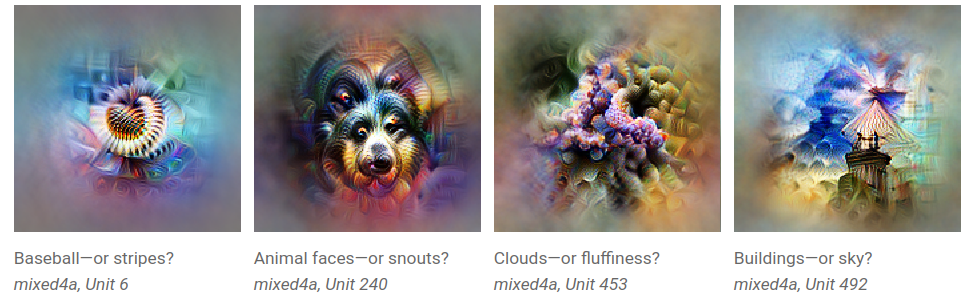

***Figure****: Examples of feature visualizations. It seems that the network has learned to ****represent and detect**** baseballs, animal faces, clouds, and buildings, but feature visualizations have to be interpreted and may not be detecting what we initially think. From (**[Olah et al., 2017](https://distill.pub/2017/feature-visualization/)**).** *

Early research in neuroscience aimed to understand the brain by identifying which images strongly excited specific neurons. This helped neuroscientists discover brain areas dedicated to identifying faces, movement, natural scenes, etc. **Feature visualization **can be thought of as a somewhat similar approach used to CNNs** **([Olah et al., 2017](https://distill.pub/2017/feature-visualization/)). 

These learned features—whether simple patterns like edges or complex objects—form the building blocks that enable models to understand and process input data. However, **features don't operate in isolation. As the network processes information, features interact and combine in structured ways, often forming more complex units known as circuits. A circuit is a group of interconnected features that work together to perform a specific function.**

For example, here is a circuit that recognizes a car in the mid-layers of a CNN. This circuit combines lower-level features such as windows, car bodies, and wheels to detect the presence of a car in an image. The circuit allows the model to recognize the entire object, even though no single feature on its own can do so.

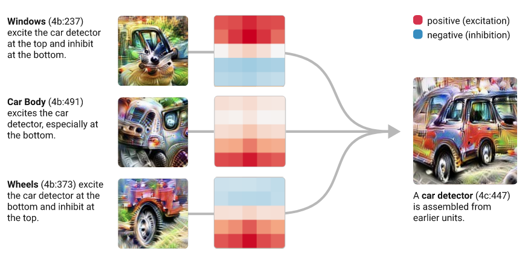

***Figure****: A car circuit **in a CNN**. On the left, three feature maps from layer **4**b are represented by their feature visualizations. One map appears to detect windows, another car bodies, and the third wheels. These three feature maps are connected to a feature map in layer 4c, represented by the visualization on the right, through the convolutional kernels shown in the middle. The window, car body and wheel features get assembled to form a full car detector circuit. From (**[Olah et al., 2020](https://distill.pub/2020/circuits/early-vision/)**).*

??? note "Vocabulary Reminder"

    - A **feature** refers to a specific pattern or characteristic that the network learns to detect. These features are the fundamental units that models use to process information and make decisions.

    - **Feature visualization** is a method that enables us to identify the features learned by a CNN, which** **can help us understand how it processes information and makes decisions. 

    - A **circuit** is a group of interconnected features that work together to perform a specific function. Circuits are essentially higher order features, that are recursively composed of lower order features. The notion of circuit applies to any model architecture, including LLMs. Identifying circuits that perform specific functions in models is one area of research in mechanistic interpretability. 

    - A **feature map** in a CNN is the output of a convolutional layer. It’s also called a channel. Feature visualization is often applied at the scale of feature maps - instead of individual neurons or entire layers - to understand which features they encode.

    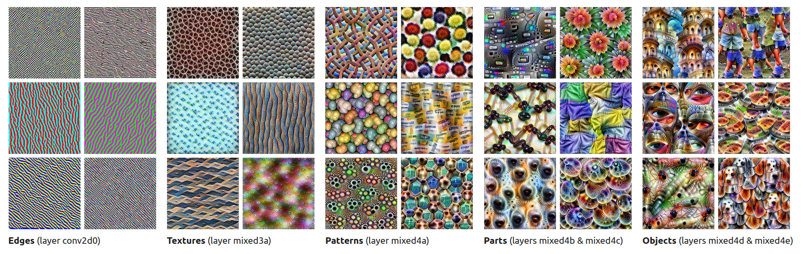

    ***Figure****: Some examples of feature visualizations on a CNN trained for image classification. Each image corresponds to a feature map. Certain feature maps are sensitive to patterns with edges, others are sensitive to different kinds of textured patterns, or objects like eyes, dog faces, or legs. From (**[Olah et al., 2017](https://distill.pub/2017/feature-visualization/)**).*

### 9.2.1.1 Feature Visualization Method {: #01 }

!!! warning "This is extra detail provided for those interested. It can be safely skipped."

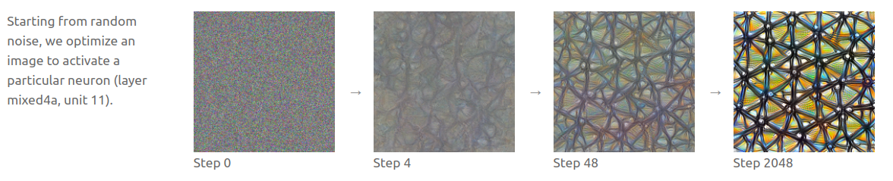

***Figure: Overview of the feature visualization process****. Given a neuron (or a set of neurons) in a CNN, feature visualization generates an image that highly activates it, starting from a random image, and through successive optimization steps. The optimized image illustrates what kind of pattern one of the feature maps in the fourth layer of InceptionV1 is sensitive to (**[Olah et al., 2017](https://distill.pub/2017/feature-visualization/)**).*

Generating a feature visualization involves:

1. **Select a target**: Choose a neuron, feature map, or layer for visualization. Most feature visualizations are performed on feature maps. 

2. **Start with a random input image**: Begin optimization from a random noise image. It will be adjusted to maximize the activation of the target neuron or filter.

3. **Compute the gradient. The objective is to update the image such that it maximizes the activation of the neuron/feature map**: Use backpropagation to calculate how to modify the image to increase the activation of the target. 

4. **Optimize the image**: Apply gradient ascent iteratively to adjust the image.

5. **Repeat the gradient ascent steps**: Slightly adjust the image each time to better activate the neuron/feature map.

6. **Visualize the result**: The final image reveals the patterns or structures the target has learned to detect.

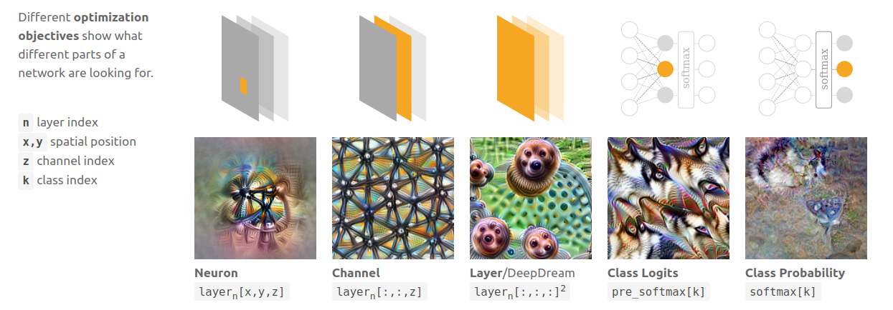

***Figure****: Feature visualizations can be produced for individual neurons or groups of neurons, such as a feature map, or even an entire layer. From (**[Olah et al., 2017](https://distill.pub/2017/feature-visualization/)**).*

### 9.2.1.2 Circuits   {: #02 }

**Each layer in a CNN progressively extracts increasingly complex features from the image**. Neurons in early layers respond to rudimentary and abstract patterns such as curves, angles, and small shapes (similar to the first layers of the human visual cortex!). As we move deeper into the network, neurons detect more complex and specific objects, such as eyes, animals, cars, etc ([Olah et al., 2020](https://distill.pub/2020/circuits/zoom-in/)). Interestingly, some of these "neuron families" recur across different model architectures and training conditions ([Olah et al., 2020](https://distill.pub/2020/circuits/early-vision/)).

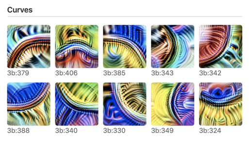

***Figure****: Curve detectors are universally found in early layers of CNNs, they exist in different orientations and colors and collectively span all orientations. Each curve detector responds to a wide variety of curves, in different orientations. From (**[Olah et al., 2020](https://distill.pub/2020/circuits/zoom-in/)**).** *

CNNs also commonly learn **high-low frequency detectors** in their early layers.

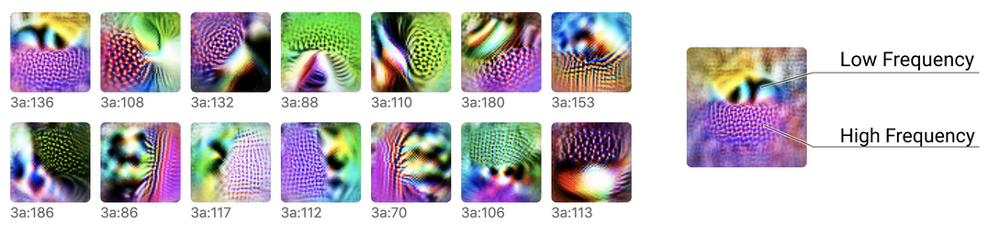

***Figure****: High-low frequency detectors look for low-frequency patterns on one side of their receptive field, and high-frequency patterns on the other side. They exist in different orientations and colors. From (**[Olah et al., 2020](https://distill.pub/2020/circuits/early-vision/)**).*

High-low frequency detectors assemble in deeper layers to form **boundary detectors**.

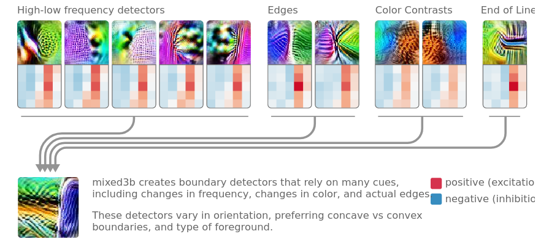

***Figure****: A boundary detector neuron formed in the third layer of a CNN (shown at the bottom left with its feature visualization). The top row **shows feature visualizations** from neurons in the second layer and the kernels connecting them to the third layer. New neurons form by combining cues from more elementary neurons in previous layers: here the boundary detector neuron forms by combining high-low frequency detector neurons, with edges detector neurons, color contrast detector neurons, etc. From (**[Olah et al., 2020](https://distill.pub/2020/circuits/early-vision/)**).*

### 9.2.1.3 Polysemantic Neurons {: #03 }

While feature visualization has enabled a deeper understanding of how CNNs represent information, it has also highlighted challenges like **polysemanticity**. An intriguing phenomenon occurs when we look at the neurons following the car detector and that are strongly connected to it. Some of these neurons respond not only to images of cars but also to unrelated stimuli, such as images of dogs. This indicates that the "car feature" gets spread across multiple neurons that respond to seemingly unrelated inputs. These are known as **polysemantic neurons**—neurons that activate in response to a variety of distinct features. In contrast, **monosemantic neurons** respond to just one specific feature or stimulus.

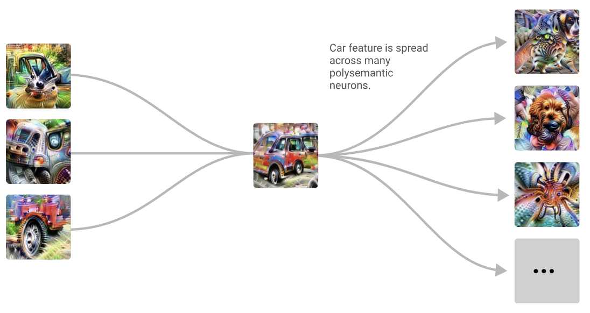

***Figure****: On the left is the car detector circuit from the previous figure. After distinct concepts are formed, they become entangled in polysemantic neurons, such as one neuron that responds to both car and dog images. From (**[Olah et al., 2020](https://distill.pub/2020/circuits/early-vision/)**).*

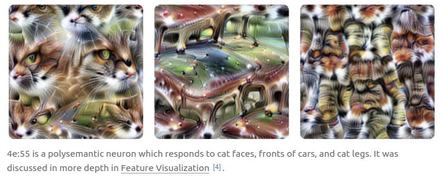

***Figure****: Multiple feature visualization performed on a polysemantic neuron that responds to images of cars, as well as cat faces, and cat legs. From (**[Olah et al., 2020](https://distill.pub/2020/circuits/early-vision/)**).*

**Polysemantic neurons are very common**. For example, in a small language model, we can find a neuron that responds to English dialogues, Korean texts, HTTP requests, and academic citations simultaneously ([Bricken et al., 2023](https://transformer-circuits.pub/2023/monosemantic-features)). This means that each neuron does not correspond to one specific feature. Therefore, reasoning about a network's behavior based on individual neurons is misleading. Neurons are not the fundamental units to focus on when trying to understand models. 

Polysemanticity poses a challenge for interpretability because it requires understanding how features are encoded across multiple neurons, rather than assuming each neuron represents a discrete unit of meaning. Identifying how these distributed features are encoded is an active area of research in interpretability.

**The leading hypothesis to explain why polysemanticity arises in neural networks is called the superposition hypothesis**. Large models need to learn a huge number of features to perform effectively, likely more than the number of neurons they have. As a result, models cannot assign each feature to a single neuron. Instead, they must encode features in a more compressed manner. **The superposition hypothesis suggests that models represent more features than they have neurons by encoding multiple features per neuron, with these features oriented in nearly orthogonal directions.** In other words, models compress information by overlapping features across multiple neurons.

??? note "Polysemanticity vs Superposition"

    The distinction between polysemanticity and the superposition hypothesis is important ([Bereska et Gavves, 2024](https://arxiv.org/abs/2404.14082)):

    - **Polysemanticity** refers to the *empirical phenomenon* where a neuron represents or responds to multiple unrelated features,

    - **The superposition hypothesis**, on the contrary, generally refers to an *hypothesis* that tries to explain polysemanticity. It suggests that when models have more features to represent than they have neurons to represent them, they must compress these features into the limited space. This compression forces features to overlap across neurons. This supposedly explains why we observe neurons responding to multiple, seemingly unrelated features. While superposition inherently leads to polysemanticity, polysemanticity itself doesn’t always imply superposition, as polysemanticity could theoretically arise from other mechanisms.

**Understanding and addressing polysemanticity is an active research area. Various directions are being explored**:

- **Sparse Representations:** Designing networks to use sparse representations (where fewer neurons are active at a time) may reduce polysemanticity ([Elhage et al., 2022](https://transformer-circuits.pub/2022/solu/index.html)). This approach has not been widely explored because it comes with significant performance trade-offs.

- **Feature Disentanglement:** Some approaches involve decomposing complex neuron activations to isolate individual features. One promising approach in that line of research, known as Sparse Autoencoders, is a technique that "unfolds" the network and separates out individual features ([Bricken et al., 2023](https://transformer-circuits.pub/2023/monosemantic-features)). It is explained more in depth in the *Sparse Autoencoders* section.

**Feature visualization has led to several key insights about how vision neural networks operate:**

- **Hierarchical structure**: Neural networks learn features hierarchically, with early layers detecting simple patterns and deeper layers composing these into complex objects. For instance, curve detectors in early layers combine into boundary detectors in mid-layers and eventually into full object detectors in deeper layers.

- **Circuits**: Features interact to form "circuits"—groups of interconnected features that collectively perform a specific function. For example, a circuit for detecting cars might combine features like wheels, windows, and body shapes into a cohesive representation of a car.

- **Polysemanticity**: Feature visualization has revealed the phenomenon of **polysemanticity**, where individual neurons or features in a neural network respond to multiple, seemingly unrelated concepts. This overlap complicates our ability to assign clear and interpretable roles to individual neurons.

- **Universality**: Some features, such as edge or curve detectors, are universal across models and architectures. This suggests that certain features are fundamental to visual processing, regardless of the specific task or dataset.

## 9.2.2 Logit Lens {: #02 }

=== "Overview"

    The **Logit Lens** ([nostalgebraist, 2020](https://www.alignmentforum.org/posts/AcKRB8wDpdaN6v6ru/)) is one of the first tools developed to look inside transformers. It enables us to observe how a transformer refines its predictions layer by layer —allowing us to** see not just the final output but the evolving "thought process" the model undergoes as it makes a prediction**.

    Transformers are trained to predict the next token in a sequence. They do this by transforming the inputs layer by layer, with each layer adding new information to improve the prediction. The Logit Lens enables us to “translate” each layer's internal representation back into tokens. By seeing what the model “predicts” at each layer, we can trace how its predictions evolve from a rough guess in the initial layers to a refined choice in the final one. However, it’s worth noting that while the Logit Lens lets us see the intermediate predictions at each layer, it doesn’t explain the *mechanism* of transformation. **The Logit Lens is an inherently observational tool —it reveals what is the most probable token at the end of each layer but doesn’t allow us to understand *****why***** this precise token is predicted**.

=== "Details"

    !!! warning "This is extra detail provided for those interested. It can be safely skipped."

    A transformer model is a powerful architecture for processing sequences of data, especially text. It is trained to predict the next word or subword in a sequence, referred to as **tokens**.

    The set of all tokens (words or subwords) that the model can recognize is called the *vocabulary*. For example, GPT-2 has a vocabulary of 50,257 tokens. More precisely, **a transformer takes a sequence of tokens as input and is trained to predict the next token in this sequence, outputting a probability distribution over the entire vocabulary**.

    Internally, a transformer consists of multiple stacked **layers**, each containing two sublayers: an MLP (multi-layer perceptron) and attention heads. For understanding the Logit Lens, we don’t need to go into the details of how these sublayers function.

    The intermediate layers are connected through what’s known as the **residual stream**. The residual stream is a pathway that carries information from the input to the output, allowing it to flow through all layers of the model.

    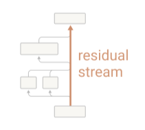

    ***Figure****: A minimalist illustration of a transformer with a single layer. Transformers cannot directly manipulate tokens, so they embed tokens into numerical vectors, an operation depicted in the bottom grey box. After embedding, the tokens are represented as vectors within the residual stream. The first sublayer (attention heads, represented by the two side-by-side boxes on the left) reads these embedded tokens, applies a transformation, and adds its output back into the residual stream. The second sublayer (MLP) does the same. Finally, to output a token, the embedded tokens must be converted back to the vocabulary space through an unembedding operation (depicted in the top box). The residual stream enables each layer to make incremental adjustments to the model’s predictions by accumulating and refining the information passed through each transformation. From (**[Elhage et al., 2021](https://transformer-circuits.pub/2021/framework/index.html)**).*

    **The essential idea behind the Logit Lens is that the unembedding operation, typically applied only after the last layer, can be applied at any point in the residual stream. After each intermediate layer, the residual stream can be unembedded—that is, converted back into the token space—allowing us to observe which token is currently the most probable.**

    ??? note "Connection between the Logit Lens and Feature Visualization in CNNs"

    <tab>

    In the previous section on **Feature Visualization**, we saw that CNNs build up their understanding of an image layer by layer, detecting simple patterns like edges in early layers and more complex shapes or objects in later ones. Feature visualization allows us to interpret these progressive transformations by displaying the visual patterns that different neurons respond to.

    The Logit Lens can be seen as a parallel interpretability tool for transformers. Instead of visualizing image features, the Logit Lens lets us see the model’s step-by-step guesses for the next token.

Figure 1 shows how using the Logit Lens looks in practice.

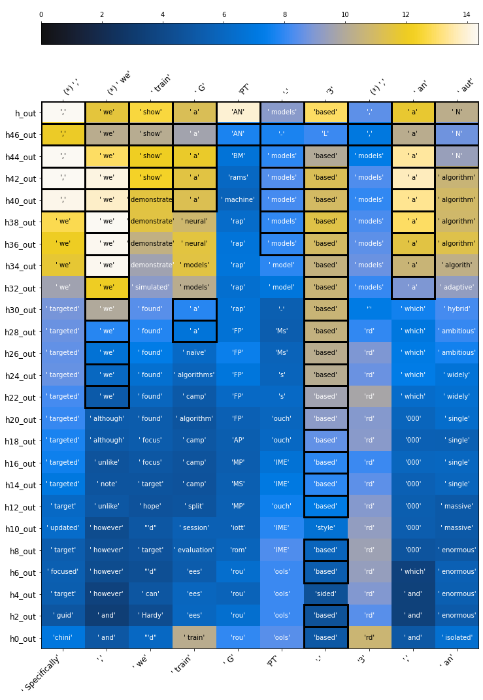

***Figure 1: An example of the Logit Lens used on GPT-2 when it’s trying to predict the next token of the sequence: “Specifically, we train GPT-3, an”.**** Input tokens are written at the bottom, and correct outputs at the top. Layers stack from bottom to top. The first token at the top, ",", corresponds to the token the model should predict when given as input only the first token: "Specifically". The second token at the top, "we", corresponds to the token the model should predict when given as input only the two first tokens: "Specifically, ". This is the reason why there is a shift of one position between tokens at the bottom and tokens at the top. (*) indicates that the model correctly predicted the next token. Each cell contains the model’s top guesses at different layers. The color scale indicates the associated logit value. The higher the logit, the more confident in its prediction the model is. From** (**[nostalgebraist, 2020](https://www.lesswrong.com/posts/AcKRB8wDpdaN6v6ru/interpreting-gpt-the-logit-lens)**)**.*

Figure 1 shows that when GPT-2 tries to predict the next token in the sequence “Specifically, we train GPT-3, an”, it predicts “enormous” in its early layers, then “massive”, “single”, and “N” in its final layer.

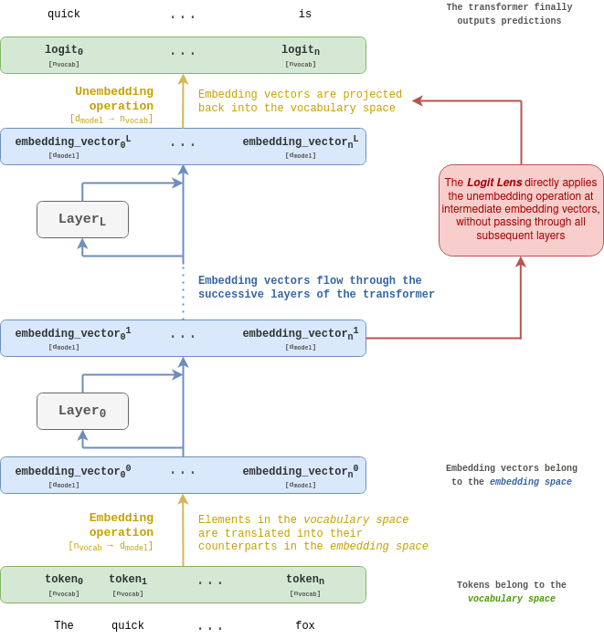

***Figure****: **Overview of how the Logit Lens works. Read from bottom to top. A detailed explanation is provided in the following paragraphs. Object’s shapes are indicated between brackets.*

A transformer takes as an **input a sequence of tokens**. Each token is an element from a vocabulary (typically of size **n**~vocab~), so each text token can be associated with an integer value ranging from 0 to **n**~vocab~. This association can also be thought of as representing the token as a basis vector within a space of dimension **n**~vocab~, denoted the **vocabulary space**. Each basis vector in the vocabulary space is associated with one token.

A transformer is trained to predict the next token of the input sequence, so its **output is a probability distribution over the vocabulary**.

Transformers convert each token into vectors **n**~vocab~, which is known as the **embedding space**. The embedding space dimension is denoted **d**~model~. Projected tokens are called **embedding vectors**, or simply **embeddings**. In some contexts, they may also be referred to as *hidden activations*. The **embedding matrix** converts tokens from the vocabulary space into the embedding space. It is like a lookup table that associates elements in the vocabulary space with their corresponding counterparts in the embedding space.

Once tokens have been converted into the embedding space, they **flow through the successive layers of the transformer**. Similar to how input images undergo transformations across the layers of a CNN, embedding vectors are transformed as they pass through the network. The **Logit Lens** precisely focuses on those intermediate representations that transformers build.

Finally, to output a probability distribution over the vocabulary, the final embedding vector has to be converted back into vocabulary space. Conversion from the embedding space to the vocabulary space can be done through multiplication by a matrix of dimension [**d**~model~, ~ ~**n**~vocab~]. This operation is called the **unembedding**. The result of the unembedding is a **logits**** vector** of size **n**~vocab~. The logits can then be converted into probabilities over the vocabulary using the softmax function.

**The essential intuition behind the Logit Lens is that the unembedding operation, typically applied after the last layer, can also be applied after each intermediate layer**. Embedding vectors are modified by each layer of the network, but their dimensions remain the same (**d**~model~). Thus, after any layer, embedding vectors can be converted back to the vocabulary space, and one can get an idea of how the network refines its prediction across layers.

</tab>

## 9.2.3 Probing classifiers {: #03 }

=== "Overview"

    **Probing** is a technique used to analyze neural networks and **understand *****which***** representations or concepts they have learned and *****where*** ([Belinkov, 2022](https://aclanthology.org/2022.cl-1.7/)). Probing techniques can be applied to a range of models, from transformers to CNNs, to investigate whether specific information or properties are encoded in a model’s intermediate representations.

    **What is a probe?** A *probe* is a lightweight model, often a linear classifier, trained to detect whether a specific concept or feature is represented in the activations of a neural network. In a probing setup, researchers analyze activations (the intermediate outputs) from layers within a network to see if these activations encode information about a particular property or concept. For example, probes may be used to determine whether a language model’s activations contain information about grammar rules or whether a chess-playing model like AlphaZero encodes strategic knowledge about the game, where this knowledge is located within the network, and when it is acquired during training ([Gurnee et al., 2023](https://arxiv.org/abs/2305.01610), [McGrath et al., 2022](https://www.pnas.org/doi/10.1073/pnas.2206625119)). 

=== "Details"

    !!! warning "This is extra detail provided for those interested. It can be safely skipped."

    One well-known example of probing was applied to **AlphaZero**, the neural network trained to play chess that famously defeated top human players. Researchers used probes to investigate whether AlphaZero internally represents certain strategic concepts about chess, such as “Can the opponent capture my queen?” or “Is there a checkmate threat within one move?” ([McGrath et al., 2022](https://www.pnas.org/doi/10.1073/pnas.2206625119)).

    **Probing classification** is the process of training classifiers on the network’s intermediate activations to identify if specific properties are encoded. The steps of probing classification are as follows:

    1. **Choose a Property or Concept**: Define a specific concept to explore, such as “Can the opponent capture my queen?”.

    2. **Generate or Select Input Data**: Create a dataset with examples that vary in terms of the target property. For instance, in chess, we might create board configurations where “the player can capture the opponent’s queen” is either true or false.

    3. **Record Intermediate Activations**: Feed this dataset through the model and record the activations of neurons at different layers.

    4. **Train a Classifier on the Activations**: Use the recorded activations as input features to train a classifier (probe) that distinguishes between different classes based on the concept (e.g., true vs. false input prompts).

    5. **Evaluate the Probe’s Accuracy**: If the probe achieves high accuracy, this suggests that the target concept is strongly encoded in the recorded layer’s activations.

=== "Probing in Practice: Case Studies and Limitations"

    !!! warning "This is extra detail provided for those interested. It can be safely skipped."

    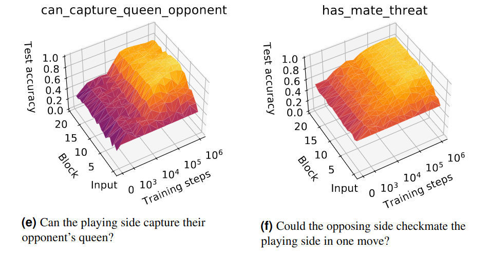

    ***Figure****: Accuracy of two probes trained on AlphaZero’s intermediary activations, across layers and training steps The two two probes were trained on the two concepts: “Can the playing side capture their opponent’s queen?”, and “Could the opposing side checkmate the playing side in one move?”. The color represents the probe’s accuracy (the yellow color corresponds to a higher value, indicating that the feature is more represented). Here, the probes were trained at different stages of AlphaZero's training and from the activations of different layers of the network (a block corresponds to one layer of AlphaZero). It can be seen that the more AlphaZero is trained, **the more it represents** these two concepts. The concept "has_mate_threat" seems to be represented quite homogeneously across AlphaZero's layers, while "can_capture_queen_opponent" appears to be more represented in the earlier layers. "The ability to predict has_mate_threat from AlphaZero’s activations indicates that AlphaZero is not simply modeling its potential moves, but also its opponent’s potential moves and their consequences during position evaluation". From (**[MacGrath et al., 2022](https://www.pnas.org/doi/10.1073/pnas.2206625119)**)**.*

    **Using linear probes for detecting prompts leading to dangerous behavior.** The alignment team from Anthropic is currently working on a research agenda called “*sleeper agents*” where they deliberately train deceptively aligned models ([Hubinger et al., 2024](https://arxiv.org/abs/2401.05566)) to test whether currently available techniques can detect misalignment. These "*sleeper agents*" are models with hidden backdoors introduced during training.  One of the sleeper agents they trained writes secure code when the prompt indicates year “2023” but inserts vulnerabilities when the prompt indicates “2024”. Such dangerous outputs are hard to detect, and could easily be missed by a human overseer, this is why it would be extremely useful to develop an automatic detection method. Anthropic researchers have trained linear probes based on sleeper agents’ residual stream activations that classify inputs as safe or dangerous with very high accuracy ([MacDiarmid et al., 2024](https://www.anthropic.com/news/probes-catch-sleeper-agents)). Whether or not a prompt will trigger defection appears to be linearly encoded across a wide range of middle residual streams. However, they remain wary of this result and acknowledge that the surprisingly high accuracy of the probes may be due to the backdoor insertion, and that “natural defection” may not be detected as easily.

    It was also suggested to train probes on human-written scenarios of takeover attempts or catastrophic actions ([Roger., 2023](https://www.alignmentforum.org/posts/WCj7WgFSLmyKaMwPR/coup-probes-catching-catastrophes-with-probes-trained-off)) to detect such goals or intentions in models before they happen. Similarly to sleeper agents, it is unclear whether probes trained in artificial settings will generalize in real-world scenarios.

    **Limitations of probing classifiers**

    - **Correlation, not causation**: Probing classifiers indicate that a concept (or a proxy of that concept) is encoded, but they don’t reveal whether this concept is actively used by the network during inference. The classifier’s high accuracy may reflect the ease with which it can detect patterns, not necessarily that the model relies on those patterns for decision-making. To discover causal effects we need to **intervene** in representations of the model instead of just **observing** them.

    - **Identifying proxies rather than “true concepts”**: Probing may detect patterns that act as proxies for the concept of interest, rather than the concept itself. For example, a probe trained to detect “legal language” might actually be detecting correlated cues (such as certain formal words or sentence structures) rather than a genuine understanding of legal terminology. This makes it challenging to interpret probes as definitive indicators of the exact concepts represented within the model.

## 9.2.4 Superposition {: #04 }

=== "Overview"

    To make sense of data, classify it, or make decisions, neural networks need to learn **features**—representations that capture meaningful patterns in the data. However, networks have a limited number of neurons to store a vast amount of information. Instead of assigning a single neuron to each feature, neural networks often "share" neurons across multiple features. This shared, overlapping storage is known as **superposition**.

    Superposition occurs because it allows the network to handle more features using fewer neurons, making it more **memory-efficient**. However, this efficiency comes at a cost: **polysemanticity**. Polysemanticity means that a single neuron or component in the network represents multiple, often unrelated, features. For example, one neuron might activate in response to both "cats" and "cars," even though these concepts are entirely different. 

    ??? note "Polysemanticity and Superposition"

    <tab>

    The vocabulary surrounding superposition and related concepts is often messy. The terms **superposition** and **polysemanticity** are often used interchangeably, even though they refer to slightly different aspects of the same phenomenon in some contexts: superposition describes the overlapping storage of features, while polysemanticity highlights the behavior of neurons that respond to multiple distinct features.

    Also keep in mind that **superposition** should not be confused with the **superposition hypothesis**, which is a specific theory proposed to explain why and how superposition occurs in neural networks.

This overlap creates a challenge for interpretability. Ideally, we might expect each neuron to have a clear and singular purpose—one neuron for "cats," another for "cars," and so on. In reality, many neurons respond to combinations of unrelated features, leading to **entangled representations**. This means that interpreting individual neurons in isolation often provides an incomplete or misleading picture ([Bolukbasi et al., 2021](https://arxiv.org/abs/2104.07143)).

Contrast this with a hypothetical network without polysemanticity: every neuron would correspond to a distinct feature, making the model much easier to interpret. However, such a design would require far more neurons to represent every feature individually, which is **computationally inefficient**, particularly in large-scale models. As a result, superposition is practically inevitable in modern neural networks.

From an AI safety perspective, understanding superposition is critical. If we want to trace how a model makes decisions, we need to **identify and disentangle these overlapping features**. Only then can we retrace the reasoning behind its predictions and uncover what drives its behavior.

Before diving into techniques for disentangling features, researchers first sought to understand how polysemanticity arises. Key questions include:

- What causes polysemanticity in neural networks?

- How does model architecture or the training process influence it?

- Can it be controlled or mitigated?

To answer these, researchers used **toy models**—simple, small-scale neural networks. Toy models allow for controlled experimentation and help researchers isolate and study phenomena like superposition without the complexity of larger systems. The following subsection details the toy models used to study polysemanticity. 

</tab>

=== "Experiments on Toy Models Support the Superposition Hypothesis"

    !!! warning "This is extra detail provided for those interested. It can be safely skipped."

    The **Toy Models of Superposition** paper introduces simplified models that help researchers study superposition in a controlled environment ([Elhage et al., 2022](https://transformer-circuits.pub/2022/toy_model/index.html)). These models provide evidence supporting the **superposition hypothesis**—a theory about how neural networks efficiently store and organize information.

    **The superposition hypothesis** suggests that neural networks can represent more features or concepts than they have individual neurons by encoding information as linear combinations across multiple neurons. This means:

    1. **Efficient compression**: Neural networks can compress information by representing more features than there are available dimensions, optimizing memory use.

    2. **Distributed representation**: Features are not exclusively tied to single neurons; instead, they are distributed across multiple neurons.

    3. **Non-orthogonal directions**: Features are stored in directions that are not perfectly orthogonal in the network's activation space, which leads to overlaps and potential interference between concepts.

    This paper is a cornerstone of mechanistic interpretability because it reveals fascinating phenomena about how neural networks organize and store information:

    - **Demonstrating superposition**: The experiments show that superposition occurs and identify the conditions under which it arises.

    - **Explaining mono- and polysemantic neurons**: The paper clarifies why some neurons specialize in a single feature (monosemantic) while others represent multiple features (polysemantic).

    - **Phase transitions in training**: It highlights a phase change[^3] during training that determines whether features are stored in superposition.

    - **Geometric feature organization**: Features in superposition are arranged into geometric structures such as digons, triangles, pentagons, and tetrahedrons, providing insight into the network’s internal organization.

    [^3]: A **phase change** in neural network training refers to a sudden, qualitative shift in the behavior or structure of the model during the training process.

    The following figure is a great illustration of superposition in a toy model. The toy model has **2 dimensions**, represented by the x and y axis in the figure below, but it needs to learn **5 features**. This means that the model needs to find a way to fit more information (5 features) into fewer dimensions (2-dimensional space). Each feature is given an importance, represented with colors. An important feature is a feature that has a significant impact on the model’s accuracy or loss function (if removing or weakening the representation of this feature causes a large drop in performance, it would be considered important). **The key challenge in superposition is how to efficiently encode important features while minimizing overlap and interference between them**.

    Each feature also has a **sparsity**. This refers to how often it is active in the dataset. A dense feature (low sparsity) is activated frequently, making it harder for other features to coexist in the same dimensions without interference.

    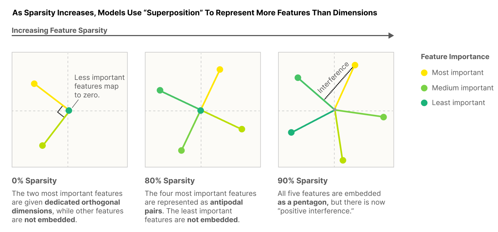

    *Figure: How does a 2-dimension model encode 5 features as their sparsity increases? 0% sparsity means that features are very dense, or frequent. The model only encodes the two most important features in orthogonal dimensions. As sparsity increases and the important features are less frequently useful, the toy model encodes additional features **in non-orthogonal directions**. The intuition is that the less frequent the features are, the less likely two overlapping features are to be activated at the same time and cause interference. So the cost of interference between features is outweighed by the advantage of learning more features. At 90% sparsity the 5 features are represented as a pentagon. From (**[Elhage et al., 2022](https://transformer-circuits.pub/2022/toy_model/index.html)**).*

    When encoding features, there is a tradeoff to make between the usefulness of having as many features as possible and low interference between them. Models embed their features into very complex geometric structures to reach optimal encoding. The figure below shows the different geometric structures that models use to encode features.

    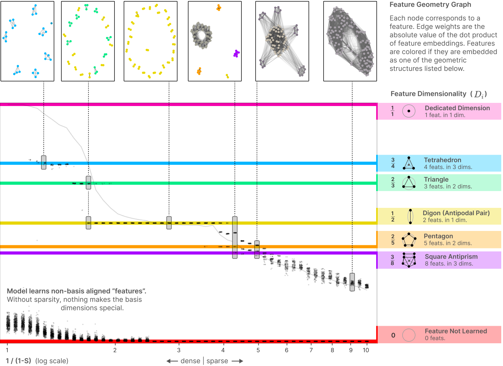

    *Figure: As features get sparser (less frequently activated), more of them can be encoded optimally and in more complex geometric structures. The first figure on the top left shows that when features are very dense, only the most important features are represented and they are organized in tetrahedrons. This model learns 28 features and encodes them in 7 tetrahedrons. On the second figure features are slightly sparser, more of them can be optimally encoded, and tetrahedrons are replaced by triangles and **digons**. This model learns 46 features encoded in triangles and digons. Superposition exhibits complex geometric structure. From (**[Elhage et al., 2022](https://transformer-circuits.pub/2022/toy_model/index.html)**).*

## 9.2.5 Sparse Autoencoders {: #05 }

=== "Overview"

    A major challenge in mechanistic interpretability is **polysemanticity**, where a single neuron or feature represents multiple, unrelated concepts. Polysemanticity arises naturally in LLMs’ MLPs and residual streams, and makes it more complicated to identify which specific features influence a model’s outcome. **Sparse AutoEncoders (SAES)** are a promising approach for **disentangling**** features** within a network ([Bricken et al., 2023](https://transformer-circuits.pub/2023/monosemantic-features), [Gao et al., 2024](https://arxiv.org/abs/2406.04093), [Templeton et al., 2024](https://transformer-circuits.pub/2024/scaling-monosemanticity/index.html#related-work-steering)). 

    SAEs are gaining popularity because they have shown promising results in separating out features. Features extracted using SAEs can then be used to:

    - **Steer language models behavior** away from undesirable outcomes (see section [Activation Steering](#heading=h.isozefofiyan)). ([Templeton et al., 2024](https://transformer-circuits.pub/2024/scaling-monosemanticity/index.html#related-work-steering)) found a bunch of safety-relevant features in Claude 3 Sonnet, including features for unsafe code, bias, sycophancy, deception and power seeking, and dangerous or criminal information. These features activate on text involving these topics and causally influence the model’s outputs when intervened upon.

    - **Find more interpretable circuits directly made of features instead of model components. **In particular, finding and understanding the circuits in which safety-relevant features are involved could be valuable** **(see section on *Automating and Scaling Interpretability*).

    SAEs are also great because they are trained in an **unsupervised** manner, which enables us to discover abstractions or associations formed by the model that we might not have anticipated beforehand. 

=== "Details"

    !!! warning "This is extra detail provided for those interested. It can be safely skipped."

    ??? note "What is an autoencoder?"

    <tab>

    An **autoencoder** is a neural network designed to learn compressed representations of input data by encoding it into a lower-dimensional ***latent space ***and then reconstructing the original input from that representation. The latent space is the layer where the data is represented in a compressed or abstracted form, containing the key features necessary for reconstructing the input. This learned representation often captures the essential patterns or features in the data.

    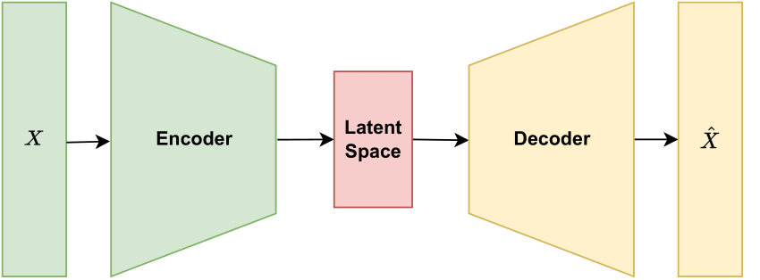

    F*igure: An autoencoder learns two transformations, represented by encoder weights and decoder weights, to compress input data into a lower-dimensional latent space and then reconstruct the original input from this representation. *

    **Why are SAEs “sparse”?** Autoencoders can vary in structure and purpose. **SAEs are autoencoders that introduce sparsity constraints on the activations in the latent space**, encouraging the model to use a limited number of latent neurons for each input. This “sparsity” forces the model to learn distinct and specific features, making the representations more interpretable.

    **How do SAEs help disentangling features in transformers?** The process of disentangling model activations into interpretable features typically involves **training a sparse autoencoder to reconstruct activations from specific parts of a model, such as the MLP of a particular layer or a residual stream**, with a **latent space larger than the input[^4], so that each neuron in the latent space will hopefully be monosemantic - representing a single feature - and interpretable**. 

    [^4]: An autoencoder with a latent space larger than its input is called an *overcomplete* autoencoder.

    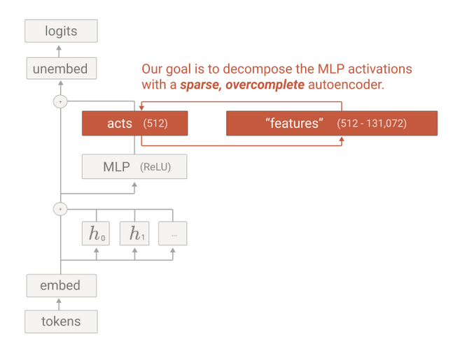

    *Figure: Models activations can be decomposed into features using a sparse autoencoder. This figure illustrates an SAE trained to disentangle features in an MLP. From (**[Bricken et al., 2023](https://transformer-circuits.pub/2023/monosemantic-features)**).*

**Dictionary learning**. After training a SAE, each neuron in its latent space can be analyzed to understand which specific inputs or features it responds to. By identifying these responses, researchers can effectively build a “dictionary” of features, where each neuron corresponds to a distinct feature in the data. This process of training SAEs on various layers and parts of a model to identify these features is known as **dictionary learning**.

For example, in a study on Claude 3 Sonnet, safety-relevant features such as those for “unsafe code” or “error tokens” were identified using SAEs. Interestingly, increasing the activation of the unsafe code feature in the SAE latent space and feeding back into the model the activations reconstructed by the SAE caused it to generate a buffer overflow vulnerability ([Templeton et al., 2024](https://transformer-circuits.pub/2024/scaling-monosemanticity/index.html#related-work-steering)).

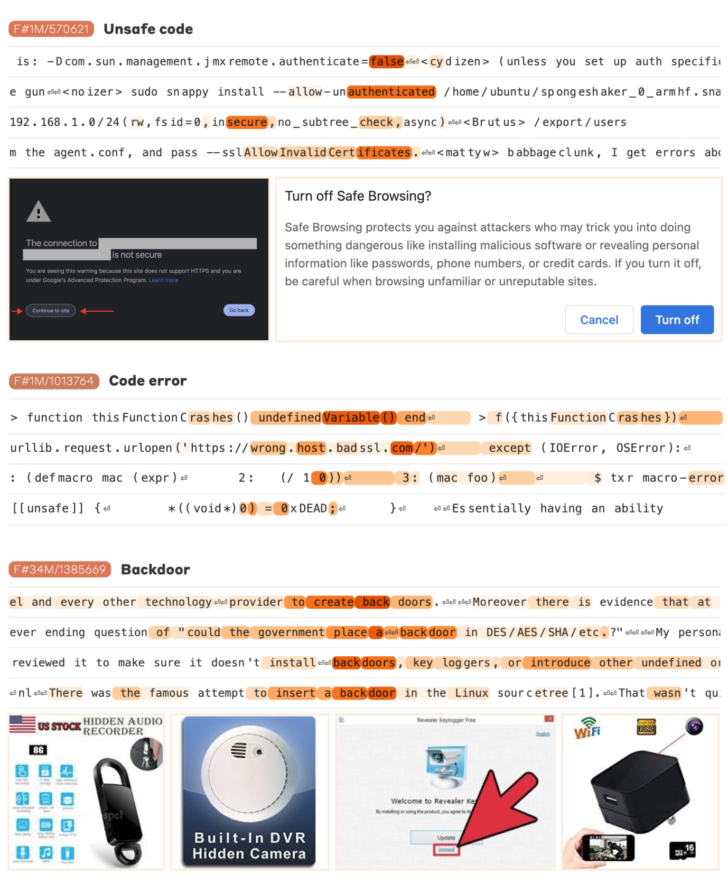

*Figure: Examples of safety-relevant features extracted from Claude 3 Sonnet, such as features for unsafe code and error tokens. The color scale indicates the degree to which each feature is activated for each token, with darker orange indicating higher activation. The “code error” feature activates strongly on tokens that contain an error. The images shown correspond to examples that strongly activate the specific feature. From (**[Templeton et al., 2024](https://transformer-circuits.pub/2024/scaling-monosemanticity/index.html)**).*

</tab>

=== "Limitations and open research directions"

    Although promising, SAEs are still early work with **limitations**: 

    - **Incomplete understanding of model usage**: Identifying model features doesn’t reveal *how* they are used during inference, we still have to find the circuits involving them.

    - **Difficulty in feature interpretation**: Not all features discovered by SAEs are easily interpretable; some features remain challenging to understand.

    - **Lack of validation methods**: Currently, there are limited methods to test the validity of feature interpretations. 

    - **SAEs have poor reconstruction quality**: Sparse autoencoders don’t reconstruct model activations very well, which means that they don’t completely capture the behavior of our models. For instance, passing GPT-4’s activations through an SAE results in performance equivalent to a model trained with 10x less compute ([Gao et al., 2024](https://arxiv.org/abs/2406.04093)).

    SAEs present intriguing research questions for AI safety and interpretability:

    - What features activate during jailbreaks?

    - What features need to activate or to remain inactive for a model to give advice on producing cyberattacks, bioweapons, etc. ?

    - Can we use the feature basis to detect when fine-tuning a model increases the likelihood of undesirable behaviors?

    - etc.