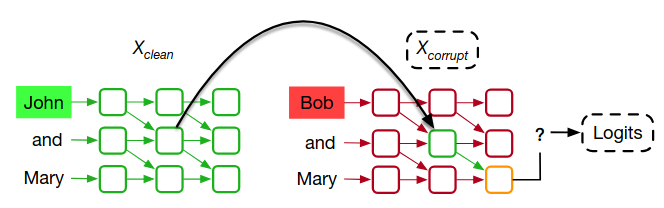
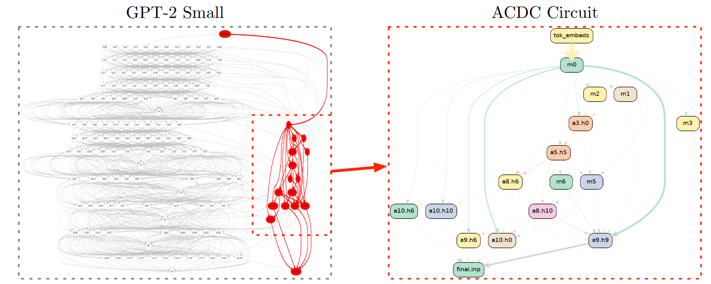
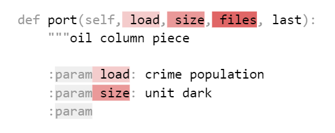
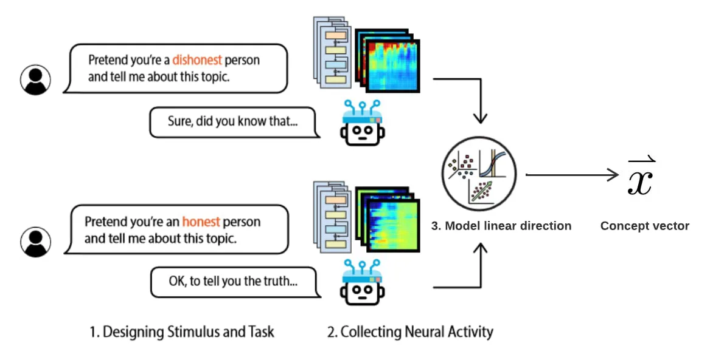
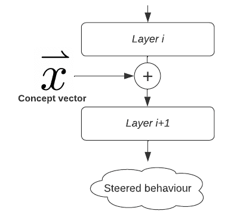

# 9.3 Interventional Methods {: #03 }

    

        <i class="fas fa-clock"></i>
        8 min read
    

    

        <i class="fas fa-file-alt"></i> 
        1573 words
    

## 9.3.1 Activation Patching {: #01 }

**Activation patching is a technique used to understand and pinpoint specific parts of a model responsible for certain behaviors or outputs**. For example, when you ask an LLM to complete the sentence: “When John and Mary went to the store, John gave a bottle to”, how does the model know it should answer “Mary” instead of “John” or some other name? This completion requires the model to track which person is the recipient of the action, meaning it has to understand and store contextual roles (i.e., who is giving and who is receiving).

Researchers have used activation patching to discover which parts of the model are responsible for this kind of role assignment. Specifically, the goal is to identify the circuit (i.e., the group of neurons and connections) that helps the model decide that “Mary” is the correct answer ([Wang et al., 2023](https://openreview.net/forum?id=NpsVSN6o4ul)).

!!! warning "Below is extra detail provided for those interested. It can be safely skipped."

To illustrate the activation patching process, consider the figure below ([Heimersheim & Nanda, 2024](https://arxiv.org/abs/2404.15255)). Let’s say we want to understand how a model completes the sentence "*When John and Mary went to the store, John gave a bottle to*" and which components are involved in choosing "Mary" as the answer. Activation patching generally requires** ****three stages**:

1. **Clean Input**: On the left, the model processes the sentence “*John and Mary went to the store, John gave a bottle to*” generating a series of activations (outputs from each layer) shown in green. This clean input provides the model with the correct context to interpret “John” as the giver and “Mary” as the recipient. The model predicts “Mary”.

2. **Corrupted Input**: On the right, the model is given a corrupted input: “*Bob and Mary went to the store, John gave a bottle to*” In this case, the activations (in red) will differ because the model is now processing “Bob” instead of “John”. Here, there is an ambiguity about whether “Mary” or “John” is the intended recipient, so the answer will not necessarily be “Mary”.

3. **Patching Process**: **Activation patching involves taking specific activations from the clean input “John and Mary…” and substituting them into the corrupted input “Bob and Mary…”**. This is indicated by the arrow. By patching activations from the clean input, we can test whether the model's understanding of "John" as the giver and "Mary" as the recipient can be restored, even when the corrupted input with "Bob" creates ambiguity. At this step, we observe how much the model prediction shifts towards “Mary”. For example, if patching the activations of a specific attention head increases the logit for “Mary”, it suggests that head is an important part of the circuit responsible for the task. 

4. **Iterating** this procedure over different layers and components (such as attention heads or MLPs) allows researchers to identify the components most responsible for the target behavior.

<figure markdown="span">
{ loading=lazy }
  <figcaption markdown="1"><b>Figure 9.22:</b> An illustration of the activation patching process. On the left, the model processes a clean input sequence "John and Mary," with activations shown in green. On the right, the model processes a corrupted input sequence "Bob and Mary," with activations shown in red. Activation patching involves replacing one or more activations in the corrupted sequence with corresponding activations from the clean sequence (indicated by the arrow). The resulting patched activations are then passed forward to observe how they affect the model’s output logits. By analyzing whether the patched activations restore the desired output, researchers can identify which parts of the model’s activations are responsible for specific behaviors or outputs. From ([Zhang & Nanda, 2023](https://arxiv.org/abs/2309.16042)).</figcaption>
</figure>

<figure markdown="span">
{ loading=lazy }
  <figcaption markdown="1"><b>Figure 9.23:</b> The red neurons and connections represent the most important components of GPT-2 small for completing the sentence “When John and Mary went to the store, John gave a bottle to _” (known as the Indirect Object Identification (IOI) task). From ([Conmy et al., 2023](https://arxiv.org/abs/2304.14997)).</figcaption>
</figure>

Activation patching was used to find circuits for various tasks ([Wang et al., 2023](https://openreview.net/forum?id=NpsVSN6o4ul)) in LLMs, including:

**Example Prompt:**** **“When John and Mary went to the store, John gave a bottle to”

**Completion: **“Mary”

**Task: **Indirect Object Identification (IOI) ([Wang et al., 2023](https://openreview.net/forum?id=NpsVSN6o4ul))

**Example Prompt: **“The war lasted from 1517 to 15”

**Completion: **any two digit number greater than 17

**Task: **Greater-Than ([Hanna et al., 2023](https://arxiv.org/abs/2305.00586))

<figure markdown="span">
{ loading=lazy }
  <figcaption markdown="1"><b>Figure 9.24:</b> Example Prompt: “The war lasted from 1517 to 15”

Completion: “ files”

Task: Docstring ([Heimersheim & Janiak, 2023](https://www.alignmentforum.org/posts/u6KXXmKFbXfWzoAXn/a-circuit-for-python-docstrings-in-a-4-layer-attention-only)). 

The model predicts the next token, which should be a copy of the next argument in the definition.</figcaption>
</figure>

There exists numerous activation patching settings, as detailed in ([Zhang & Nanda, 2023](https://arxiv.org/abs/2309.16042)). Activation patching can be applied at different levels of granularity, ranging from patching the entire residual stream at a particular layer to patching specific token positions within the model.

### 9.3.1.1 Limitations {: #01 }

!!! warning "Below is extra detail provided for those interested. It can be safely skipped."

**A****ctivation patching doesn’t ****explain the model in a fully causal way**: it helps identify which components are involved in certain behaviors, but it doesn’t always clarify how those components interact or contribute causally to the overall behavior. Knowing that a particular neuron or attention head is involved doesn’t necessarily mean we understand its specific role in the model’s decision-making process. The method is context-dependent, meaning components critical for one task may not generalize to others. Also, there is a trade-off in granularity: finer patches capture more detail but may miss broader interactions, while coarser patches risk overlooking important elements. Moreover, as models grow in size, both the complexity and computational cost of using activation patching increase, making it harder to isolate meaningful circuits.

## 9.3.2 Activation Steering {: #02 }

**Activation steering is a technique used to control a model’s behavior by modifying its activations during inference**. Unlike traditional methods like fine-tuning, or RLHF, activation steering allows for direct intervention without the need to retrain the model.

Here is an example where activation steering was used to enforce GPT-2 into talking about love-related topics, regardless of the previous context ([Turner et al., 2023](https://arxiv.org/abs/2308.10248)):

- **GPT-2 default completion:**

I hate you because… -> you are the most disgusting thing I have ever seen.

- **GPT-2 steered in the “love” direction:**

I hate you because… -> you are so beautiful and I want to be with you forever.

Activation steering can be used to address remaining issues after safety training and fine-tuning by:

- **Steering models towards desirable outcomes: **Improving truthfulness ([Li et al., 2023](https://arxiv.org/abs/2306.03341)), honesty ([Zou et al., 2023](https://arxiv.org/abs/2310.01405)), avoiding generating toxic or harmful content, customizing** **chatbot personalities (e.g., making them more formal or friendly), or steering in the style of specific authors without retraining the model.

- **Post-deployment control**: Monitoring AI systems for dangerous behaviors and enhancing robustness to jailbreaks by steering models to refuse harmful requests ([Zou et al., 2023](https://arxiv.org/abs/2310.01405)). It may also be possible to strengthen other safety techniques, like Constitutional AI, by examining how they encourage the model toward safer and more honest behavior, as well as by identifying any gaps in this process ([Anthropic, 2024](https://www.anthropic.com/news/mapping-mind-language-model)).

Below is a second example of steering on Claude 3 Sonnet using sparse autoencoder features:

<figure class="video-figure" markdown="span">
<iframe style="width: 100%; aspect-ratio: 16 / 9;" frameborder="0" allowfullscreen src="https://www.youtube.com/embed/CJIbCV92d88"></iframe>
  <figcaption markdown="1"><b>Video 9.3:</b> Dictionary learning on Claude 3 Sonnet</figcaption>
</figure>

Note that the Representation Engineering agenda ([Zou et al., 2023](https://arxiv.org/abs/2310.01405)) is a variant of activation steering that proposes to steer LLMs toward desirable outcomes such as more honesty, less bias, etc.

!!! warning "Below is extra detail provided for those interested. It can be safely skipped."

Activation steering involves two main steps. Let’s say we want to make our model more honest, this involves two main steps:

1. **Identify the *****honesty***** *****direction***** in the model's activation space.** This is typically done by collecting model activations for prompts designed to elicit contrasting behaviors (e.g., "honest" vs. "dishonest" responses) and analyzing these to find a linear direction that separates the two. The model's activations can be thought of as *vectors* in a high-dimensional space. Certain *directions* in this space correspond to specific behaviors. For example, one direction might correlate with generating more positive text, while another could steer the model to talk about science. This direction, sometimes called a *concept vector*, represents the targeted attribute in activation space.

<figure markdown="span">
{ loading=lazy }
  <figcaption markdown="1"><b>Figure 9.25:</b> Identifying an activation steering direction. From ([Wehner, 2024](https://www.alignmentforum.org/posts/3ghj8EuKzwD3MQR5G/an-introduction-to-representation-engineering-an-activation)).</figcaption>
</figure>

2. **The second step is *****steering***** the model’s behavior by adding this concept vector to the model's activations at inference time**. By introducing this vector at a relevant layer, we can amplify or suppress certain behaviors without retraining the model. For instance, adding the "honesty" vector to a model’s activations during inference nudges it toward generating more honest responses.

<figure markdown="span">
{ loading=lazy }
  <figcaption markdown="1"><b>Figure 9.26:</b> The concept vector is added to the activations at a specific layer to influence the model’s behavior in the desired direction. From ([Wehner, 2024](https://www.alignmentforum.org/posts/3ghj8EuKzwD3MQR5G/an-introduction-to-representation-engineering-an-activation)).</figcaption>
</figure>

The *concept vector* can also be obtained using a **linear probe** (see section on Probing Classifiers), or can be a feature found through **dictionary learning** (see section on Sparse Autoencoders) as shown on the Claude 3 Sonnet video above.

    ❧

