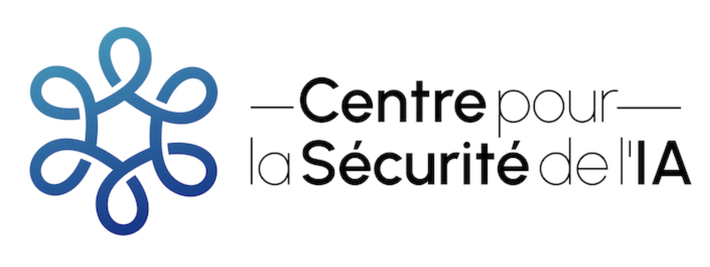

<!--File: textbook/docs/index.md-->

# Overview

**What are we building?** The overarching project is to improve the AI safety education landscape. This means that we aim to do a couple of things:

- **Textbook**: First, the core of our project is writing a textbook that systematically maps the landscape of AI Safety knowledge. Rather than just aggregating existing content, we reconstruct key ideas into a carefully structured narrative where concepts build naturally on previous ones. This textbook currently contains 9 chapters, spanning from the basics of understanding AI capabilities, to the technical details of interpretability.

- **Course Materials**: Second, we also want to use the textbook as a foundation around which we also develop course materials. We have the goal of helping university courses, AI safety study groups, or even independent learners be able to engage with the ideas in the manner that they find most comfortable. We don't run courses, we aim to provide the best possible materials that others can use. This makes our material designed to be "plug and play" for different learning contexts. We to provide things like videos, facilitation guides, and interactive learning to name just a few.

**Why does AI Safety need this project?** The field of AI Safety has grown significantly, yet its educational infrastructure hasn't kept pace. While there's abundant information available, it's scattered across forums, blogs, papers, and videos. This makes learning difficult, and demands significant effort to piece together concepts, and see how everything is connected to the larger safety infrastructure. Our project transforms this fragmented landscape into a coherent learning journey.

## Adoption

**Who currently uses this project?** Our materials have been adopted across three main categories of users:

- **AI Safety Programs**: Dedicated AI Safety initiatives have been among our earliest adopters. ML4Good, one of our largest implementations, reaches approximately 250 students annually across multiple countries. AI Safety Collab runs cohorts of around 80 students each, using our materials as their core curriculum. There are also self organized AI Safety groups like AI Safety Gothenburg that have adapted our content for their local communities. Generally, these programs seem to prefer the full technical track, as it helps prepare students for more advanced AI Safety work.

- **University Courses**: Some academic institutions have begun incorporating our materials into their formal curricula. ENS Ulm and ENS Paris-Saclay use our content to teach approximately 100 machine learning master's students annually. UBC's AI Safety program in Vancouver reaches 30-50 students per semester. We're seeing growing interest from other universities looking to establish AI Safety courses.

- **Independent Readers**: Beyond formal programs, our materials support numerous independent study groups and individual learners. We have received positive feedback from individual groups and readers in Moscow, Germany, Brazil and many other countries around the world.

!!! quote "Reception"
    * “*I found it to be very well written and super insightful. Learned tons of new things. Looking forwards to continue reading.*” - Participant of ML4G Germany 2023.
    * “*I liked the text, was well written, concise, easy to follow, contained many important points.*” - Participant of ML4G Germany 2023.
    * “*The textbooks are very helpful to keep a clear line of thought and a better structure.*”  - Participant of ML4G France 2023.
    * “*The material and content are great, thank you for writing it and I can't wait to read it in its entirety.*” - Participant of ML4G France 2023.

## Target Audiences

We follow a "details on demand" approach, both in our writing and in the overarching project structure. Since different groups needed different depths of engagement with AI Safety concepts, our project serves two audiences - governance and technical. The technical path simply uses the governance chapters as prerequisite foundations, and then goes into more detail with additional chapters.

### The Governance Path

For policymakers and governance professionals, we focus on building a strong conceptual foundation. Through four carefully crafted chapters, readers develop a clear understanding of AI Safety risks, potential solutions, and their policy implications. This track requires no technical background but provides the depth needed for informed decision-making about AI governance.

### The Technical Path

Technical practitioners - from students to experienced ML engineers - need both conceptual understanding and implementation details. Building on the foundation laid in the first four chapters, six additional technical chapters dive deep into specific safety mechanisms, mathematical frameworks, and current research directions. This track serves as excellent preparation for specialized programs like MATS or ARENA.

This is a project from the [French Center for AI Safety (Centre pour la Securité de l'IA, CeSIA)](https://www.securite-ia.fr/).

