This is just for experimenting

=== "Unordered list"

    * Sed sagittis eleifend rutrum
    * Donec vitae suscipit est
    * Nulla tempor lobortis orci

=== "Ordered list"

    1. Sed sagittis eleifend rutrum
    2. Donec vitae suscipit est
    3. Nulla tempor lobortis orci

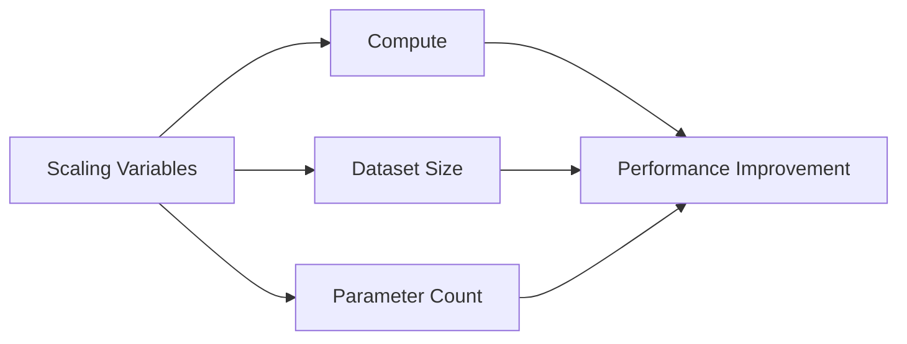

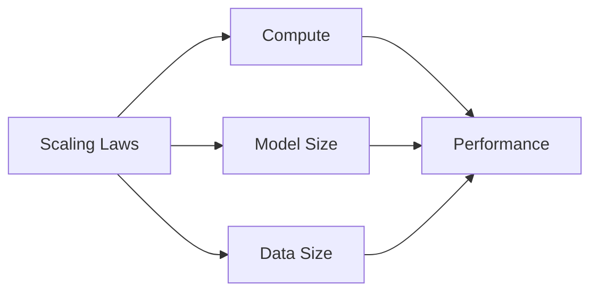

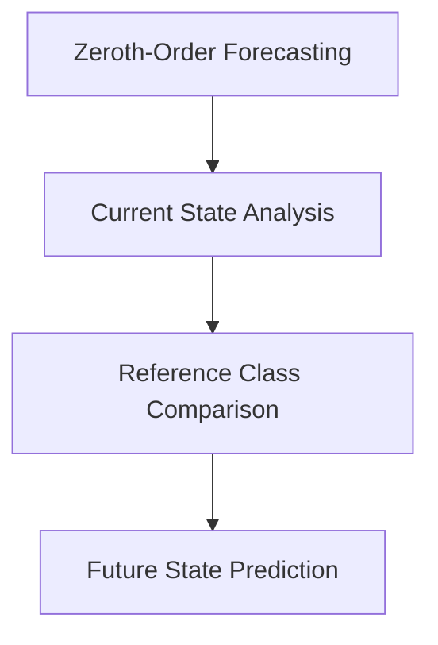

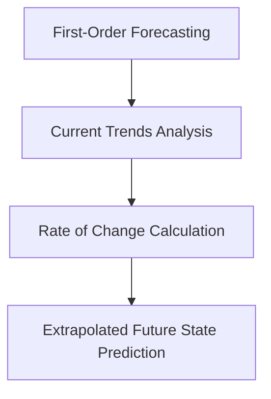

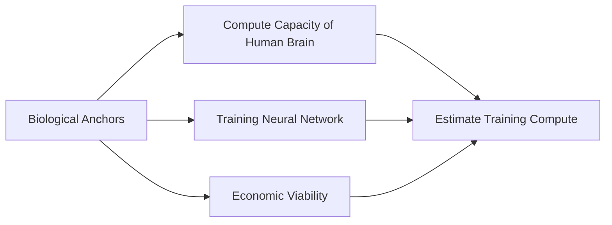

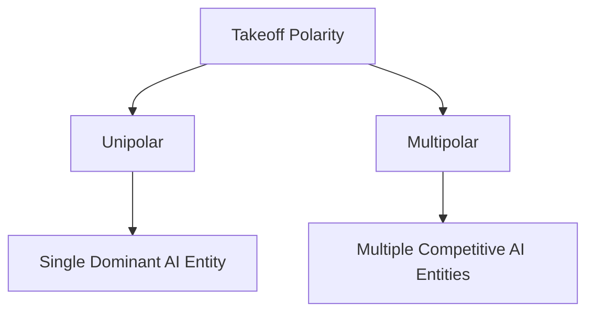

Fancy

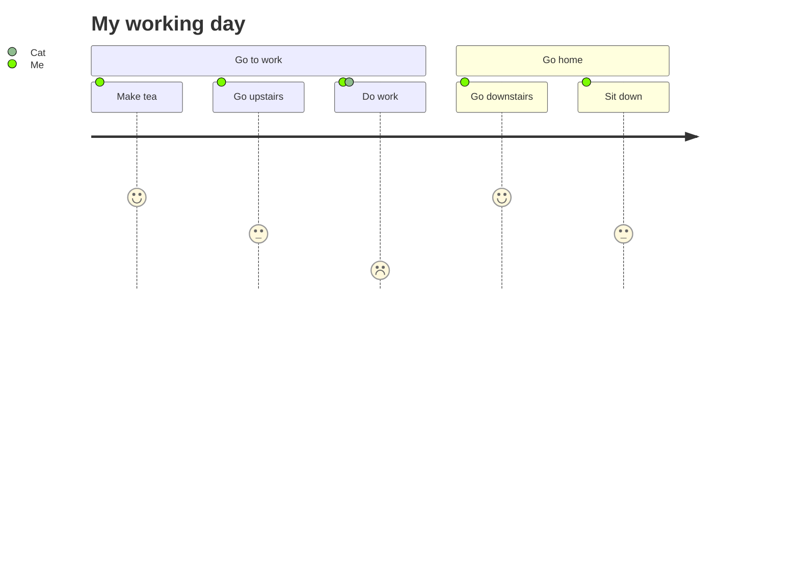

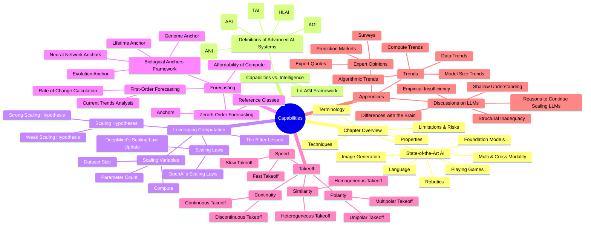

Certainly! Here are examples of each type of diagram based on the content of the first chapter of your book.

### 1. Flowchart

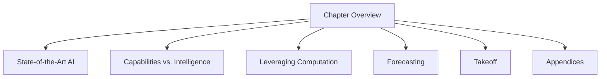

### 2. Sequence Diagram

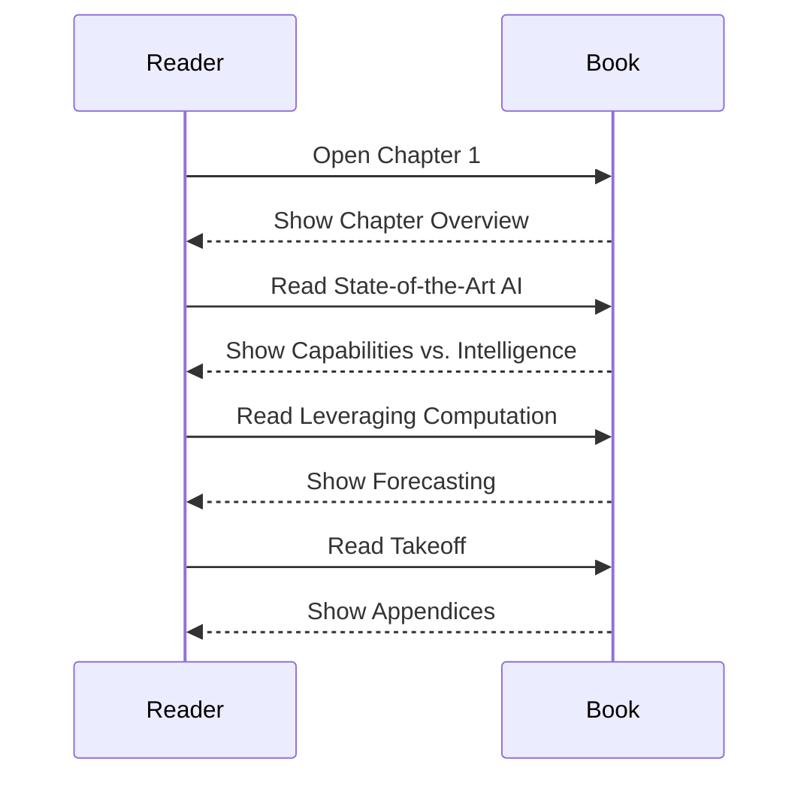

### 3. Class Diagram

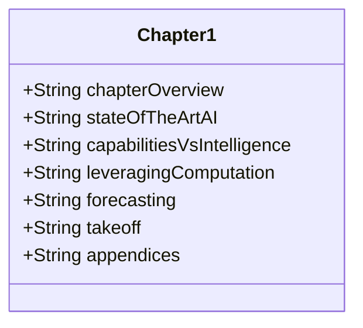

### 4. State Diagram

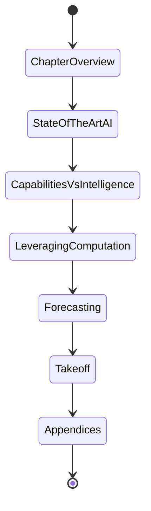

### 5. Entity Relationship Diagram

### 6. User Journey

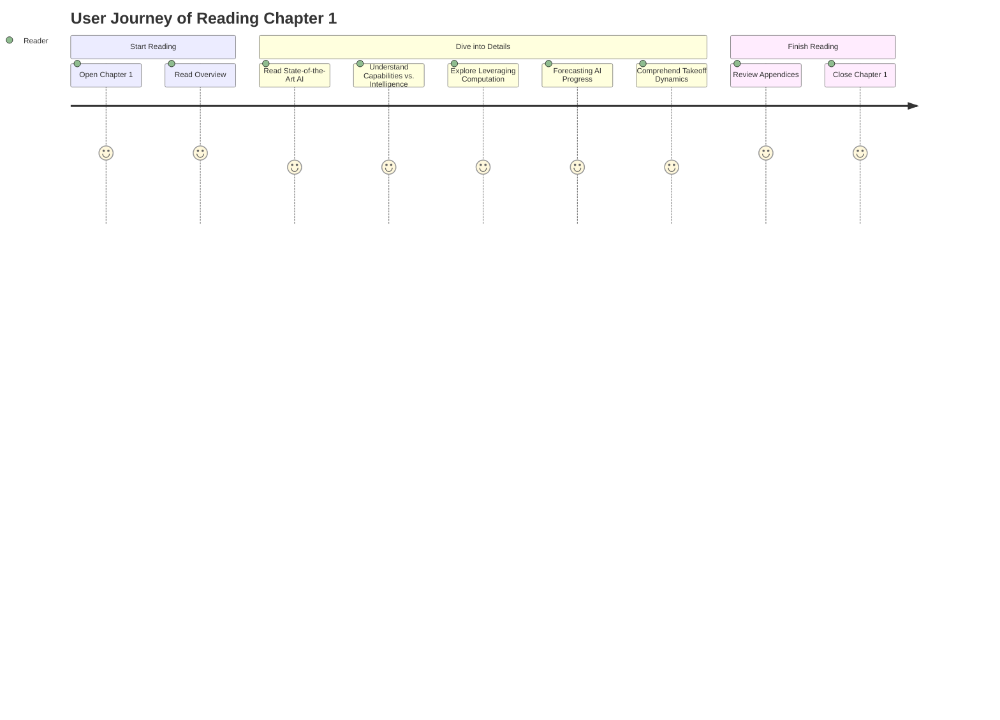

### 7. Gantt Chart

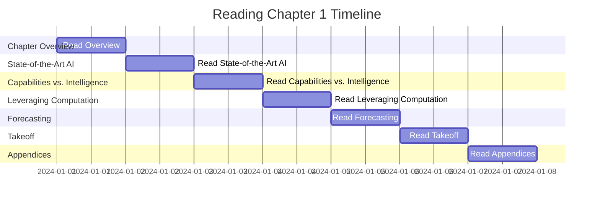

### 8. Pie Chart

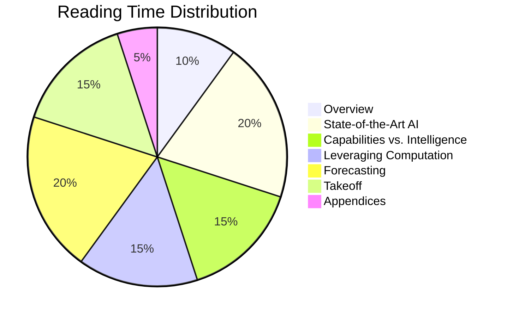

### 9. Quadrant Chart

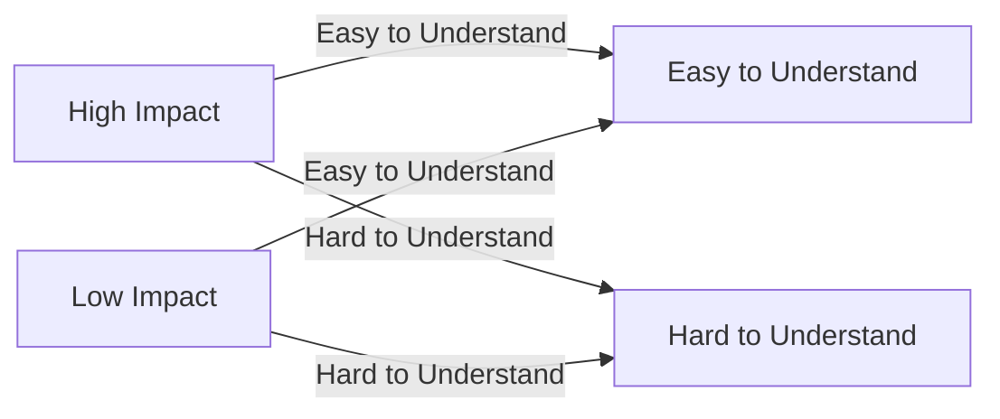

### 10. Requirement Diagram

```mermaid
requirementDiagram
    requirement Chapter1 {
        id: 1
        title: Chapter 1
        description: The first chapter of the book.
    }

    requirement StateOfTheArtAI {
        id: 1.1
        title: State-of-the-Art AI
    }

    requirement CapabilitiesVsIntelligence {
        id: 1.2
        title: Capabilities vs. Intelligence
    }

    requirement LeveragingComputation {
        id: 1.3
        title: Leveraging Computation
    }

    requirement Forecasting {
        id: 1.4
        title: Forecasting
    }

    requirement Takeoff {
        id: 1.5
        title: Takeoff
    }

    requirement Appendices {
        id: 1.6
        title: Appendices
    }

    Chapter1 --|> StateOfTheArtAI
    Chapter1 --|> CapabilitiesVsIntelligence
    Chapter1 --|> LeveragingComputation
    Chapter1 --|> Forecasting
    Chapter1 --|> Takeoff
    Chapter1 --|> Appendices
```

### 11. Gitgraph (Git) Diagram

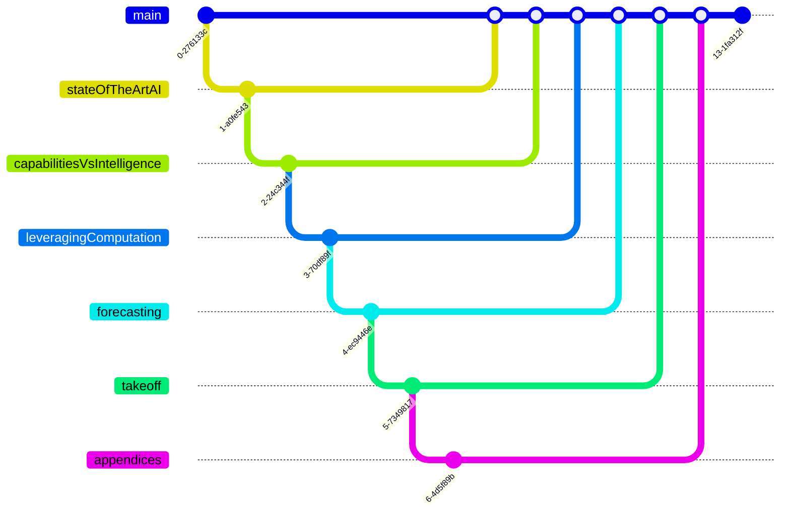

### 12. C4 Diagram

```mermaid
C4Context
    title C4 Model for Chapter 1

    Person(reader, "Reader", "Person reading the book")
    System(chapter1, "Chapter 1", "First chapter of the book")

    Boundary(b0, "Content Sections") {
        Container(stateOfTheArtAI, "State-of-the-Art AI", "Markdown", "Overview of current AI capabilities")
        Container(capabilitiesVsIntelligence, "Capabilities vs. Intelligence", "Markdown", "Definitions and frameworks")
        Container(leveragingComputation, "Leveraging Computation", "Markdown", "Scaling laws and hypotheses")
        Container(forecasting, "Forecasting", "Markdown", "AI progress prediction methods")
        Container(takeoff, "Takeoff", "Markdown", "Takeoff speed and dynamics")
        Container(appendices, "Appendices", "Markdown", "Supplementary information")
    }

    reader --> chapter1
    chapter1 --> stateOfTheArtAI
    chapter1 --> capabilitiesVsIntelligence
    chapter1 --> leveragingComputation
    chapter1 --> forecasting
    chapter1 --> takeoff
    chapter1 --> appendices
```

### 13. Mindmap

```mermaid
mindmap
    root((Capabilities))
        Chapter Overview
            State-of-the-Art AI
                Language
                Image Generation
                Multi & Cross Modality
                Robotics
                Playing Games
                Foundation Models
            Techniques
            Properties
            Limitations & Risks
            Terminology
        Capabilities vs. Intelligence
            Definitions of Advanced AI Systems
                Artificial Narrow Intelligence (ANI)
                Artificial General Intelligence (AGI)
                Human-Level AI (HLAI)
                Transformative AI (TAI)
                Artificial Super Intelligence (ASI)
            (t,n)-AGI Framework
        Leveraging Computation
            The Bitter Lesson
            Scaling Variables
                Compute
                Dataset Size
                Parameter Count
            Scaling Laws
                OpenAI's Scaling Laws
                DeepMind's Scaling Law Update
            Scaling Hypotheses
                Weak Scaling Hypothesis
                Strong Scaling Hypothesis
        Forecasting
            Zeroth-Order Forecasting
                Reference Classes
                Anchors
            First-Order Forecasting
                Current Trends Analysis
                Rate of Change Calculation
            Biological Anchors Framework
                Evolution Anchor
                Lifetime Anchor
                Neural Network Anchors
                Genome Anchor
            Affordability of Compute
        Takeoff
            Speed
                Slow Takeoff
                Fast Takeoff
            Continuity
                Continuous Takeoff
                Discontinuous Takeoff
            Similarity
                Homogeneous Takeoff
                Heterogeneous Takeoff
            Polarity
                Unipolar Takeoff
                Multipolar Takeoff
        Appendices
            Expert Opinions
                Surveys
                Expert Quotes
                Prediction Markets
            Discussions on LLMs
                Empirical Insufficiency
                Shallow Understanding
                Structural Inadequacy
                Differences with the Brain
                Reasons to Continue Scaling LLMs
            Trends
                Compute Trends
                Model Size Trends
                Algorithmic Trends
                Data Trends
```

### 14. Timeline

```mermaid
timeline
    title Timeline of Reading Chapter 1
    section Chapter Overview
      Overview: 2024-01-01
    section State-of-the-Art AI
      Language: 2024-01-02
      Image Generation: 2024-01-03
      Multi & Cross Modality: 2024-01-04
      Robotics: 2024-01-05
      Playing Games: 2024-01-06
      Foundation Models: 2024-01-07
    section Capabilities vs. Intelligence
      Definitions: 2024-01-08
      Frameworks: 2024-01-09
    section Leveraging Computation
      Bitter Lesson: 2024-01-10
      Scaling Variables: 2024-01-11
      Scaling Laws: 2024-01-12
      Scaling Hypotheses: 2024-01-13
    section Forecasting
      Zeroth-Order Forecasting: 2024-01-14
      First-Order Forecasting: 2024-01-15
      Biological Anchors: 2024-01-16
      Affordability of Compute: 2024-01-17
    section Takeoff
      Speed: 2024-01-18
      Continuity: 2024-01-19
      Similarity: 2024-01-20
      Polarity: 2024-01-21
    section Appendices
      Expert Opinions: 2024-01-22
      Discussions on LLMs: 2024-01-23
      Trends: 2024-01-24
```

### 15. Zenuml

```mermaid
zenuml
@startuml
:Reader: -> :Chapter 1: Open Chapter 1
:Chapter 1: -> :Overview: Show Chapter Overview
:Reader: -> :State-of-the-Art AI: Read State-of-the-Art AI
:Chapter 1: -> :Capabilities vs. Intelligence: Show Capabilities vs. Intelligence
:Reader: -> :Leveraging Computation: Read Leveraging Computation
:Chapter 1: -> :Forecasting: Show Forecasting
:Reader: -> :Takeoff: Read Takeoff
:Chapter 1: -> :Appendices: Show Appendices
@enduml
```

### 16. Sankey Diagram

```mermaid
sankey
  A[State-of-the-Art AI] 100
  B[Capabilities vs. Intelligence] 75
  C[Leveraging Computation] 50
  D[Forecasting] 40
  E[Takeoff] 35
  F[Appendices] 25
  A -> B
  A -> C
  B -> D
  C -> D
  D -> E
  E -> F
```

### 17. XYChart

```mermaid
scatter
    title AI Progress Prediction
    x-axis Scale (in years)
    y-axis Performance (in %)
    "State-of-the-Art AI": [1, 20]
    "Capabilities vs. Intelligence": [2, 30]
    "Leveraging Computation": [3, 50]
    "Forecasting": [4, 70]
    "Takeoff": [5, 80]
    "Appendices": [6, 90]
```

### 18. Block Diagram

```mermaid
flowchart TB
    subgraph Chapter1
        direction LR
        A[Chapter Overview]
        B[State-of-the-Art AI]
        C[Capabilities vs. Intelligence]
        D[Leveraging Computation]
        E[Forecasting]
        F[Takeoff]
        G[Appendices]
    end
    Chapter1 --> H[Understanding AI Capabilities]
```

These diagrams should provide a comprehensive and engaging visualization of the first chapter's content.

Certainly! Let's focus on creating meaningful and engaging diagrams that will enhance the understanding and appreciation of the content in your online textbook. I'll select a few key types of diagrams that can effectively convey the main ideas and concepts from each section of the chapter. Here are the choices:

### 1. Flowchart for Chapter Overview

This flowchart will provide a high-level view of the chapter, showing the main sections and how they connect.

```mermaid
flowchart TD
    A[Chapter Overview] --> B[State-of-the-Art AI]
    A --> C[Capabilities vs. Intelligence]
    A --> D[Leveraging Computation]
    A --> E[Forecasting]
    A --> F[Takeoff]
    A --> G[Appendices]
```

### 2. Mindmap for Detailed Structure

A mindmap will help readers visualize the hierarchical structure of the chapter and the relationships between different subtopics.

```mermaid
mindmap
    root((Capabilities))
        Chapter Overview
            State-of-the-Art AI
                Language
                Image Generation
                Multi & Cross Modality
                Robotics
                Playing Games
                Foundation Models
            Techniques
            Properties
            Limitations & Risks
            Terminology
        Capabilities vs. Intelligence
            Definitions of Advanced AI Systems
                Artificial Narrow Intelligence (ANI)
                Artificial General Intelligence (AGI)
                Human-Level AI (HLAI)
                Transformative AI (TAI)
                Artificial Super Intelligence (ASI)
            (t,n)-AGI Framework
        Leveraging Computation
            The Bitter Lesson
            Scaling Variables
                Compute
                Dataset Size
                Parameter Count
            Scaling Laws
                OpenAI's Scaling Laws
                DeepMind's Scaling Law Update
            Scaling Hypotheses
                Weak Scaling Hypothesis
                Strong Scaling Hypothesis
        Forecasting
            Zeroth-Order Forecasting
                Reference Classes
                Anchors
            First-Order Forecasting
                Current Trends Analysis
                Rate of Change Calculation
            Biological Anchors Framework
                Evolution Anchor
                Lifetime Anchor
                Neural Network Anchors
                Genome Anchor
            Affordability of Compute
        Takeoff
            Speed
                Slow Takeoff
                Fast Takeoff
            Continuity
                Continuous Takeoff
                Discontinuous Takeoff
            Similarity
                Homogeneous Takeoff
                Heterogeneous Takeoff
            Polarity
                Unipolar Takeoff
                Multipolar Takeoff
        Appendices
            Expert Opinions
                Surveys
                Expert Quotes
                Prediction Markets
            Discussions on LLMs
                Empirical Insufficiency
                Shallow Understanding
                Structural Inadequacy
                Differences with the Brain
                Reasons to Continue Scaling LLMs
            Trends
                Compute Trends
                Model Size Trends
                Algorithmic Trends
                Data Trends
```

### 3. Sequence Diagram for Forecasting Methods

A sequence diagram will show the steps involved in different forecasting methods, helping readers understand the process.

```mermaid
sequenceDiagram
    participant Forecaster
    participant Data
    participant Model
    Forecaster->>Data: Collect Historical Data
    Forecaster->>Model: Analyze Current Trends
    Model-->>Forecaster: Provide Rate of Change
    Forecaster->>Model: Apply Scaling Laws
    Model-->>Forecaster: Generate Predictions
    Forecaster->>Data: Validate Predictions
    Data-->>Forecaster: Feedback
```

### 4. Gantt Chart for Reading Timeline

A Gantt chart will help readers plan their reading schedule and understand the time allocation for each section.

```mermaid
gantt
    title Reading Chapter 1 Timeline
    dateFormat  YYYY-MM-DD
    section Chapter Overview
    Read Overview           :a1, 2024-01-01, 1d
    section State-of-the-Art AI
    Read State-of-the-Art AI :a2, 2024-01-02, 1d
    section Capabilities vs. Intelligence
    Read Capabilities vs. Intelligence  :a3, 2024-01-03, 1d
    section Leveraging Computation
    Read Leveraging Computation   :a4, 2024-01-04, 1d
    section Forecasting
    Read Forecasting    :a5, 2024-01-05, 1d
    section Takeoff
    Read Takeoff    :a6, 2024-01-06, 1d
    section Appendices
    Read Appendices    :a7, 2024-01-07, 1d
```

### 5. Pie Chart for Reading Time Distribution

A pie chart will provide a quick visual representation of the time distribution across different sections.

```mermaid
pie
    title Reading Time Distribution
    "Overview" : 10
    "State-of-the-Art AI" : 20
    "Capabilities vs. Intelligence" : 15
    "Leveraging Computation" : 15
    "Forecasting" : 20
    "Takeoff" : 15
    "Appendices" : 5
```

### 6. Sankey Diagram for Concept Flow

A Sankey diagram will illustrate the flow of concepts and how they contribute to the understanding of AI capabilities.

```mermaid
sankey
  A[State-of-the-Art AI] 100
  B[Capabilities vs. Intelligence] 75
  C[Leveraging Computation] 50
  D[Forecasting] 40
  E[Takeoff] 35
  F[Appendices] 25
  A --> B
  A --> C
  B --> D
  C --> D
  D --> E
  E --> F
```

### 7. C4 Diagram for System Structure

A C4 diagram will help in visualizing the components of the chapter and how they interact, useful for more technical readers.

```mermaid
C4Context
    title C4 Model for Chapter 1

    Person(reader, "Reader", "Person reading the book")
    System(chapter1, "Chapter 1", "First chapter of the book")

    Boundary(b0, "Content Sections") {
        Container(stateOfTheArtAI, "State-of-the-Art AI", "Markdown", "Overview of current AI capabilities")
        Container(capabilitiesVsIntelligence, "Capabilities vs. Intelligence", "Markdown", "Definitions and frameworks")
        Container(leveragingComputation, "Leveraging Computation", "Markdown", "Scaling laws and hypotheses")
        Container(forecasting, "Forecasting", "Markdown", "AI progress prediction methods")
        Container(takeoff, "Takeoff", "Markdown", "Takeoff speed and dynamics")
        Container(appendices, "Appendices", "Markdown", "Supplementary information")
    }

    reader --> chapter1
    chapter1 --> stateOfTheArtAI
    chapter1 --> capabilitiesVsIntelligence
    chapter1 --> leveragingComputation
    chapter1 --> forecasting
    chapter1 --> takeoff
    chapter1 --> appendices
```

These diagrams should provide a comprehensive and engaging visualization of the first chapter's content, making it more interactive and enjoyable for readers.

Let's correct and simplify the C4 diagram to better illustrate the system structure of Chapter 1.

### Corrected C4 Diagram

```mermaid
C4Context
    title C4 Model for Chapter 1

    Person(reader, "Reader", "Person reading the book")
    System(chapter1, "Chapter 1", "First chapter of the book")

    Container_Boundary(chapter1, "Chapter 1") {
        Container(stateOfTheArtAI, "State-of-the-Art AI", "Markdown", "Overview of current AI capabilities")
        Container(capabilitiesVsIntelligence, "Capabilities vs. Intelligence", "Markdown", "Definitions and frameworks")
        Container(leveragingComputation, "Leveraging Computation", "Markdown", "Scaling laws and hypotheses")
        Container(forecasting, "Forecasting", "Markdown", "AI progress prediction methods")
        Container(takeoff, "Takeoff", "Markdown", "Takeoff speed and dynamics")
        Container(appendices, "Appendices", "Markdown", "Supplementary information")
    }

    reader --> chapter1
    chapter1 --> stateOfTheArtAI
    chapter1 --> capabilitiesVsIntelligence
    chapter1 --> leveragingComputation
    chapter1 --> forecasting
    chapter1 --> takeoff
    chapter1 --> appendices
```

This C4 diagram now should work correctly to show the relationships and structure within Chapter 1. The containers represent different sections within the chapter, and the interactions are simplified to show the reader's engagement with the chapter content.

<div class="grid cards" markdown>

- :material-clock-fast:{ .lg .middle } **Set up in 5 minutes**

    ---

    Install [`mkdocs-material`](#) with [`pip`](#) and get up
    and running in minutes

    [:octicons-arrow-right-24: Getting started](#)

- :fontawesome-brands-markdown:{ .lg .middle } **It's just Markdown**

    ---

    Focus on your content and generate a responsive and searchable static site

    [:octicons-arrow-right-24: Reference](#)

- :material-format-font:{ .lg .middle } **Made to measure**

    ---

    Change the colors, fonts, language, icons, logo and more with a few lines

    [:octicons-arrow-right-24: Customization](#)

- :material-scale-balance:{ .lg .middle } **Open Source, MIT**

    ---

    Material for MkDocs is licensed under MIT and available on [GitHub]

    [:octicons-arrow-right-24: License](#)

</div>

<div class="grid cards" markdown>

- :material-brain:{ .lg .middle } **State-of-the-Art AI**

    ---

    Discover the latest advancements in artificial intelligence across various domains like language, image generation, and robotics.

    [:octicons-arrow-right-24: Explore](#)

- :material-book-open-page-variant:{ .lg .middle } **Capabilities vs. Intelligence**

    ---

    Understand the difference between capabilities and intelligence and explore definitions of advanced AI systems.

    [:octicons-arrow-right-24: Learn More](#)

- :material-chart-line:{ .lg .middle } **Leveraging Computation**

    ---

    Dive into the importance of computation in AI's progress and the scaling laws that predict future capabilities.

    [:octicons-arrow-right-24: Read More](#)

- :material-calendar-clock:{ .lg .middle } **Forecasting**

    ---

    Explore methods to forecast AI's future, including biological anchors and first-order forecasting.

    [:octicons-arrow-right-24: Find Out How](#)

- :material-rocket-launch:{ .lg .middle } **Takeoff Dynamics**

    ---

    Learn about the potential speed, continuity, and polarity of AI takeoff and its implications.

    [:octicons-arrow-right-24: Understand Takeoff](#)

- :material-note-multiple-outline:{ .lg .middle } **Appendices**

    ---

    Access supplementary information, expert opinions, and discussions on large language models.

    [:octicons-arrow-right-24: View Appendices](#)

</div>
